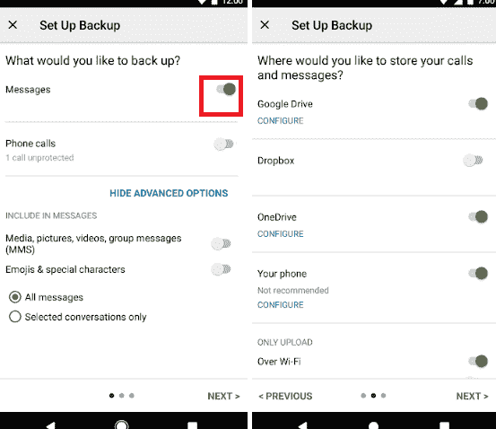
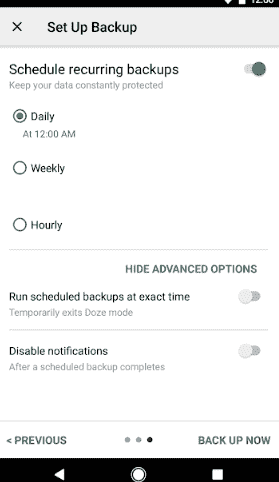
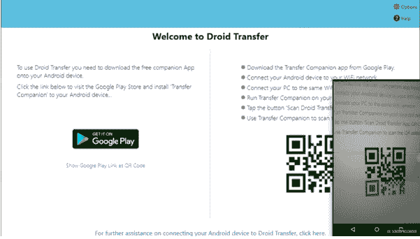
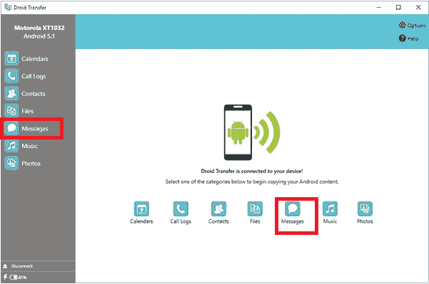
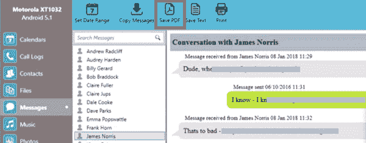
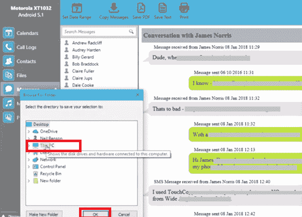

# 如何在安卓系统上保存短信

> 原文：<https://www.javatpoint.com/how-to-save-text-messages-on-android>

短信是手机用户最基本的交流方式之一。我们中的许多人通过手机和平板电脑用短信交流思想和信息。在消息交换过程中，我们会收到许多与工作相关的重要消息，这些消息需要存储起来以备将来使用或存储。

有时会出现这样一种情况，你突然需要保存你的短信副本，以备将来记录，即使你的手机出现了一些错误，你也不想丢失它们。许多人会捕捉他们文本对话的截图，并将副本永久保存起来，以便妥善保管。

所有现代安卓智能手机都提供了一项功能，可以备份您的数据或将数据传输到另一台设备，您可以从该设备获取数据。然而，很多时候，从手机传输的数据不包括短信，除非你在处理前保存它们。

## 为什么需要长期保存或保留短信？

每个移动用户都有不同的保存、导出和保护短信安全的需求。有时保存文本消息的需要突然需要，并且移动用户有立即将其文本消息存储到计算机或其他设备的时间限制。一些用户全年定期、每周或每月保存他们的短信，以记录在案。

### 人们希望永远保存短信的一些常见原因:

1.  人们喜欢保存家人的短信。
2.  人们需要保存和打印他们的信息，以供法庭、审判或律师使用。
3.  保存来自爱人或关系的短信，让记忆永存。
4.  永远保存短信作为警察或法律需要的证据。
5.  为公司需要或记录保存和打印短信。

## 使用第三方应用保存安卓手机的短信

你会在网上找到许多第三方应用程序，允许你导出和备份你的短信。一些广泛使用的安卓程序保存短信有**短信备份+，短信备份&恢复**等。

***短信备份+*** app 配合用户 ***Gmail 账号*** 进行安卓短信的备份、保存和打印。以下是使用短信备份+应用程序在安卓系统上保存短信的步骤:

### 使用短信备份+在安卓系统上保存短信

1.  您必须确保您使用的是 Gmail 帐户。
2.  打开你的 Gmail 账号**启用 IMAP**
    *   点击 Gmail 账户上的**设置**图标。
        T3】
    *   从下拉选项中，点击**查看所有设置**。
        T3】
    *   点击屏幕顶部的**转发和 POP/IMAP** 标签。
    *   在 IMAP 访问部分，选择**启用 IMAP。**
    *   点击**保存更改**按钮进行设置更改。
        T3】
3.  下载、安装并**启动 [**短信备份+**](https://play.google.com/store/apps/details?id=com.zegoggles.smssync&hl=en_IN&gl=US)**
4.  授予应用程序在您的安卓手机上请求的所有权限。
5.  使用您连接的 Gmail 帐户，在短信备份+中选择**备份**。
    T3】
6.  当备份过程完成时，您会保存一份文本消息。
7.  您可以打印或下载您的短信以供进一步使用。

### 使用短信备份和恢复在安卓系统上保存短信

[短信备份&恢复](https://play.google.com/store/apps/details?id=com.riteshsahu.SMSBackupRestore&hl=en_IN&gl=US) app 免费下载使用，包含了成吨的好功能。您可以使用此应用程序**备份您的短信和彩信**。最初，这个应用程序以 XML 格式存储您的文本消息，它还将您的数据保存在本地和云中。*该应用还支持谷歌驱动、电子邮件和 Dropbox 云存储，你可以在其中上传你的短信*。它的一个有趣的功能是自动备份，您可以将其设置为自动备份，并且不要忘记手动存储您的邮件。

### 使用短信备份和恢复应用程序保存短信的步骤

1.  在您的安卓设备上下载、安装并启动短信备份和恢复应用程序。
2.  点击**设置备份**按钮创建新的备份。
    T3】
3.  选择要保存的信息**(短信)**和保存备份的目标位置(本地或云端)。您可以在同一台设备上或在**谷歌硬盘、Dropbox、**或 **OneDrive** 上保存您的信息。
    
4.  从*每日、每周或每小时*中选择您的**备份时间表**。
    
5.  为备份文件命名，以便于识别。

如果您对手动保存短信不感兴趣，您也可以安排应用程序通过设置自动完成上传过程。

## 使用 Droid 传输应用程序在电脑上保存短信

**Droid Transfer** 是一款电脑程序，可以将安卓设备的短信(或其他数据)备份保存到 PC 上。您可以从您的安卓手机以 **PDF、纯文本、**或 **HTML** 格式导出并保存您的短信。

要将你的安卓手机数据传输到你的电脑上，你必须在你的电脑上下载并安装 **Droid Transfer** 程序和你的安卓手机上的[**Transfer Companion**](https://play.google.com/store/apps/details?id=was.android.transfercompanion)应用。

使用 Droid Transfer 应用程序，按照以下步骤将安卓手机中的短信传输并保存到您的电脑中:

**第一步:**在你的 PC 上下载并安装 **Droid Transfer** 和安卓手机上的[**Transfer company**](https://play.google.com/store/apps/details?id=was.android.transfercompanion)应用。

**第二步:**在电脑上打开 Droid Transfer 应用，在安卓手机上打开 Transfer Companion App。

**第三步:**在*转账伴侣*应用程序屏幕上，点击**扫描二维码按钮**扫描电脑上机器人转账应用程序上出现的二维码。

**第四步:**使用*转账伴侣* app 扫描仪扫描二维码；它连接并在电脑上显示手机数据。

**步骤 5:** 在 Droid Transfer 应用程序屏幕上，单击**消息**部分以显示电话消息。牢记在心；它仅显示您在默认消息应用程序上完成的短信对话。如果您想显示另一个应用程序的短信对话，请将该应用程序设置为您设备上的默认消息应用程序。

**第六步:**等几秒钟加载联系人，他们的文字对话就和你完成了。加载完成后，点击**联系人姓名**保存他们的短信。

**第七步:**现在，点击**保存 PDF** 图标，将短信保存为 PDF 格式(可以选择 HTML 或纯文本格式)。

**第八步:在电脑上选择目标地点**保存短信，点击**确定**按钮。

一旦应用程序以您选择的格式(PDF)将您的文本消息存储在电脑上，您就可以使用任何 PDF 文档查看器打开并查看它们。

### 将短信永远保存在 iPhone 上。

如果你是 iPhone 用户，想把短信永远保存在电脑上，可以使用桌面应用**破译短信**。您可以将文本消息以 PDF 文件的形式保存在电脑或苹果设备上。

当您在电脑或苹果电脑上运行该应用程序时，它会自动检测您的电脑上是否存在任何以前的 iTunes 备份。你会看到你的 iPhone 屏幕出现在解密短信的左侧，你的所有短信和即时消息都被导入到程序中。该应用程序允许用户将他们的短信保存在设备中，并打印出来保存。

使用 decrypt TextMessage 应用程序存储 iPhone 短信的一个优点是，它可以在 PC 或 Mac 上保存短信和 iMessage 的历史记录。假设您的 iPhone 出现了一些畸形(或丢失)，或者您的信息意外从手机中删除。在这种情况下，您仍然可以在“历史记录”部分访问您电脑或 Mac 上应用程序中显示的消息。

### 使用解密短信永久保存 iPhone 短信的步骤

以下是在任何电脑上永久保存 iPhone 短信的步骤:

1.  在你的电脑上启动**破译短信**。
2.  **使用应用程序通过 USB 电缆将您的 iPhone 与 PC 连接起来。**
3.  在应用程序中选择您的 iPhone。
4.  选择要永久保存其文本对话的联系人。
5.  点击**“导出**”将短信以 PDF 格式保存在电脑上。
    T3】

当您导出并保存您的文本消息以使用解密文本消息时，您将看到对话以双格式显示，与它们在 iPhone 或 iPad 上的外观相同。

## 将电话短信传输到存储卡

由于短信存储在设备的内部存储器中，如果手机的内部存储器已满，您可以将短信传输到 Micro SD 内存(存储卡)。或者如果你买了一部新的安卓智能手机，想把旧手机的短信转移到新手机上。您可以通过将短信导出到 SD 卡并将其插入新的安卓手机来执行。

1.  在你的安卓手机上，点击**菜单**或**信息**
2.  选择您想要传送的信息，点击**菜单**或**选项**
3.  从选项列表中，点击**保存到 SD 卡**。它会将你的短信/彩信传输到你的 SD 卡上。
4.  现在，您可以从旧手机中取出 SD 卡，将其插入新手机，并从那里检索您的消息。

请注意，某些版本的安卓操作系统不允许导出/导入(传输)文本消息。所以，建议使用任何第三方工具保存你的短信。

* * *