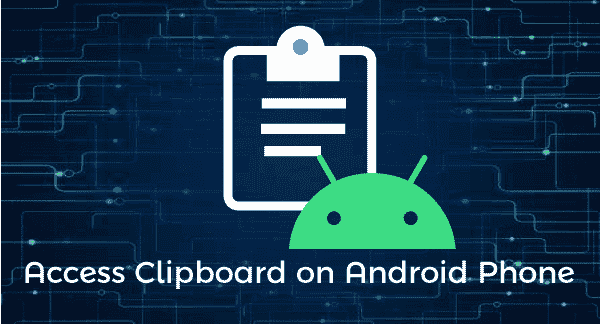
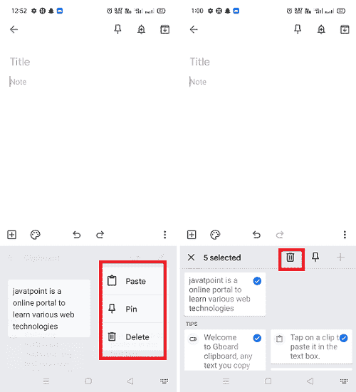

# 安卓手机上的剪贴板在哪里？

> 原文：<https://www.javatpoint.com/where-is-clipboard-on-android-phone>

[在安卓](https://www.javatpoint.com/how-to-copy-and-paste-on-your-android)上复制粘贴的功能是智能手机和平板电脑上的基本功能。但是，如果您想将此功能提升到高级水平，请使用“**剪贴板**功能”。剪贴板是一个有趣的工具，你可能会发现在安卓设备上很有用，剪贴板工具让你看到的不仅仅是你复制的最后一个项目或文本。

一些智能手机，如三星和 LG，内置了剪贴板。你也可以使用一些提供剪贴板功能的第三方安卓键盘应用。

根据安卓设备的版本，剪贴板工具的工作方式有所不同。剪贴板保存您复制的所有内容的历史记录，并允许您从最近的副本中选择并再次粘贴它们。这个功能对于那些做大量复制粘贴活动的安卓用户来说是有好处的。

剪贴板在安卓上的工作方式因你使用的安卓版本而异。最有效和最广泛使用的方法是通过键盘应用程序。内置剪贴板功能的最受欢迎的键盘有 **Gboard** 键盘、 **Swiftkey** 键盘、 **Clipper** 等。

## 粘贴最近复制的项目

1.  首先，通过在 Android 上选择复制文本或链接。
2.  现在，点击文本区域调出键盘。在键盘应用中寻找“**剪贴板**”图标。
3.  点击**剪贴板**图标，会看到你复制的最后几样东西。
4.  请选择您想要粘贴的任何一个。

## 使用键盘剪贴板

谷歌的安卓键盘应用( **Gboard** )是一个很棒的键盘应用，可以访问剪贴板管理器。使用它的剪贴板，你可以看到你复制的所有东西，包括最近和以前的数据。如果你已经在手机上安装了 Gboard，那就太好了；否则，从谷歌 Play 商店下载。一些安卓智能手机附带了预装的 Gboard 应用程序。

确保您已经将 Gboard 键盘应用程序设置并[更改为手机的默认键盘。](https://www.javatpoint.com/how-to-change-keyboard-on-android-phone)

1.  启动任何支持在手机上打字的应用程序(笔记应用程序)。
2.  点击文本字段，调出**面板**
3.  如果键盘屏幕上的字母上方没有显示剪贴板图标，点击**更多**选项(三个点)。
4.  点击**“剪贴板**”进行选择。
    T3】
5.  如果没有打开，点击**打开剪贴板**
6.  点击**剪贴板内容**将其粘贴到当前文本区域。
    T3】

要对剪贴板内容执行更多操作，请点击并按住内容。显示不同的菜单选项(**粘贴、锁定、**和**删除**)。选项**粘贴**允许您粘贴您选择的剪贴板内容，**锁定**选项允许将内容在剪贴板中保留更长时间。最后，**删除**选项将其从剪贴板中清除。

您也可以一键删除所有剪贴板内容，方法是选择全部并点击垃圾箱图标(删除)。

## 使用剪贴器-剪贴板管理器应用程序访问剪贴板

另一个允许你访问安卓剪贴板的应用是 **Clipper -剪贴板管理器**应用。在你的智能手机上从谷歌 Play 商店下载[剪贴画-剪贴板管理器](https://play.google.com/store/apps/details?id=org.rojekti.clipper&hl=en_IN&gl=US)应用程序。这款应用可以免费使用，拥有良好的用户评价，可以将你复制的所有内容保存到一个位置。剪贴板管理器声称保存在其剪贴板中的数据始终是私有的，它们从不与任何人共享。也可以升级到 ***Clipper Plus*** 获得广告免费体验。

1.  **打开 Clipper** -剪贴板管理器应用，在你的主屏幕上看起来像一个蓝白相间的剪贴板。
    T3】
2.  第一次使用的用户需要**设置 Clipper 应用程序**，你可以浏览关于访问指南的快速介绍部分或者跳过这一课。
    T3】
3.  接下来，该应用程序将带您进入“广告”设置页面，您可以在其中选择您喜欢在设备上看到的广告类型。
4.  相应地设置广告首选项:
    *   **显示个性化广告:**如果您不介意 Clipper Manager 访问您的个人数据来显示相关广告，请选择此选项。
    *   **显示非个性化广告**:选择此选项会显示随机广告。
    *   **升级到 Clipper Plus** :点击即可通过付费访问无广告升级到 Clipper Plus。
    *   完成设置后，您就可以访问剪贴板管理器了。
    *   点击屏幕右上角的**菜单**选项(三点)，进入设置，自定义剪贴板界面。
        T3】
5.  **随时打开 Clipper - Clipboard** 应用查看你的剪贴板。
6.  **整理你的剪贴板内容**:在**剪贴板**选项卡上，你所有的新剪报都被保存。**片段**选项卡是存储复制项目的默认位置。
7.  点击剪辑文本旁边的三个点查看更多选项，包括**查看、编辑、删除、锁定、移动**等。
    T3】
8.  点击**移动**选项，将新剪贴板内容从**剪贴板**标签移动到**片段**

## 三星手机上的剪贴板在哪里？

不同的三星智能手机有不同的方式来访问它们上面的剪贴板。下面我们将介绍基于各种三星型号的一些步骤:

### 访问三星 Galaxy S7 Edge 上的剪贴板

1.  启动三星设备上的任何文本编辑器以打开其键盘。
2.  现在，点击*键，然后选择**剪贴板***
**   按住文本区域，调出剪贴板按钮。*   最后，点击剪贴板按钮，查看你复制的各种文本。*

 *### 访问三星 Galaxy S9 Plus 上的剪贴板

要访问 Galaxy S9 Plus 上的剪贴板，请执行以下步骤:

1.  长按设备上的任何文本区域。
2.  一旦菜单选项弹出，点击**剪贴板**按钮。

## 如何在大多数安卓手机上粘贴剪贴板中的内容？

1.  在安卓手机上找到想要复制粘贴的**文字**。
2.  长按**文本**将其选择为副本。
3.  移动光标拖动**组边界**高亮显示所有要复制的文本。
4.  点击弹出菜单中出现的**复制**选项。
5.  轻按并按住要粘贴复制文本的文本区域，直到出现一个菜单选项。
6.  点击**粘贴**选项，你会看到你复制的文字出现在那个地方。

### 如何在三星手机上复制粘贴文字？

要在三星手机上复制并粘贴单个单词或完整段落，请按照以下步骤操作:

1.  点击并按住文本，拖动蓝色标记突出显示所有您想要复制的文本，并从弹出菜单中点击**复制**。要选择全部内容，点击**全选**
2.  现在，点击并按住要粘贴复制文本的文本区域(目标位置)。当菜单出现在屏幕上时，点击**粘贴**。

### 如何清除三星 Galaxy S8 上的剪贴板内容

在安卓设备中，剪贴板工具允许你将你复制的各种数据归档，并选择将哪些数据粘贴到哪里。但是如果您愿意，也可以从设备中删除剪贴板内容。以下是在 Galaxy S8 上清除剪贴板内容的方法:

1.  当剪贴板打开时，点击**垃圾桶图标**(删除)。
2.  **从剪贴板中选择想要清除的文本**或其他内容。
3.  您也可以选择全部，一键删除全部内容。
4.  选择后，点击**完成**。

* * **