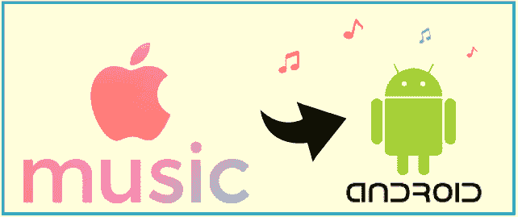
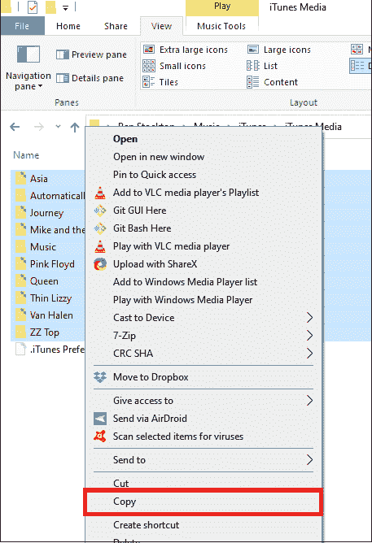
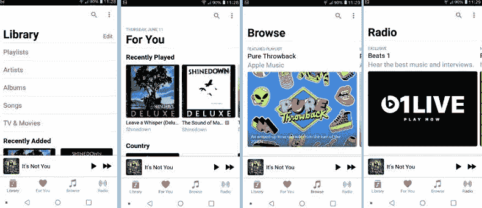

# 如何在安卓系统上获得苹果音乐

> 原文：<https://www.javatpoint.com/how-can-you-get-apple-music-on-android>

每个人都喜欢听音乐，因为它是获得娱乐的最终来源之一。不同的人听音乐有不同的选择，音乐爱好者总是试图找到新的来源来获得他们收藏的音乐。在这方面，我们将知道如何在安卓手机和平板电脑上获得或使用苹果音乐。

如果你认为 Apple Music 只适用于苹果设备，那么事实并非如此。 ***苹果的高级音乐流媒体应用也可以在安卓设备上使用*** ，安卓用户也可以在手机上享受苹果的音乐服务。

如果您的设备运行的是安卓 5.0 或更高版本，在安卓设备上下载苹果音乐不会花费更多时间。本文将讨论如何从谷歌 Play 商店下载和访问安卓系统上的苹果音乐应用程序。

## 在安卓设备上获得苹果音乐应用

要订阅苹果音乐或在安卓智能手机或平板电脑上下载其应用程序，您应该有一台运行安卓 5.0 或更高版本的设备。您还可以在支持安卓应用的 Chromebook 上下载并访问苹果音乐应用。

**以下是在安卓系统上订阅苹果音乐的步骤**

1.  启动 Play Store 应用，搜索**“苹果音乐**”。
2.  根据您的搜索结果，点击苹果音乐应用程序**并将其安装在您的手机和平板电脑上。
    T3】**
3.  安装后，在安卓智能手机或平板电脑上打开该应用。
4.  第一次打开会看到一条消息“*欢迎来到苹果音乐*”。如果您不能点击屏幕上的**立即收听**按钮。
5.  **使用您现有的**苹果 ID** 登录**(如果您有)或点击**创建新的苹果 ID** 来创建它。
6.  您也可以选择 ***免费试用*** 优惠，最长三个月。
7.  选择您喜欢的**订阅类型**:
    *   您可以将其用作 ***学生*** 订阅计划，对此您需要与您的大学招生部门核实。
    *   认购 ***个人***
    *   订阅一个包含六人的 ***家庭*** 计划。
    *   订阅成为 ***年度***
8.  确认您的支付模式和账单信息。
9.  同意条款和条件并点击**加入苹果音乐**即可在您的安卓手机或平板电脑上欣赏苹果音乐。

## 如果你已经订阅了苹果音乐

如果你已经是苹果音乐的订阅者，你不需要创建一个新的苹果标识就可以在安卓系统上使用。

1.  在你的安卓设备上，[安装来自谷歌 Play 商店的苹果音乐应用](https://play.google.com/store/apps/details?id=com.apple.android.music)。
2.  **在你的安卓设备上启动**苹果音乐应用。
3.  如果有三个月的免费试用版，可以使用(如果你愿意)。点击菜单选项**并登录**。
4.  与您在 Apple Music 中使用的相同的现有 **Apple ID 和密码**相关联。

## 在安卓系统上管理您的苹果音乐订阅

如果您不想在您的安卓系统上继续使用苹果音乐，您可以随时更改或取消其订阅。要在您的安卓设备上更改或**取消**其订阅服务，请按照以下步骤操作:

1.  在你的安卓手机上打开**苹果音乐**应用。
2.  点击屏幕右上角的**菜单**选项，然后点击**账户设置**。
3.  点击**管理会员资格**
4.  根据您的计划，您可以选择不同的选项。可以选择**更改**其计划或者**完全取消**其计划。
    *   您可以**将您的任何计划更改为个人订阅、家庭订阅计划或学生订阅。**
    *   关闭自动续订，在当前计费计划结束时自动**取消**您的订阅计划。

## 将音乐从 iTunes 传输到安卓系统

还有一个替代选项，你可以通过它在你的安卓设备上获得苹果音乐。您可以选择不同的方法将 iTunes 音乐传输到您的安卓手机。下面列出了一些方法:

*   手动将您的 iTunes 音乐复制到您的安卓设备。
*   用苹果音乐在安卓上流式播放 iTunes。
*   将 iTunes 与 YouTube 音乐同步。
*   下载并使用任何第三方应用程序将您的 iTunes 歌曲传输到安卓系统。

### 手动将 iTunes 音乐复制到您的安卓设备上

将 iTunes 歌曲传输到安卓设备的最简单方法是手动复制并粘贴它们。你可以用你的电脑在安卓系统上传输 iTunes 音乐。以下是将 iTunes 音乐传输到安卓的步骤:

1.  在计算机上的任何位置创建一个新文件夹。
2.  默认情况下，由于 iTunes 将音乐文件存储在位置**音乐> iTunes > iTunes Media** 上。导航到此位置，找到您想要复制和粘贴的歌曲。
3.  请选择一个或多个需要传输的音乐文件， ***右键单击其上的*** ，选择**复制**或按 **Ctrl + C** 。
    
4.  再次访问您新创建的文件夹，在空间中右键单击，选择**粘贴**
5.  现在，使用 USB 电缆将您的 Android 设备连接到您的计算机。可能有选项来调整 USB 和电话设置，并将其设置为通过 USB 传输文件。
6.  导航到您从 iTunes 粘贴音乐文件的新创建的文件夹。现在，选择您想要传输到您的安卓系统的所有音乐文件，右键单击并选择**复制**或按 **Ctrl + C** 。
7.  在电脑上访问安卓设备的音乐文件夹，右键点击任意位置，点击**粘贴**。
    T3】
8.  现在，iTunes 音乐文件被传输到您的安卓设备。

如果您想要复制单个音乐文件而不是完整的文件夹，这种方法可能会令人厌烦。另外，请记住 iTunes 使用“ **.m4a** ”文件来播放音乐，这意味着您应该有一个兼容的音乐播放器来播放它。你也可以在转移到你的安卓手机之前转换文件扩展名。

## 一款与 iOS 惊人相似的安卓应用。

除了订阅之外，安卓上的苹果音乐给人的体验几乎和你在 iOS 上使用的一样。应用程序屏幕( ***【库】【为你浏览】*** 和 ***单选*** 选项卡)看起来与其 iOS 应用程序几乎相似。甚至浏览新音乐来下载和播放也像在你的 iOS 设备上一样简单和完美。

在 Apple Music 上，您可以根据艺人名称或歌曲名称搜索歌曲，甚至可以浏览您喜欢的流派。它的“**For You”**标签会根据你的收听历史推荐更多歌曲。Apple Music 还允许您将喜爱的音乐下载到设备上，并选择是将其存储在内存中还是 SD 卡中。

## 在安卓系统上使用苹果音乐的经验

安卓用户喜欢在自己的安卓系统上使用 Apple Music，整体体验令人愉悦。用户很容易从苹果庞大的图书馆中找到自己感兴趣的音乐。此外，他们可以创建自己的播放列表，并根据自己喜欢的曲调、艺术家和流派创建广播电台。

## 如何在所有其他支持的设备上获得 Apple Music 服务

一旦您订阅了 Apple Music，您就可以使用相同的 Apple ID 在其他设备上访问它的服务。按照以下步骤在各种设备上访问苹果音乐:

### 在您的 iPhone、iPad 或 iPod touch 上访问苹果音乐

1.  在您的设备(您拥有 iPhone、iPad 或 iPod 的设备)上打开 Apple Music 应用程序，然后轻按“立即收听”选项。
2.  在屏幕的右上角，点击帐户图标。
3.  使用您的苹果标识和密码登录。

### 在苹果电脑或个人电脑上访问苹果音乐

1.  在您的苹果电脑或电脑上打开苹果音乐或 iTunes 门户。
2.  在屏幕顶部的菜单栏中，单击帐户，然后登录。
3.  使用您的苹果标识和密码登录。

### 在苹果电视上访问苹果音乐

1.  在苹果电视上，打开“设置”应用程序，点击“用户和帐户”。
2.  使用您的苹果凭据(身份证和密码)登录。

* * *