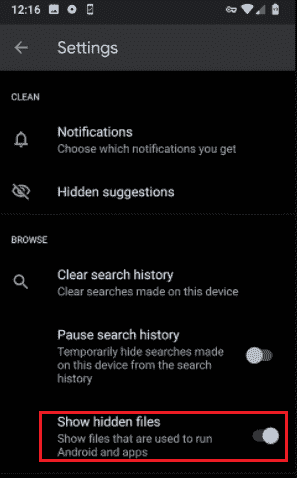

# 如何在安卓上查找下载

> 原文：<https://www.javatpoint.com/how-to-find-downloads-on-android>

我们都喜欢在网络和社交媒体平台上下载任何我们感兴趣的东西，比如图像、歌曲、视频等。下载文件后，人们很难在安卓系统上找到它们。每部安卓手机都有一个独特的应用程序来管理文档，但大部分都是一样的。

安卓设备也像其他操作系统一样有一个文件系统来管理它们的文件。每个安卓手机和平板电脑都预装了一个“**文件管理器”** app(在某些设备中，它被称为“**文件”**或“**我的文件”**)。

如果你不喜欢你预装的文件管理器应用的结构，你可以选择*从谷歌 Play 商店下载任何第三方文件管理器应用*。

## 在安卓上找到你下载的文件

在安卓手机和平板电脑上查找下载的文件相当容易。根据您使用的设备型号(和操作系统版本)，文件类型的位置可能会有所不同。 ***【文件管理器】*** (或 ***【文件】*** ) app 包含不同的文件夹，分别存储不同的文件。您还可以在其中找到一个“下载”文件夹。无论你在安卓设备上从网上下载什么，默认情况下，它们都在“**下载”**文件夹中。

在安卓上有几种方法可以找到下载(照片、视频、音乐、文档)文件。其中一些列举如下:

1.  通过通知面板快速访问
2.  使用预装的文件管理器应用程序查找下载的文件
3.  使用谷歌浏览器查找你的下载
4.  使用第三方文件管理器应用
5.  使用您的电脑查找安卓下载

### 通过通知面板快速访问

在安卓上访问下载文件最简单的方法是通过设备通知面板。无论你在安卓设备上下载什么，你都会在通知面板上看到一条通知消息。

1.  等待完成下载。
2.  点击**下载通知**图标，查看并打开您的下载文件。
    T3】

### 使用预装的文件管理器应用程序查找下载的文件

你的安卓手机或平板电脑应该有一个预装的文件管理器应用程序来访问文件系统。要使用默认的文件管理器应用程序在安卓系统上找到您下载的文件，请执行以下步骤:

1.  导航到设备上的应用抽屉部分。通常可以通过从屏幕底部向上滑动或点击主屏幕底部的几个点按钮来执行。
2.  查找**文件管理器**(或**文件**，或**我的文件**或**下载**因设备型号而异)应用程序并点击它。
3.  在*文件管理器*应用屏幕下，转到**内存条**，你会看到一个**下载**(或**下载**)文件夹。单击下载文件夹访问您下载的文件。
    

您下载的文件会在顶部列出最新的文件。但是，您可以通过点击右上角的**更多**选项(三个点)和**编辑**根据它们的名称对它们进行排序。还有其他选项，包括共享、编辑、删除和排序。

**检查你的应用设置**

几个应用程序都有自己的下载区。默认情况下，他们不会将下载的文件保存到设备的下载文件夹中，而是将文件保存到应用程序的下载文件夹中。

例如，你手机的 WhatsApp 应用程序下载各种文件，并将它们存储在自己的下载部分。您将在 WhatsApp Image 中找到一个下载的图像，并在 WhatsApp Videos 中找到下载的视频。

### 使用谷歌浏览器查找你的下载

如果您使用谷歌浏览器下载您的媒体或其他文件，您可以通过浏览器的菜单直接访问它们。以下是访问通过 Chrome 下载的文件的步骤:

1.  在安卓手机上打开你的 **Chrome 浏览器**。
    T3】
2.  点击屏幕右上角的**更多**(三个点)选项。
    T3】
3.  点击**下载**部分，查看您从网络下载的文件。如果您有几个下载文件，您可以使用搜索图标并键入它们的名称来定位它。
    T3】

### 使用第三方文件管理应用程序

该设备预装的文件管理器应用程序运行良好，但许多人喜欢体验新事物。人们喜欢使用第三方文件管理应用程序来访问他们的文件系统。甚至一些第三方文件管理器提供了更多访问设备文件夹结构的选项，包括**下载**。

一些受欢迎和信任的文件管理器应用是“谷歌的文件”、*谷歌像素的*、**文件**应用和三星 Galaxy 手机的**我的文件**。您可以从谷歌 Play 商店安装您选择的任何文件管理器应用程序来访问设备文件目录。

在上面列出的每个文件管理器应用程序中，您会在名为“ **Downloads** ”的文件夹中找到您下载的数据。要在安卓设备上查看下载的文件，请完成以下讨论步骤:

**使用*谷歌像素的文件***

1.  打开你的文件管理应用**文件**。
2.  点击屏幕左上角的**菜单**图标。
    T3】
3.  菜单会打开导航选项列表。从选项列表中，选择“**下载**”。
    T3】

在“下载”文件夹下，您会找到所有下载的文件。

**使用谷歌的*文件***

1.  打开你的**谷歌文件**文件管理器应用。
2.  点击**浏览**标签。
    T3】
3.  点击**下载**部分，找到你所有下载的数据。
    T3】

在“下载”文件夹下，您会找到所有下载的文件。

### 使用您的电脑查找安卓下载

如果你发现很难在小屏幕上访问你的安卓下载，你也可以使用你的电脑来定位你的安卓下载。要使用 Windows 电脑查找您的安卓下载，请按照以下步骤操作:

1.  **使用 USB 线将**安卓设备与电脑连接。当你连接两个设备时，你可能会在你的安卓系统上收到一个通知，要求你 ***选择一个你想要执行的动作*** 。
2.  选择一个**文件传输**
3.  点击窗口资源管理器屏幕上的**电话**选项。导航到**内存条**(或者根据你的下载设置选择 SD 卡)，然后**下载**在这里你可以找到你在安卓上下载的东西。

## 如何在安卓上找到 YouTube 下载

YouTube 是一个流行的视频内容平台。人们喜欢访问和流式传输视频内容。YouTube 还方便你下载视频供离线使用。由于 YouTube 视频存储在**中。exo** 格式，你不能在其他视频播放器应用上播放。您只能在 YouTube 应用程序上离线播放它们。

要在安卓系统上查找 YouTube 下载内容，请导航至安卓手机上的以下位置:

1.  打开你的 ***文件管理器*** app，进入**内存条**。
2.  点击**安卓**文件夹，然后点击**数据**。
3.  在 ***数据*** 文件夹下，转到**。
    **
***   现在，点击**文件>离线**和**流**。
    *   在这里你可以在**找到你的 YouTube 下载。exo**
    **

 **但是请记住，您不能在其他视频播放器应用程序上播放它们。您只能在 YouTube 应用程序上离线播放它们。要离线播放下载的 YouTube 视频:

1.  **打开**你的 YouTube 应用。
2.  点击应用按钮上的**库**部分。
3.  在*库*部分，点击**下载**在这里你会看到你要播放的下载内容。
4.  点击任何视频内容，在 YouTube 应用程序上离线播放。

## 如何在安卓上找到网飞下载

你从网飞下载的内容不会持续很长时间。这取决于个人内容的许可。一些下载的内容在 48 小时内过期无法观看；其他人会在您的**下载**屏幕上显示离到期日期还剩不到七天。

假设您已经在安卓手机上使用网飞应用程序下载了视频，并且很想知道这些视频存储在手机的内部存储器中的什么位置。默认情况下，网飞下载是隐藏的，但是您可以使用文件管理器应用程序访问它们。

要了解网飞下载位置，请按照以下步骤操作:

1.  启动你的**文件应用**，进入**设置**，然后**显示隐藏文件**。如果您正在使用任何其他文件管理器应用程序，您还需要找到等效的设置。
    
2.  访问地点**内部存储>安卓>数据>网飞.媒体客户端>文件>下载>。**的
3.  这里你会看到一个文件夹，名字是八位数的随机数。打开它，找到你的网飞下载的电影。
    

网飞的内容是以 NFV 格式下载的，而且是加密的。您不能在图库应用程序中传输它们，也不能在任何其他媒体播放器应用程序中观看它们。

## 如何在安卓上找到 Spotify 下载

Spotify 是一个流行的音乐流媒体应用程序，允许你在线和离线(下载后)听音乐。该应用的高级用户可以保存歌曲供离线播放。离线列出您最喜欢的歌曲可以保存您每月或每天的数据使用情况，当然，您可以随时随地播放它们。不幸的是，Spotify 不允许直接访问您本地下载的音乐。要在安卓上找到 Spotify 下载，请按照以下步骤操作:

1.  在你的安卓设备上启动你的 **Spotify** 应用。
2.  点击屏幕底部的“**您的库**”部分。
3.  您的库歌曲被分类为“播放列表”、“艺术家”和“专辑”。
4.  要按专辑对下载音乐进行排序，请点击“**专辑**”。
5.  在屏幕底部，您将找到过滤器选项，并从它们中选择**下载**。
    T3】

在这里你可以在安卓上找到从 Spotify 下载的专辑音乐。

* * ***