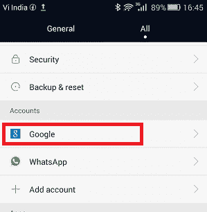
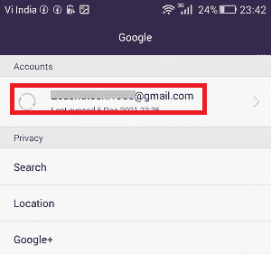
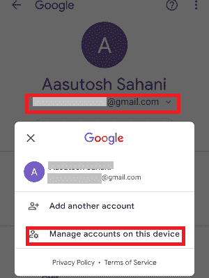
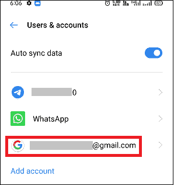
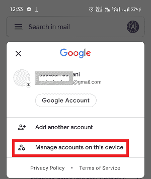

# 如何在安卓系统上注销谷歌

> 原文：<https://www.javatpoint.com/how-to-sign-out-of-google-on-android>

你可能有任何理由想从你的安卓手机或平板电脑上注销你的谷歌账户。您可能正在更换现有的安卓手机，或者您可能会丢失它，并希望从您的谷歌帐户注销。在本文中，您将了解不同的方法(使用设备本身和远程) ***在您的安卓智能手机*** 上逐步注销您的谷歌帐户。

请记住，您设备的谷歌帐户也与您手机中的其他谷歌应用程序相关联，如 YouTube、谷歌地图等。*在你的安卓手机上注销一个谷歌账户，也可以从其他谷歌产品上注销。*

## 方法一:在安卓手机上注销谷歌账号

从安卓智能手机或平板电脑上注销(删除)谷歌账户的最简单方法是使用设备的设置。不同的安卓设备型号或安卓操作系统版本在步骤上可能略有不同，但基本相同。以下是您在安卓设备上应该遵循的步骤:

1.  打开安卓设备上的“**设置”**应用。
2.  导航至“**账户”**部分，点击
    
3.  点击您的 **Gmail 地址。**
    
4.  最后，点击屏幕下方的“**移除账号”**，在你的安卓系统上注销谷歌。
    T3】

有些安卓设备是不同的设置，从智能手机上注销谷歌账户。如果以上步骤不适用于您的安卓设备，您可以选择以下步骤注销:

1.  打开安卓设备上的“**设置”**应用。
2.  向下滚动至**谷歌**并点击。
    T3】
3.  点击您的 **Gmail 地址**，从弹出的屏幕中，点击本设备
    上的**管理账户**
4.  在下一个屏幕上，再次点击您的 **Gmail 地址**
    
5.  点击屏幕右上角的**菜单**选项(两个点)。
6.  从选项列表中，点击**删除账户**。
    T3】

## 方法 2:使用 Gmail 应用程序在安卓系统上注销谷歌账户

另一种从安卓手机上的谷歌账户注销的方法是使用 Gmail 应用程序。按照下面给出的步骤从 Gmail 应用程序中注销。

1.  在你的安卓设备上启动 **Gmail 应用**。
2.  点击邮件主屏幕右上角的**个人资料图标**。
    T3】
3.  点击本设备
    上的**管理账户**
4.  点击您希望注销的 **Gmail 帐户**。
    T3】
5.  点击屏幕右上角的**菜单**选项(两个点)。
6.  从选项列表中，点击**删除账户**。
    T3】

从你的安卓手机上删除你的谷歌账户并不意味着它会永久删除你的谷歌账户。再次登录后，您仍然可以在其他设备或同一设备上使用您的相同帐户。

## 方法 3:从谷歌仪表板(远程)注销安卓系统上的谷歌账户

如果你的安卓手机在任何地方被盗或丢失，而你仍然连接并登录了它。您可能希望从那里注销以保护您的数据安全。要从任何设备远程注销谷歌，请执行以下步骤:

1.  使用您的任何设备访问“**”google.com。**
***   使用登录安卓设备时使用的相同谷歌凭据登录。*   进入网站后，点击**安全**部分。
    T3】*   **选择您希望退出谷歌的设备**。
    T3】*   之后，点击所选设备旁边的**三个垂直点**菜单选项。*   最后，从下拉选项中点击**退出**。
    T3】**

 **## 在桌面浏览器上注销谷歌帐户

桌面浏览器是“始终连接”谷歌的另一个资源。如果你也想在桌面浏览器上从谷歌注销，你需要打开它(你的 Gmail 账户)。

1.  在浏览器上访问您的 **Gmail 账户**后，点击屏幕右上角的**账户图标**。
2.  从各种账户选项列表中，点击“**注销所有账户**”。

就是这样，从浏览器注销 Gmail 账户后，你会发现需要登录凭证才能打开其他 Google 服务，比如“*Google Drive”*或者“*Google Docs”*。

* * ***