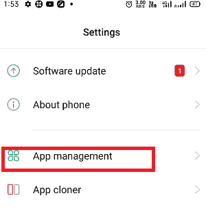
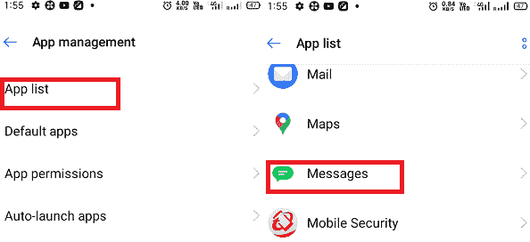
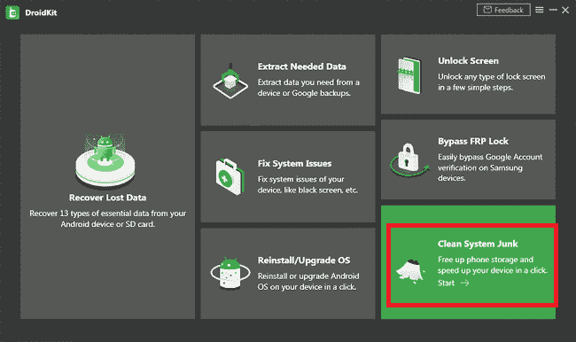
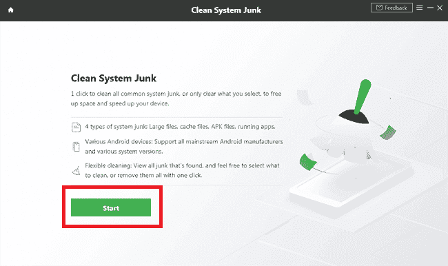
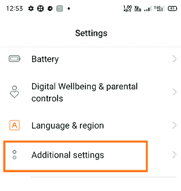
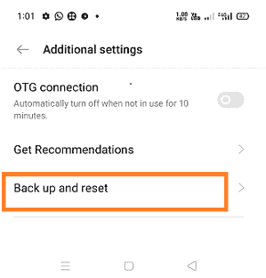

# 为什么我的短信不会在我的安卓系统上发送？

> 原文：<https://www.javatpoint.com/why-wont-my-text-messages-send-on-my-android>

短信是最古老和最基本的交流方式之一。然而，社交媒体平台的快速增长和使用在最近的衰退中，短信的使用已经下降。但这并不意味着短信不再被使用，它仍然是一种可靠、安全的人与人之间的验证和交流方式。

有时会出现问题，我们无法在安卓手机上发送/接收短信。*如果你的安卓智能手机在发送短信时遇到了麻烦，那说明设备的某个核心功能运行不正常，需要尽快修复*。

## 为什么我不能在我的安卓系统上发送短信？

可能有一个或多个问题限制您在 Android 上发送短信。下面给出了一些限制您发送短信的常见问题:

*   设备中没有信号
*   SIM 卡问题
*   播放时间不足(或超时)
*   短信应用的缓存和数据问题
*   默认设置可能会更改
*   蜂窝网络可能不允许在该特定时间发送或接收文本消息
*   网络连接
*   您可以在手机上启用飞行模式
*   无效的消息中心设置(SMSC)
*   等等。

## 你应该在初始阶段检查的基本要点

*   检查您的邮件长度；您可能正在尝试发送长消息，这需要更多的时间来传递并超时。
*   检查您的蜂窝服务提供商关于网络问题的状态。
*   确认收件人的电话号码正确有效。
*   确保您已将 SIM 卡正确插入插槽。
*   重启手机刷新应用。它可能在运行一个无限循环。

## 当你不能用安卓手机发短信时，你可以试试

您可以尝试以下一个或多个选项来启动您的邮件服务或对其进行故障排除。

*   检查阻止的号码
*   重启你的手机
*   检查您的 SIM 卡
*   将邮件设置重置为默认值
*   清除“消息”应用程序的缓存
*   强制停止消息应用程序
*   检查更新
*   清除手机上的系统垃圾
*   工厂重置您的安卓设备

### 检查被阻止的号码

如果您无法向某人发送短信，他们的电话号码可能会被您的手机屏蔽。不同的安卓手机型号和不同的安卓操作系统版本有不同的方法来检查被阻止的号码及其解锁过程。要检查被阻止的号码:

1.  启动设备的**消息**应用，进入**菜单>骚扰过滤器。**
2.  现在，点击**黑名单**选项，点击您想要解除阻止的号码。如果您想取消阻止之前阻止的所有号码，请点击
3.  点击**删除**按钮确认解锁号；从阻止列表中删除该号码。

也有可能收件人也阻止了你，这意味着你可以从你这边发送短信，但收件人的设备无法接收你的消息。此外，接收者可能没有回复你，给你的印象是你的信息没有被传递到那里。在这种情况下，您可以激活 ***【阅读回执】*** 确认收件人已阅读您的留言。

1.  打开你的**消息**应用，点击**菜单**(三点)选项。
2.  从选项列表中，点击**设置>更多设置>短信**。
3.  启用**发送报告**切换按钮，确认您的消息是否已发送。
    T3】

### 重启你的手机

多次重启手机也能解决几个问题。你也可以尝试这些技巧来解决安卓手机不发送消息的原因。

重启手机时，不要选择标准方法，即按住电源按钮几秒钟，然后点击“关机”。按住电源按钮并调低音量，直到手机强制开机，重新启动手机。

这种关机方式会重置手机并修复任何问题。

### 检查您的 SIM 卡

在你去修理厂之前，还有一件事你可以试着解决你的问题。检查并确保您的 SIM 卡已正确插入 SIM 卡槽。您可以从手机中弹出您的 SIM 卡，并将其正确地重新插入插槽；这可能会解决你的问题。

### 将邮件设置重置为默认值

如果您使用的手机具有带两个 SIM 卡的双 SIM 卡功能，则在问题出现之前，您已经交换了 SIM 卡。那么这可能是一个机会，你的手机的默认短信设置得到改变。更改短信设置成为服务提供商发送短信的挑战。这是因为每个运营商服务提供商都有不同或独特的偏好来正确发送短信。将您的消息重置为默认值可能会解决您的问题:

1.  在你的安卓手机上启动**消息**应用，点击**菜单>设置**。
2.  点击**重置**选项，将所有消息功能设置为默认。
3.  现在，**重启**你的安卓手机设备，再次尝试发送短信。

### 清除“消息”应用程序的缓存

清除应用的缓存也是修复一些安卓问题的常用方法。因此，许多技术人员也建议清除您的 Messages 应用程序的缓存数据。以下是清除手机消息应用程序缓存数据的步骤:

1.  打开**设置** app，进入 **App 管理**。
    
2.  点击**应用列表**，导航至您的消息应用(**消息**)。
    
3.  点击**存储**
4.  最后，点击**清除缓存**。
    T3】
5.  想想也可以清除 app 数据。为此，点击清除数据，然后通过点击**确定**确认您的动作

清除缓存数据后，重启安卓手机，然后再次尝试重新发送消息。

### 强制停止消息应用程序。

有时不向他人发送短信的原因是短信应用程序本身。在这种情况下，您可以通过强制停止并重新启动来检查应用程序。要强制停止您的消息应用程序，请执行以下步骤:

1.  打开**设置**应用，导航至**应用管理**。
    
2.  点击**应用列表**，导航至您的消息应用(**消息**)。
    
3.  点击**强制停止**
4.  现在回到主屏幕，重新启动您的设备。

### 清除手机中的系统垃圾

如果清除缓存数据并重启安卓设备不能解决不发送短信的问题，你可能还需要清除安卓设备的系统垃圾。几个第三方安卓应用帮助[清除系统垃圾](https://www.javatpoint.com/device-cleaner-and-booster-for-android)并释放手机存储空间。

[DroidKit](https://www.imobie.com/droidkit/) 是安卓用户中值得信赖且广泛使用的清除系统 junks 文件的桌面应用。您可以通过单击清除所有基本系统垃圾或选定的系统垃圾。

1.  在您的设备上下载并安装 **DroidKit** 应用程序。
2.  在电脑上打开，点击**清除系统垃圾**
    
3.  在*清洁系统垃圾*页面，点击**启动**按钮继续清洁过程。
    
4.  通过 USB 电缆将您的安卓手机与 DroidKit 应用程序连接起来。点击**开始**按钮扫描你的安卓设备。
    T3】
5.  查看扫描结果，选择想要清理的垃圾文件，然后点击**立即清除**按钮开始清理过程。
    T3】

### 检查更新

如果设备重置对您不起作用，您可以检查是否有任何更新。打开设置应用寻找**软件更新**。点击“*软件更新*”获取任何可能有助于您的消息应用程序再次正常工作的重要更新。

### 工厂重置你的安卓手机。

如果以上所有方法都无法解决您的“不发送消息”问题，那么您可以尝试通过将手机重置为默认设置来修复该问题。对您的手机执行[工厂重置](https://www.javatpoint.com/how-to-reset-android-phone)会将其恢复到全新的初始设置状态。但是请记住，对你的安卓手机执行 ***工厂重置将会删除你手机中的所有数据*** 。

1.  启动你的设备**设置**
2.  寻找**附加设置**。
3.  通过选择扩展**附加**(高级)**设置**的选项。
    
4.  转至**备份并重置。**
    
5.  现在，点击**清除所有数据(出厂复位)**。
    T3】
6.  点击**清除所有数据**。
    T3】
7.  如果出现提示，请输入您的个人识别码。
8.  选择**清除所有数据**，让手机完成任务。

* * *