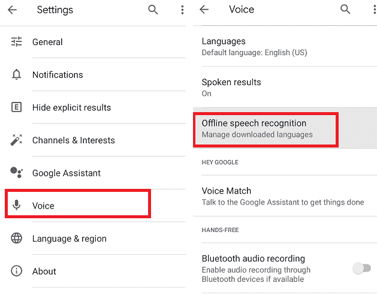
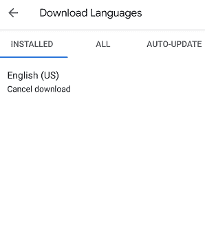
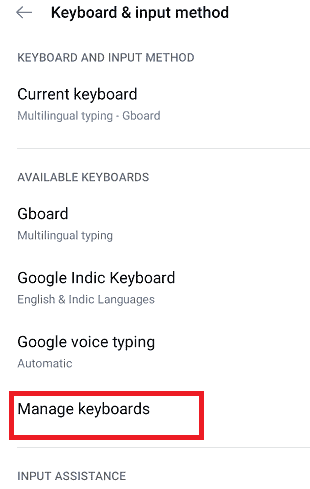
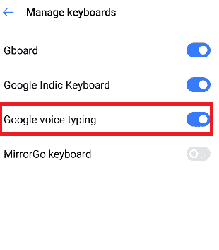
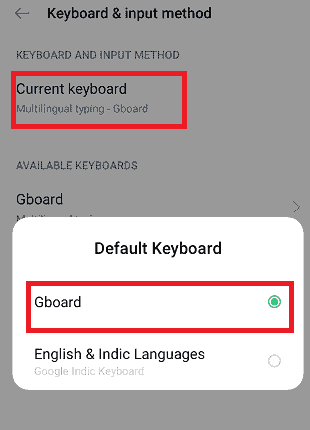
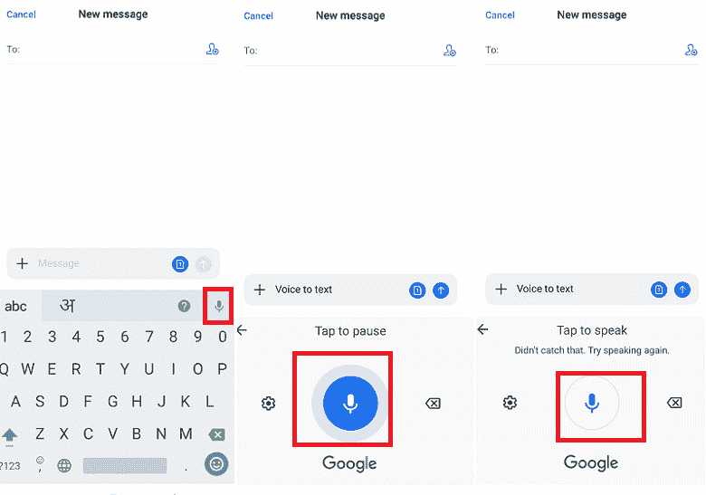

# 如何在安卓系统上激活语音转文本

> 原文：<https://www.javatpoint.com/how-do-i-activate-voice-to-text-on-android>

如果你更喜欢在安卓手机上进行大量的文本聊天或者做任何类似的工作，你必须输入长文本。那么你一定很清楚，有时候手机的键盘不能正常工作，变得很难工作。此外，有时在手机上输入文本会很痛苦，尤其是如果你正在输入一大段文本，而你的数字对于小键盘字母来说可能太大了。

在上述任何一种情况下，在你的安卓手机上启用**语音转文本**(或**语音转文本**)可以帮助你，并节省大量手动键入所有内容的工作。语音转文本是一项允许您说话的功能，智能手机会将您的文字转换为文本。此外，语音转文本功能比手动键入文本更快，为您节省了宝贵的时间。

## 语音输入的特点

*   安卓 OS 10 和安卓 11 默认开启语音输入。
*   语音输入使免提键盘能够使用位于屏幕键盘上的麦克风键入文本。
*   在某些安卓设备上，您无法将其关闭。

## 安卓上如何激活语音转文字？

一般来说，大多数安卓手机都已经启用了语音转文本功能。如果不是，您可以在设备上轻松激活它。以下是在安卓手机上激活语音转文本功能的步骤:

1.  在你的安卓智能手机上打开谷歌应用。
2.  点击屏幕右下角的**“更多”**选项。
    T3】
3.  现在点击**设置**
    
4.  进入设置界面后，点击**语音**，然后点击**离线语音识别**。
    

此外，确保您已经下载了您所说的语言。当您说话时，设备上设置的语言将被识别用于语音到文本的转换。

语音转文本功能可能由三星智能手机中的三星语音输入本身提供。要激活三星手机中的语音输入，请按照以下步骤操作:

1.  转到设备的**设置**，然后转到**通用管理**。
2.  点击**语言，输入**
3.  现在，点击**“屏幕键盘**”
4.  最后，点击**三星语音输入**；一旦你在这里，你可以改变你的键盘和语音输入的默认语言。

语音转文本功能适用于多种语言，包括英语、德语等。但是请记住，您所说的语言已正确安装或设置在您的设备上。语音到文本的转换比键盘更容易使用。

## 使用设备键盘

还有一个替代选项可以使用安卓设备的键盘管理语音输入。以下是使用安卓手机键盘设置语音输入的步骤:

1.  在您的设备上，轻按“设置”，然后轻按“语言和输入”或“语言和键盘”。不同版本的操作系统设备有不同的设置，但它们大多相同。
    *   对于奥利奥操作系统，访问**设置>系统>语言&键盘，输入&手势**。
    *   有奥利奥操作系统的三星设备，进入**设置>通用管理>语言输入**。
    *   对于 Pie OS，访问设备:**设置>系统>语言&键盘，输入&手势**。
    *   对于安卓 10 (Q)，导航至**设置>语言&区域(附加设置)>键盘&输入法**。
        T3】
2.  点击“虚拟键盘”或“屏幕键盘”
3.  在某些设备中，它有“**管理键盘**”，然后点击任何合适的选项:
    

    *   启用**谷歌语音输入**打开或关闭。
    *   点击 **<设备名称>键盘**，点击**谷歌语音输入**切换按钮启用。
        

## 使用谷歌键盘/键盘

如果你的安卓设备没有上述功能(设备键盘)，你也可以使用**谷歌键盘(Gboard)** 来管理你的语音输入。步骤如下:

1.  在您的设备上，点击**设置**并点击“语言&输入”或“语言&键盘”。不同操作系统版本的设备有不同的设置，但大多是相同的。
    *   对于奥利奥操作系统，访问**设置>系统>语言&键盘，输入&手势**。
    *   有奥利奥操作系统的三星设备，进入**设置>通用管理>语言输入**。
    *   对于 Pie OS，访问设备:**设置>系统>语言&键盘，输入&手势**。
    *   对于安卓 10 (Q)，导航至**设置>语言&区域(附加设置)>键盘&输入法**。
2.  从键盘选项中，点击“**当前键盘**，选择**谷歌键盘/键盘**。
    
    在大多数安卓设备上，谷歌的 Gboard 都是预装的。如果你没有，从谷歌 Play 商店下载并安装它。
3.  点击**偏好设置**。
4.  打开**语音输入键**。

## 如何在安卓手机上用语音发短信

现代的文本听写非常好用，你可以使用任何允许文本输入的应用程序将语音转换为文本。要在安卓手机中使用语音转文本功能，请打开任何支持文本输入的应用程序(如消息应用程序)，并按照以下步骤操作:

1.  **打开**消息应用，点击文本区域，启用设备键盘。
2.  一旦键盘弹出，你会看到一个**麦克风图标。点击**麦克风图标**上的**，启动语音转文本功能，通过语音输入文本。
3.  如果您想在语音输入之间休息一会儿，请轻按麦克风图标。再次点击它将重新启动语音转文本功能来输入文本。

在设备中使用语音转文本功能时，您应该对听写有适当的控制。无论何时需要，你都必须关心速度和标点符号。与谷歌软件相关的一些最常见的语音命令有:

*   时期
*   逗号
*   问号
*   感叹号
*   新行
*   新段落

如果你说完了话，点击麦克风图标停止语音识别。如果语音转文本功能听到错误的单词，您可以通过手动返回来更改它。你必须发出语音命令，用一个词替换另一个词。

## 如何在安卓设备上提高语音到文本的转换

虽然语音到文本功能本身工作得更好，但是您可以通过记住一些要点来做到更加可靠。

*   **慢点说**:如果你说得很快，可能你的设备听不到你说的每一句话，所以建议慢点说。
*   **说清楚**:让你的话比平时说得更清楚，这样你想说的话就不会出错。你不必像机器人一样说话，因为引擎是为理解自然语言而设计的。
*   **小心背景噪音**:如果你在一个拥挤嘈杂的区域，试图说话，可能会有发动机无法正常工作的可能，因为它无法将你的声音与周围的噪音区分开来。
*   **利用用户词典**:访问你的设备**设置**然后**语言&输入>高级>个人词典**在这里你可以在语音中添加一些你想要的单词到文本中。

安卓上的语音转文本功能非常适合搜索关键词、键入少量文本、发送消息和撰写快速备忘录。

## 结合谷歌助手和语音转文本，实现免提语音输入

要提供文本输入，您必须按下按钮来启用语音到文本功能。但是谷歌正在研究免提语音输入，谷歌助手将处理这项任务。该功能目前正在特定的谷歌像素设备上进行测试，但在您阅读本文时，它可能会在 Gboard 应用程序中对所有人开放。

目前，您正在使用谷歌助手执行此任务，例如使用谷歌助手向联系人列表中的某人发送消息。

* * *