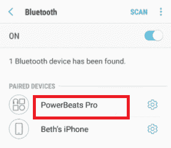
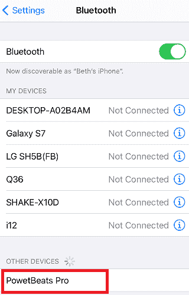
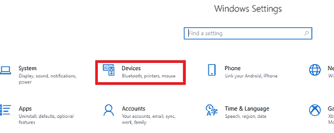
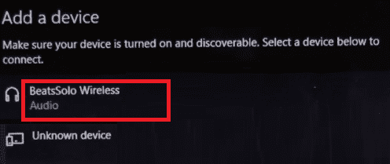
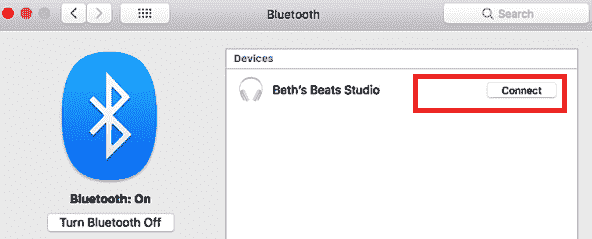
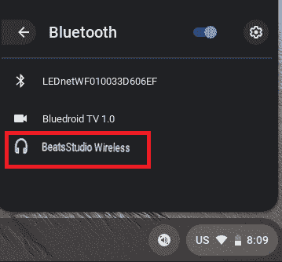

# 如何将 Beats Wireless 连接到安卓、iPhone、Windows、Mac

> 原文：<https://www.javatpoint.com/how-to-connect-beats-wireless-to-android-iphone-windows-mac>

Beats Wireless 系列耳机让长长的纠结电线有点过时。如果您想将 Beats Wireless 与安卓或任何其他设备(如 iPhone、Mac、Windows PC)配对，那么您可以轻松做到这一点。此外，您可以将 Beats 无线耳机连接到任何其他具有内置蓝牙功能的设备。

本文将解释 ***如何将 Beats 无线耳机连接到不同的设备，包括安卓、iOS 和 Windows*** ，只需几步。使用 Beats 无线连接您的安卓和其他设备的过程主要包括三个步骤。*第一步，你需要打开耳机。接下来，您必须打开设备的蓝牙。最后一步是连接两个设备。*

### 开始之前

在开始将无线 Beats 与安卓设备连接之前，您应该了解 Beat 无线耳机的一些系列。Beats 耳机提供多种选项，包括:

*   电源功率
*   击败索罗
*   魔声录音师
*   节拍 X

将上面提到的任何一个 Beats 与您的设备连接的关键点是知道设备的电源按钮位置。如果您不确定电源按钮的位置，请使用 Beats 耳机查看手册指南。

在将 Beats 耳机连接到安卓或其他蓝牙设备之前，您必须确保您的设备可被发现。您可以通过长按 Beats 设备的电源按钮几秒钟来实现这一点。启用蓝牙后，指示灯会闪烁，表示设备已准备好连接。

## 将 Beats 无线连接到安卓设备

将 Beats 无线耳机连接到安卓并没有那么复杂。一旦您使您的设备可被发现，就可以轻松地将 Beats 与安卓或其他蓝牙设备配对。以下是 Beats 无线耳机与安卓手机或平板电脑连接的步骤。

1.  按住 Beats 无线设备，打开**电源**按钮。
2.  在你的安卓设备上，启动**设置**
3.  点击**连接**(或**无线和网络**)选项。
4.  点击**蓝牙**并切换启用。
    T3】
5.  蓝牙启用后，查看**配对设备**下。
6.  在配对设备列表中找到您的 Beats 无线设备。
    
7.  点击**配对**选项来配对您的两个设备。
8.  成功配对设备后，Beat 无线显示为与您的手机连接。

当您想要断开两个设备(Beats 耳机和安卓)的连接时，请关闭 Beats 无线。下次您打开它们时，如果它们在范围内，它们将自动连接。

## 将 Beats 无线耳机连接到 iPhone

将 Beats 无线连接到 iPhone 的步骤与安卓相似。以下是将 Beats 无线耳机与 iPhone 或其他 iOS 设备连接的步骤。

1.  按住 Beats 无线设备，打开**电源**按钮。
2.  在你的 iPhone 设备上，启动**设置**
3.  点击**蓝牙**并切换启用。
    T3】
4.  一旦启用蓝牙，您的 Beats 将出现在**我的设备**或其他设备部分下。从设备列表中选择 **Beats Wireless** 。
    
5.  成功配对设备后，Beat 无线显示为与您的 iPhone 连接。

## 将 Beats 无线耳机连接到 Windows 电脑

Beats 无线还支持连接 Windows PC。以下是将 Beats Wireless 连接到 Windows 电脑的步骤:

1.  按住 Beats 无线设备，打开**电源**按钮。
2.  点击窗口左下角的**开始**菜单。
    T3】
3.  点击电源按钮上方左侧边栏上的**设置**。
    T3】
4.  在您的 ***设置*** 屏幕上，点击**设备**选项。
    
5.  在设备部分，点击“**蓝牙&其他设备**
6.  在上启用**蓝牙**开关至**。**
7.  点击**添加蓝牙或其他设备**按钮。
    T3】
8.  点击**蓝牙**选项。现在，您的 Windows 电脑开始搜索其他支持蓝牙的设备。
    T3】
9.  在设备列表中找到您的 Beats 无线耳机。
    

一旦您的设备成功连接，您将看到一个通知，显示“您的设备准备就绪”。现在，您可以在 Windows PC 上欣赏音乐、观看电影或玩视频游戏，并通过 Beats 无线耳机接收音频。

## 将 Beats 无线耳机连接到 MAC

将 Beats 无线连接到苹果电脑比 Windows 电脑更简单。按照以下步骤将 Beats 无线连接到您的 Mac:

1.  按住 Beats 无线设备，打开**电源**按钮。
2.  转到苹果设备上的**苹果**菜单图标。
    T3】
3.  点击“**系统偏好设置**”选项。
    T3】
4.  从各种选项列表中，找到**蓝牙**并点击。
    T3】
5.  打开蓝牙选项**。
    T3】**
***   在“*设备”下，找到您的 Beats 无线并选择**连接**。
    ***

 ***连接两个设备可能需要几秒钟的时间来配对。一旦配对成功，下次，您就不需要完成整个过程来将 Beats 无线连接到您的 Mac 设备。相反，下次您打开 Beats 无线时，如果它们在范围内，它会自动重新连接到您的 Mac。

如果您同时将 Beats 设备与另一台设备连接，则需要重复上述所有步骤才能再次与 Mac 设备连接。

## 将 Beats 无线连接到您的 Chromebook

大多数 Chromebook 版本都启用了蓝牙功能，但建议您检查一次设备。如果 Chromebook 的菜单上有蓝牙图标，您可以通过 Beats 无线轻松连接它。以下是将 Beats 无线耳机与 Chromebook 配对时可以遵循的步骤:

1.  按住 Beats 无线设备，打开**电源**按钮。
2.  在您的 Chromebook 设备上，点击屏幕右下角的“**快速设置面板**”。
    T3】
3.  从各种选项中，点击**蓝牙图标**将其打开。现在，您的 Chromebook 设备会自动开始搜索附近支持蓝牙的设备。
    T3】
4.  从蓝牙设备列表中， ***点击你的 Beats*** 无线进行连接。
    
5.  如果出现任何额外说明，请遵循。

两台设备配对成功后，它会通知您可以安全使用 Beats 无线。现在，使用您的 Beats 无线与 Chromebook 一起收听您想要的任何内容。

## 如果您的设备无法连接到 Beats Wireless，您该怎么办？

连接设备(安卓、iPhone、Mac 等)时，有时可能会出现问题。)搭配 Beats Wireless。这通常发生在安卓或其他设备无法识别您的 Beats 无线时。有时，您无法将两个设备重新连接在一起，即使第一次配对时它们工作正常。您可以采取一些步骤来解决此问题:

*   如上所述，Beats 无线一次只能连接一台设备。所以建议关闭已经连接过去重新连接的 Beats 无线的蓝牙。
*   长时间按住电源按钮，关闭并再次打开 Beats Wireless。
*   重新启动您的安卓或其他设备，与 Beats 无线连接。
*   更新设备的蓝牙驱动程序。
*   检查你的两个设备都在范围内。

* * ****