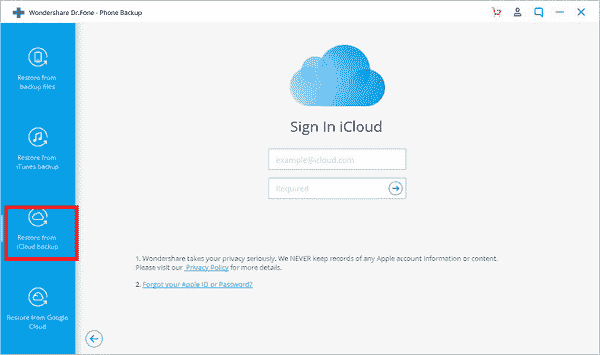

# 如何在安卓系统上访问 iCloud 照片

> 原文：<https://www.javatpoint.com/how-to-access-icloud-photos-on-android>

如果您同时使用 iPhone 和 Android 设备，或者从 iOS 转到 Android，并希望在 Android 上或从其他来源访问您的 **iCloud** 数据，您将在此获得解决方案。iOS 和安卓都是跨平台的，iOS 平台不允许其他平台直接访问。

iCloud 是苹果提供的一项出色的存储服务，用户可以在上面安全地存储自己的照片、视频、笔记和其他各种文档。与从安卓系统访问和传输文件到安卓系统不同，iCloud 仅适用于像 iPhone、iPad 和 iPod touch 这样的 iOS 产品，不适用于安卓手机。因此，在安卓手机上查看或访问 iCloud 存储中的数据似乎是一项具有挑战性的任务

然而，有积极的一面，iCloud 允许通过**icloud.com**从各种平台访问存储的数据，包括 iOS 本身、Windows 和 Android。因此，在安卓上访问 iCloud 照片、视频和其他数据只能在您的安卓网络浏览器中进行。

下面，我们列出了苹果 iCloud 的用户如何使用设备的互联网浏览器从安卓和其他平台访问他们的照片。

## 如何在安卓设备上访问 iCloud 照片

1.  在你的安卓手机上启动一个你最喜欢的浏览器应用。
2.  在网页浏览器 app 中访问***【https://www . I cloud . com/】***网站。
3.  使用您的 ***苹果 ID、用户名、*** 和 ***密码登录 iCloud。***
    
4.  如果你是从一个新的安卓智能手机登录 iCloud，当你的苹果 id 链接到你的设备时，你必须点击 ***【信任】*** 屏幕。
    
5.  之后，输入发送到与 Apple ID 关联的设备的双因素验证码。
    
    如果你丢失了苹果设备，想登录 iCloud，可以在安卓设备上使用**查找我的 iPhone** ，绕过双因素认证步骤。
6.  从您的 iCloud***(icloud.com)***主页，点击**【照片】**部分，您现在可以访问任何特定或所有照片。不幸的是，如果您的云存储变满，您可能无法看到存储在苹果设备上的所有照片。
    

## 如何在 iPhone、iPod touch 和 iPad 设备上访问 iCloud 照片

**照片**是一个很好的应用程序，可以查看你的图像或从这些照片中创建视频记忆。它还充当文档目录，通过电子邮件、短信或社交媒体共享您的照片。该应用程序还允许使用隔空投送向附近的苹果设备发送数据。您甚至可以将图像保存并传输到其他基于云的服务，如 Dropbox、Google Drive 或任何其他服务。

如果你想在你的 iPhone 或 iPad 设备上访问你的 iCloud 照片，你可以通过手机**设置**应用程序来实现。在这里，我们举例说明了在 iPhone 上从 iCloud 的照片应用程序访问照片的步骤。

1.  在你的 iPhone 设备上启动**设置**应用，点击用户名【你的名字】。
2.  点击 **iCloud** 选项。
    T3】
3.  点击**照片**应用。
    T3】
4.  启用 **iCloud 照片库**选项。
5.  勾选**“优化 iPhone 存储”**和**“下载并保留原件”**选项。它总是会从 iCloud 下载你的图片的全尺寸版本。
    

完成所有设置后，点击设备上的**照片 app** ，点击 ***照片点击*** 即可访问您的照片。但是有一个限制，它不允许你选择想要下载的图片，甚至下载过程可能需要很长时间。

## 如何在 Windows 上访问照片

也可以从任何基于 Windows 的设备访问您的 iCloud 照片。您需要在个人电脑上下载并安装 Windows 的***I cloud***设置。要在您的 Windows 设备上安装 iCloud Photos 的设置，请按照下面给出的步骤操作:

1.  在您的 Windows 设备上打开 iCloud 应用程序，并确保您使用您的苹果标识(用户名和密码)登录。
2.  点击**照片旁边的**选项**。**
3.  在照片选项屏幕中，选中标记**I 大声照片**库。
    T3】
4.  点击**完成**，然后点击**应用。**

您可以通过打开窗口的“文件资源管理器”来访问存储在“照片”应用程序中的照片。现在，在导航窗格下，展开“快速访问”，然后选择“照片”。在这里，您将看到 iCloud 照片分为三个部分:

*   **下载:**本部分包含你用 iPhone 或 iPad 点击的照片。您可以从这里自动将照片下载到电脑上。
*   **上传:**你可以从这个部分上传照片到你的 Apple photos 应用程序。
*   **共享:**此文件夹允许您访问 iCloud Photo 中存在的任何共享相册。
    T3】

## 如何从网络浏览器访问照片

如果你不想在你的设备上安装和设置 iCloud(尤其是在 Windows 上)，有一个替代方法可以访问你的 **iCloud 照片。**您可以使用设备上任何喜欢的网络浏览器来访问它们。要从任何网络浏览器访问 iCloud 照片，请按照以下步骤操作:

1.  打开设备上的任何 web 浏览器应用程序。
2.  通过地址栏访问**www.icloud.com**。
3.  使用您的苹果用户名和密码登录您的 iCloud 帐户。
4.  在 iCloud 主屏幕上，选择**照片。**
    

您可以在线访问您的 iCloud 照片库，包括您存储在那里的其他数据，如视频、文件等。该应用程序还允许通过选择上传部分上传照片，上传部分表示为指向云的箭头。

## 使用手机将照片复制到安卓系统-将数据复制到安卓系统

*MobileTrans -将数据复制到安卓*让你只需点击几下鼠标，就可以在安卓手机中传输 iCloud 照片、联系人、视频等。最好有您的 iCloud 备份存储和适当的互联网连接。要访问您的 iCloud 照片并将其传输到安卓设备，请执行以下步骤:

**第一步:在你的安卓系统上安装应用**

下载并在您的设备上安装[mobile trans-Copy Data to Android](https://mobiletrans.en.softonic.com/android)应用程序，以访问您的 iCloud 备份数据，如照片、视频、联系人等。

**第二步:从 iCloud 或 USB 线导入**

改变安装；在您的设备上启动应用程序。在应用的主屏幕上，你会看到两个选项:*从 iCloud 导入和从 USB 数据线导入。*当我们在安卓系统上处理 iCloud 照片时，点击**从 iCloud 导入**选项。

**第三步:登录**

现在，使用您的苹果用户名和密码登录到 iCloud，以访问您的 iCloud 备份。当您使用 Apple 帐户登录时，MobileTrans 将自动检测您的 iCloud 备份文件。

**第四步:选择要传输的数据**

选择您想要从 iCloud 存储移动到安卓手机或平板电脑的数据。勾选 iCloud 照片，点击 ***开始导入。*T3】**

MobileTrans 是一个免费的应用程序，允许将 iCloud 照片传输到安卓设备。但是，要传输日历、联系人、文档和提醒等其他数据类型，您必须购买此应用程序的完整版本。

## 通过安卓工具的 iCloud 访问安卓上的 iCloud 照片

针对个人电脑(视窗和苹果)和安卓系统的几个第三方应用程序允许您在安卓手机上访问 iCloud Photos。使用这样的应用 ***(Wondershare 博士 Fone)，你可以轻松地将 iCloud 照片查看并下载到你的安卓智能手机或平板电脑上。*** 要通过第三方应用程序访问安卓系统上的 iCloud Photos，请按照以下步骤操作:

**第一步:下载并安装**

首先，在你的电脑上下载并安装***【wonder share Dr . Fone】***设置，启动如下图所示的应用程序。现在点击 ***【电话备份】*** 来备份和恢复你设备的数据。

**第二步:将手机与应用程序**连接

现在，使用应用程序可能会自动检测到的通用串行总线电缆将您的安卓手机或平板电脑连接到您的计算机。

**第三步:登录你的 iCloud 账户**

在下一个屏幕的左侧，点击**“从 iCloud 备份恢复”**选项，使用您的用户名和密码登录您的 iCloud 帐户。您将收到一个验证码(仅当您打开双因素身份验证时)；输入此验证码以验证您的 Apple 帐户。

**第四步:访问你的 iCloud 备份文件**

登录您的帐户后，您将看到您存储在帐户上的 iCloud 备份列表。在这里，您可以用 iCloud 看到连接的设备。

**第五步:在安卓上恢复或访问 iCloud 照片**

现在，您可以从中间面板检查“照片”和其他所需的备份，并单击**“恢复到设备”**按钮将 iCloud 照片导入到安卓设备。导入过程完成后，您可以在安卓设备上访问 iCloud 图像。

* * *