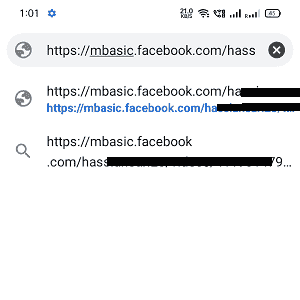

# 如何在安卓系统上下载脸书视频

> 原文：<https://www.javatpoint.com/how-to-download-facebook-videos-on-android>

与 YouTube 不同，脸书没有提供观看离线视频的功能。如果你正在搜索如何下载脸书的视频，这并不像点击下载按钮那么简单。脸书没有提供在任何设备(包括安卓、视窗或 iOS)上下载视频的直接选项。然而，有一些技巧和第三方应用程序和平台可以让你在安卓或其他设备上下载脸书视频。

从脸书下载视频可以让您在设备上拥有一份视频拷贝。您可以随时观看和分享它们，而无需滚动新闻提要。在本文中，您将了解 ***如何在不同的设备上下载脸书视频，包括安卓、iPhone、Windows 和 Mac 设备。*T3】**

## 你能从脸书下载哪些视频？

你可以从脸书下载公开发布的视频。不同设备平台下载视频的方式或方法不同。安卓、Windows、Mac 用户需要复制修改视频 URL(链接)，iPhone 用户则需要使用任何允许下载脸书视频的第三方 app，如***【my media】***。

还有一个替代选项，你可以观看有趣的视频。当你点击视频右上角的三点图标时，你会发现一个 ***保存视频*** 选项。请记住，此选项不会将视频保存到您的设备；它只保存在应用程序上，以便您以后可以从“已保存”部分观看。

## 在安卓智能手机和平板电脑上下载脸书视频:方法 1

有几种方法可以在安卓设备上下载脸书视频。一种是使用视频链接的最简单方法。要在你的安卓手机上下载脸书视频，点击视频上方的三点菜单图标，它会显示选项列表，点击**复制链接。**现在，启动一个浏览器应用程序，将复制的链接粘贴到上面。将*【www】*替换为*【姆巴西克】*，进入链接。最后，点击并按住视频，选择“下载视频”选项。以下是在安卓系统上下载 FB 视频的分步说明:

1.  **在你的安卓手机上启动脸书**应用。请确保您已登录您的脸书帐户。
2.  **选择想要下载的视频**。
3.  **点击所选视频上方的三点**图标。
4.  从选项列表中，点击**复制链接。**
    
5.  在你的安卓设备上打开你最喜欢的浏览器(Chrome 浏览器)应用，通过地址栏中的链接。为此，按下地址栏，当**粘贴**选项出现时，点击它。
6.  将链接中的**【www】**替换为**【姆巴西克】。**这样你的链接就被修改了，看起来像“https://mbasic.facebook.com/...”
    
7.  现在点击屏幕键盘上的**转到**按钮。
8.  现在，如果您还没有在浏览器上登录您的脸书帐户，您可能需要在此阶段再次登录**。
    T3】**
***   登录后，长按视频上的**、**，会出现一个弹出菜单。*   点击**下载视频。**如果你的浏览器要求任何许可，那么允许它继续。
    T3】*   视频下载成功后，您会在屏幕底部看到您下载的视频。点击**打开**观看视频。
    T3】**

 **你可以在**文件应用>下载文件夹下找到你下载的视频。**根据设备型号，访问下载视频的步骤可能会有所不同，但基本相同。

## 在安卓智能手机和平板电脑上下载脸书视频:方法 2

另一种在安卓系统上下载脸书视频的方法是使用名为**“fdown . net”的网站。**以下是下载脸书视频的步骤:

1.  登录您的脸书帐户(使用应用程序或网站)后，找到您想要下载的脸书视频。
2.  点击视频下方的**分享**按钮，点击**复制链接。**如果使用的是网站，复制其网址链接。
    
3.  现在，在你的 Chrome 浏览器(或任何其他支持下载的浏览器)中打开网站**“https://fdown . net/”**。
4.  **将你复制的 FB 视频链接**粘贴到它要求做的区域，点击**下载**按钮。
    
5.  **接下来，选择想要下载的视频质量**，可以是普通，也可以是高清。
6.  点击 Chrome 或其他等效浏览器中的**下载视频**链接。
    T3】

## 如何在 Windows 电脑上下载脸书视频:方法 1

在 Windows PC 上下载脸书视频的步骤与你在安卓上下载 FB 视频的步骤基本相同。要在 Windows PC 上下载 FB 视频，点击视频上方的三个点，点击 ***“复制链接”。*** 它会复制网址并粘贴到你的浏览器中。从视频网址中，将“www”替换为“mbasic”，然后输入。最后，右键点击正在下载的视频，点击 ***【将视频另存为】*** 选项。

1.  在你的电脑上打开你最喜欢的浏览器**登录你的脸书账号。**
2.  **选择想要下载的视频**。
3.  在视频的右上角，点击三点图标。它会弹出菜单选项，从选项中，点击**复制链接。**
    
4.  在浏览器上打开另一个选项卡，粘贴您复制的脸书网址。
5.  将链接中的**【www】**替换为**【姆巴西克】。**这样你的链接就被修改了，看起来像“https://mbasic.facebook.com/...”
    
6.  修改更改网址后，点击键盘上的**进入**键。它将在整个网页上打开一个包含您的视频的新页面。
7.  右键点击正在下载的视频，点击**“将视频另存为”**选项或按**“Ctrl+S”**键。
    
8.  给你的视频命名，在你的设备上选择一个位置，点击**保存**按钮。您可以打开支持 MP4 文件的视频。
    T3】

## 如何在 Windows 电脑上下载脸书视频:方法 2

几个网站声称他们将支持从脸书下载视频。fdown.net 就是这样一个网站，它通过简单的步骤下载视频。以下是在电脑上下载视频时可以遵循的步骤描述:

1.  打开你的网络浏览器(Chrome)，在你的电脑上**登录你的 FB 账号**。
2.  **找到想要下载的视频**。
3.  现在，点击视频右上角的三点菜单。它会弹出菜单选项，从选项中，点击**复制链接。**
4.  在您的网络浏览器上访问网站**fdown.net**。
5.  **在文字区粘贴复制的 FB 视频链接**，点击下载按钮。
6.  **在下一页选择想要的视频质量**:普通或者高清。
7.  点击 Chrome 浏览器中的**下载视频**链接。

## 如何在 iPhone 或 iPad 上下载脸书视频:方法 1

在 iPhone 或 iPad 上下载脸书视频的步骤类似于在安卓或 Windows PC 上下载视频。以下是您可以遵循的步骤:

1.  登录您的脸书帐户(使用应用程序或网站)后，找到您想要下载的脸书视频。
2.  点击视频下方的**分享**按钮，然后点击**复制链接**选项。如果你正在使用一个网站，复制它的网址链接。
3.  现在，在你支持下载的 Chrome 浏览器(火狐浏览器)中的浏览器上打开**网站“https://fdown . net/”**。
4.  **将你复制的 FB 视频链接**粘贴到它要求的地方，点击下载按钮。
5.  接下来，**选择想要下载的视频质量**:普通或者高清。
6.  点击火狐浏览器或支持下载的**下载视频**链接(您正在使用)。
7.  导航到火狐浏览器的下载部分。你会在 iPhone 右下角(或者 iPad 右上角)的汉堡图标下找到它。
8.  进入下载区后，点击视频并选择**“保存视频”**选项。
9.  访问你的照片应用中的**相机滚轮**，你会在那里找到你下载的视频。

## 在 iPhone 或 iPad 上下载脸书视频:方法 2

在 iPhone 或 iPad 上下载 FB 视频的替代方法是使用应用程序**“我的媒体-文件管理器”。**步骤大部分和你在以上方法中学习到的差不多。以下是使用我的媒体应用程序下载脸书视频的步骤。

1.  从 iPhone 上的苹果应用商店下载 [MyMedia - File Manager](https://apps.apple.com/us/app/mymedia-file-manager/id412490864) 应用。
2.  在您的 iPhone 上登录您的脸书帐户。
3.  点击视频下方的共享按钮，然后点击**复制链接**选项。
4.  现在，在您的设备上启动我的媒体应用程序。
5.  在搜索栏中输入网站名称**“fdown . net”**，点击屏幕上的 **Go** 。
6.  一旦网站打开，按下文本区域，当弹出窗口出现时，选择**粘贴。**
7.  点击**下载**按钮。它将带您进入显示视频缩略图的下一页。
8.  点击**“更多选项”**，选择要下载的视频质量。
9.  接下来，点击**“下载文件”。**
10.  给你的视频取一个文件名，点击**保存。**稍等片刻，完成下载过程。
11.  下载完成后，点击应用右上角的**后退**。
12.  点击“我的媒体”应用底部的**媒体**选项。
13.  点击你下载的视频:它会弹出选项列表。
14.  最后，点击**保存到相机胶卷**选项，你会在你的照片应用中找到一个视频。

* * ***