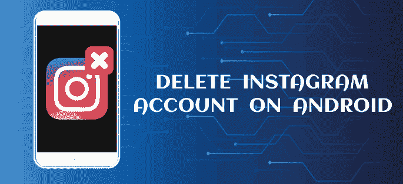
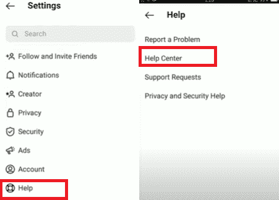
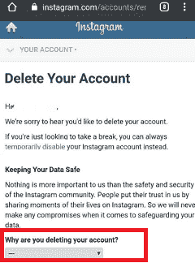
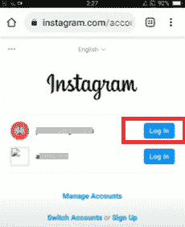

# 如何在安卓系统上删除 Instagram 账号

> 原文：<https://www.javatpoint.com/how-to-delete-instagram-account-on-android>

如今，人们在社交媒体上广泛活跃，分享他们的个人和其他信息。如果你也在社交媒体平台，尤其是 **Instagram** 上，决定少花时间或者不花时间在网上分享。在这种情况下，你可以选择**暂时暂停你的 Instagram 账户，或者永久删除它们**。

Instagram 帐户是一个你可以与你的朋友和追随者联系，并在他们之间分享图片、视频等的地方。这是一个娱乐平台，你可以在这里花时间提神。但在某个时候，你可能想休息一下，或者想通过永远完全删除你的 Instagram 帐户来继续前进。您有任何理由想要永久删除您的 Instagram 帐户或暂时禁用它。你可能会发现它的隐私政策选项很弱，或者有人黑了你的 Instagram 账户。

在这篇文章中，*你将知道如何在安卓*上暂时停用你的 Instagram 账户并永久删除它们。

摆脱你的 Instagram 账户并不复杂，但是在采取这一步之前，你应该知道一些事情。有两种方法可以让你的 Instagram 账号消失:第一步你可以**暂时停用你的 Insta 账号**，第二步你可以**永久删除**。

*   ***停用 Instagram 账户*** 会使你的数据不可见，但当你决定再次激活时，你的所有内容都会出现。
*   ***永久删除 Instagram 账号*** 将永久删除你所有的照片、视频、评论、关注者和其他内容。

## 如何从安卓手机暂时禁用你的 Instagram 账号

如果你想从使用 Instagram 中休息几天，你可能会考虑暂时禁用你的 Instagram 帐户。禁用您的 Instagram 帐户将暂时隐藏您的个人资料、照片、视频、评论、喜欢等。除非您使用登录凭据启用它。如果您同意这一点，请执行以下步骤并暂时停用您的 Instagram 帐户。

1.  假设你在 Instagram 的手机应用上找不到禁用你的 insta gram 账户的直接选项。你必须在你最喜欢的手机浏览器上**登录你的 Instagram 账户**。
2.  登录后，点击主屏幕右下角的**个人资料图标**。
    T3】
3.  点击**菜单**(三线)选项。
    T3】
4.  现在，从选项列表中点击**设置**选项。
    T3】
5.  点击**帮助**选项，点击**帮助中心**。
    
6.  选择浏览器。
7.  选择选项“**管理您的帐户”**。
    T3】
8.  现在，点击“**删除您的账户”**
9.  点击“**如何删除我的账户？**”；从这里，您可以访问这两个选项，暂时禁用您的 Instagram 帐户或永久删除它们。
    T3】
10.  现在，点击链接“**暂时禁用你的账号**”。
    T3】
11.  选择停用您的 Instagram 帐户的原因？
    
12.  再次输入密码，点击**暂时禁用账户**。
    T3】

现在，您成功地暂时停用了您的 Instagram 帐户，并且您的帐户对您的追随者隐藏，直到您再次登录。

## 如何在安卓上永久删除你的 Instagram 账号？

如果您确定要永久删除您的 Instagram 帐户，请在您的安卓设备上仔细遵循以下步骤。请记住，一旦您永久删除您的 Insta 帐户，以后就不能再访问它了。

1.  在你的安卓手机上，使用你最喜欢的浏览器登录你的 Insta 账户。
2.  登录后，点击左下角的**个人资料图标**。
3.  点击**菜单**(三线)选项。
4.  现在，从选项列表中点击**设置**选项。
5.  点击**帮助**选项，点击**帮助中心**。
6.  选择浏览器。
7.  选择选项“**管理您的帐户”**。
8.  点击“**删除您的账户”**。
9.  点击“**如何删除我的账户？**”
10.  向下滚动页面，点击**删除你的账户**，它会带你进入在浏览器上删除你的账户的页面。
    T3】
11.  在浏览器上再次登录您的 Instagram 帐户。
    
12.  如果浏览器要求保存您的密码以供进一步使用，请点击“**而不是现在**”选项。
13.  从下拉选项中选择**删除您的账户**的原因。
    T3】
14.  确认你的 Instagram 账号密码，点击**永久删除我的账号**选项。
    T3】

1.  点击**确定**确认您的动作。

#### 注意:重要的是要知道，如果您永久删除您的 Instagram 帐户，您将无法使用您删除的 Instagram 用户名再次登录。此外，您不能使用已删除的用户名创建另一个帐户。即使不是 Instagram 也可以重新激活您已删除的帐户，并且无法访问您的数据。

## 如何下载您的 Instagram 数据

如果你认为你通过 Instagram 上传的数据对你来说很重要，并且想永远保存这些数据， ***在删除你的 Insta 账号*** 之前先下载。一旦删除您的 Insta 帐户，您将丢失所有数据。如果你的 Instagram 数据对你很重要，建议下载。要下载您的 Instagram 数据副本，请遵循以下步骤:

1.  在您的 Instagram 账户上，点击**个人资料图标**和**设置**。
2.  点击**安全**部分，点击**请求下载**选项，请求数据备份。
3.  提供您的 ***电子邮件地址*** 获取您的 Instagram 数据并确认您的密码。
4.  最后，点击**完成**
5.  检查您的电子邮件帐户；48 小时内，您可能会收到一封包含“您的 Instagram 数据”链接的电子邮件。
6.  按照链接下载你的 Instagram 数据，点击**下载数据**。

## 一些常见问题与停用 Instagram 帐户有关

### 停用 Instagram 账号后会不会丢失数据和关注者？

是的，假设您永久删除您的 Instagram 帐户。在这种情况下，您将完全丢失所有数据，包括上传的帖子、保存的帖子、关注者以及您在 Instagram 帐户上关注的人。

但是，如果您暂时停用您的 Insta 帐户，情况就不同了。暂时停用帐户只会隐藏您的帐户，不让其他人和关注者访问。然而，你甚至可以通过使用你的 Instagram 凭据登录来再次访问它，你的数据会重新出现在你面前，你的追随者也可以联系到你。

### 有人可以停用其 Instagram 帐户多少次？

任何人都可以每周暂时停用一次 Instagram 帐户。假设你现在已经停用了账户，过了一段时间不管什么原因你又回来了，那么你就不能在同一个星期再次暂停。如果你愿意，你必须等到下周才能停用你的账户。

* * *