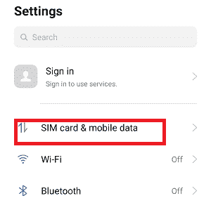
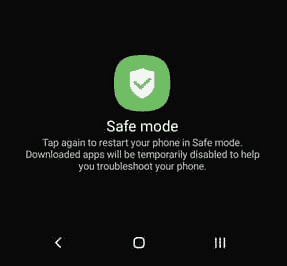
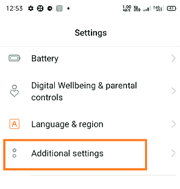
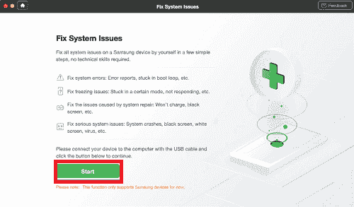
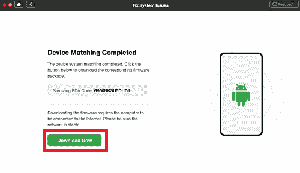

# 为什么我的安卓手机说不服务

> 原文：<https://www.javatpoint.com/why-does-my-android-phone-say-no-service>

“没有服务”的错误在每个品牌制造商和运营商的安卓手机或平板电脑中都很常见。如果你的手机瞬间显示“无服务”的通知，你可能想找到它的解决办法。然而，解决这个问题最简单的方法之一是重新启动手机或再次打开和关闭飞机模式。手机显示“无服务”通知的原因有很多。本指南将学习所有这些可能的原因以及如何解决“无服务”问题。

## 安卓手机说“不服务”的原因

安卓手机说“不服务”有几个原因，但也有常见的。几个原因是 SIM 卡没有正确插入或可能无法正常工作。另一个原因可能是你的手机系统出现了问题。

## 如何解决安卓无服务和信号问题

您通常可以使用快速简单的方法解决“无服务”问题。您可以尝试几种方法来解决此问题，但不能保证哪种方法可以解决此问题。你可以逐一尝试下面提到的所有方法，直到问题得到解决。

*   再次打开和关闭飞机模式。
*   重新插入 SIM 卡。
*   重启你的安卓手机。
*   从可用网络列表中手动选择您的运营商。
*   使用安全模式。
*   更换您的 SIM 卡。
*   检查您手机的空 IMEI。
*   工厂重置您的手机。

### 方法 1:再次打开和关闭设备的飞机模式

当手机无法与您的网络提供商连接时，就会出现“无服务”问题。您可以通过再次打开和关闭飞机模式来尝试连接。当您打开飞机模式时，您的手机会与所有网络断开连接。之后，当您再次关闭飞机模式时，您的手机会重新启动与运营商的连接，问题可能会得到解决。以下是打开和关闭飞机模式的步骤:

1.  从顶部下拉设备屏幕，访问一个**通知面板**。
2.  点击飞机模式选项**启用**
3.  再次点击飞机模式选项**禁用**。
    T3】

### 方法 2:重新插入 SIM 卡

由于 SIM 卡插入插槽不正确，出现了一些网络问题。可能会重新插入 SIM 卡，这可能会解决无服务问题。

1.  只需**关闭**手机， ***将 SIM*** 卡从插槽中取出。
2.  小心地将 SIM 卡重新插入插槽。
3.  **打开**你的手机。

### 方法三:重启你的安卓手机

你可以通过重启来解决安卓手机的一些小问题。重启安卓手机将清理内存，让操作系统从一个新的页面开始，解决任何小的软件故障。

1.  ***长按电源*** 按钮片刻，直到弹出菜单出现。
2.  选择**重启**选项重启安卓手机。
    T3】

### 方法 4:手动选择您的运营商

通常，默认情况下，手机会自动扫描并选择其网络运营商。但是如果出现任何“无服务”或网络问题，您可以从自动选择运营商切换到手动选择运营商。这些步骤可能因设备制造商品牌或操作系统版本而异，但它们基本相同。

1.  打开**设置**应用，导航至 **Sim 卡&移动数据**。
    
2.  **选择你的 SIM** 卡(如果是他们的双 SIM)。
    T3】
3.  在*网络设置*部分，点击**航母**
    T5】
4.  **关闭****自动选择**
5.  从可用网络列表中，手动**选择您的运营商**。
    T3】

### 方法 5:使用安全模式

如果您的设备显示“无服务”，即使有服务，您的手机或应用程序也可能有问题。您的手机带有一个名为**安全模式**的功能，使用该功能您可以对设备进行故障排除。步骤可能因设备型号而异。

1.  **长按电源**按钮几分钟，直到弹出菜单出现。
    T3】
2.  点击并按住设备屏幕选项中的关机按钮，即可进入 ***安全模式***
    
3.  您的设备得到**重启**(重启)并进入安全模式。您可以在设备屏幕的左下方看到安全模式文本。
    T3】

### 方法 6:更换您的 SIM 卡

坏的 SIM 卡也会导致“无服务”问题。所以看看你的 SIM 卡，确保没有损坏。即使是正确插入的 SIM 卡也显示“无服务”，这可能是由于 SIM 卡损坏。SIM 卡可能被物理损坏，您的设备很难识别它。

您可以通过访问最近的运营商商店并交谈更换您的 SIM 卡来修复它。不用担心新的 SIM 卡，你的电话号码不变。现在，把你的新 SIM 卡插入你的手机，带着希望，问题从设备开始出现。

### 方法 7:检查空的 IMEI

这个世界上的每一部手机都有一个 IMEI 号码，这是一个识别设备的唯一号码。偶尔，由于任何原因，IMEI 号码被破坏，因此识别您的设备变得乏味。这可能会导致您的安卓设备出现“无服务”问题。

如果是你的设备的情况，你可以通过拨号器 app 拨打 ***#06#** 进行查看。如果结果显示一个有效的 IMEI 号码，使用本文中提到的其他方法。如果 IMEI 显示一个空的或无效的结果，你需要在手机上修复它。

### 方法八:工厂重置你的手机

假设上面提到的任何方法都不能解决你的问题。然后，您可以尝试将手机重置为出厂默认设置。当你购买了全新的手机时，它会删除你手机中的所有数据，并将你的手机设置和应用程序设置为默认状态。

1.  启动您的设备**设置**。
2.  寻找**附加设置**。
3.  通过选择扩展**附加**(高级)**设置**的选项。
    
4.  转至**备份并重置**。
    T3】
5.  现在，点击**清除所有数据(出厂复位)**。
    T3】
6.  点击**清除所有数据**。
    T3】
7.  如果出现提示，请输入您的个人识别码。
8.  选择**清除所有数据**让手机完成任务。

关于工厂重置的更多信息，请看[如何重置你的安卓手机](https://www.javatpoint.com/how-to-reset-android-phone)。

### 方法 9:用 DroidKit 修复安卓手机无服务

如果以上讨论的方法都不能解决你的安卓手机的“无服务”问题，请尝试第三方计算机软件应用程序。一个这样的软件工具是 **DroidKit** ，一个强大的安卓系统修复工具。该工具声称它解决了三星设备上的大多数系统问题。DroidKit 工具的一些关键特性如下:

*   DroidKit 工具修复了很多 Android OS 问题，包括三星平板黑屏、设备触摸屏不工作、应用崩溃等。
*   它兼容 Windows 和 Mac 电脑，用于维修三星手机。
*   droidkit 支持所有三星智能手机和平板电脑
*   它解决了问题，而不需要你的设备，它甚至非常容易访问。
*   除了系统修复，DroidKit 还为安卓锁移除、数据恢复等提供了解决方案。

**现在，按照下面提到的这些步骤，只需几个步骤就可以解决手机的“无服务”和其他系统问题:**

1.  在您的电脑上下载并安装最新版本的 [DroidKit 工具](https://www.imobie.com/droidkit/)。
2.  安装后，启动该工具，并使用 USB 电缆连接您的安卓设备。
3.  现在点击应用程序上的**修复系统问题**部分。
    T3】
4.  一旦机器人工具包应用程序找到你的设备，点击**开始**
    
5.  DroidKit 会自动匹配你手机的 PDA 码。点击**立即下载**下载固件。
    
    如果没有匹配的 PAD 代码，则需要将设备置于恢复模式才能获取 PDA 代码。
6.  固件下载完成后，点击**立即修复**如果屏幕上还有其他说明，请按照说明将您的三星手机置于下载模式。
    T3】
7.  下载模式完成后，工具会自动开始修复你的安卓手机。修复成功后，您将成功进入系统修复页面，点击**完成**您的设备再次重启并修复所有系统问题。
    T3】

* * *