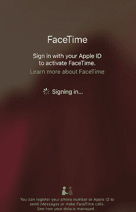
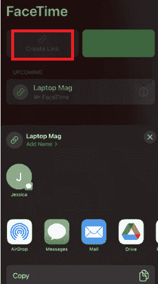
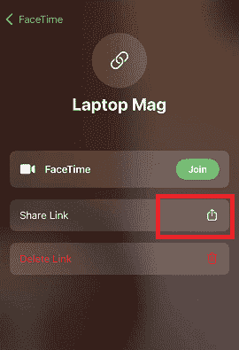
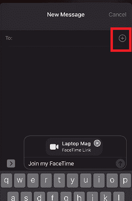

# 如何在安卓或 Windows 上使用 FaceTime

> 原文：<https://www.javatpoint.com/how-to-use-facetime-on-android-or-windows>

FaceTime 是一个 iOS 应用程序，用于进行视频通话。然而，苹果没有发布任何面向安卓的官方 FaceTime 应用作为其 iPhone 但是苹果在 iOS 15 上做了一个很大的改变。现在， ***苹果已经让安卓或 Windows 用户加入 FaceTime 通话成为可能，苹果设备(iPhone)至少运行 iOS 15*** 。想要在安卓或 Windows 上进行 FaceTime 通话的 iPhone 用户需要下载并更新手机至 iOS 15。

请记住，安卓用户只能加入 FaceTime 通话，不能主持任何通话。只有 iPhone 用户可以发起 FaceTime 通话，并向安卓或 Windows 收件人发送链接。安卓用户只会响应它加入 FaceTime。在这里，您将逐步了解如何使用 FaceTime 在 Android 或 Windows 上拨打电话。

## 如何与安卓或 Windows 用户启动 FaceTime 通话？

拥有苹果设备的人只能拨打和安排 FaceTime 电话。安卓或 Windows 用户无法发起 FaceTime 通话。他们只能加入某人使用苹果设备(iPhone)拨打的电话。安卓或 Windows 用户需要一个 ***Chrome 浏览器*** 或 ***微软 Edge*** 和一个内置或连接的 ***麦克风*** 和 ***摄像头*** 才能参与 FaceTime 通话。

想要开始 FaceTime 通话的苹果用户需要以下设备中的任何人:

*   运行在至少 iOS 15 上的 iPhone 设备
*   至少运行在 iPadOS 15 上的 iPad 设备
*   运行在至少 macOS 12 蒙特利上的 Mac 设备

## iPhone 用户使用安卓或 Windows 启动 FaceTime 的步骤

1.  打开 iPhone 上的 FaceTime 应用程序。
2.  如果您尚未登录，您需要使用您的苹果用户名和密码登录。
    
3.  点击**创建链接**按钮，创建一个 FaceTime 链接。一个屏幕将显示带有“**添加名称**选项的“ **FaceTime 链接**”。如果您愿意，请键入一个首选标题来命名，然后点击“**确定**”
    
4.  您将从弹出屏幕中找到各种选项来共享您与安卓或视窗用户的链接。从可用选项(文本、电子邮件、推特、谷歌驱动等)中选择一个。).您也可以复制并粘贴链接，通过任何其他方式的链接共享应用程序进行共享。
5.  现在，点击你的链接旁边的小“ **i** ”图标，点击“**共享链接**”。
    
6.  点击“**消息**”，点击绿色 **+** 添加您想要邀请加入 FaceTime 通话的联系人，现在，发送您的链接。
    

## 安卓或 Windows 用户使用 iPhone 加入 FaceTime 的步骤(链接发送者)

安卓或视窗用户需要该链接才能加入拥有苹果设备的人发送给他们的 FaceTime 呼叫。他们不需要下载任何单独的应用程序来获得 FaceTime。一旦他们收到显示“***【facetime.apple.com】***”的链接，他们需要在 Chrome 或微软 Edge 上打开。按照以下步骤使用共享链接加入 FaceTime 通话:

1.  点击您收到的 **FaceTime 链接**，在您的设备(安卓或视窗)上打开它。
2.  该链接将在您的任何浏览器(谷歌浏览器或微软边缘)中打开。
3.  输入您的姓名，点击**继续**按钮继续。
    T3】
4.  允许 FaceTime 访问您的*麦克风*和*摄像头*。
5.  选择**加入**，等待呼叫主持人让您进入
    。
6.  要离开 FaceTime 通话，点击**离开**
    

## 你能在网络上的 FaceTime 通话中做什么

在网络浏览器上参与 FaceTime 通话时，您可以在使用 FaceTime 应用程序的同时进行许多活动。拨打 FaceTime 电话时，您可以执行的一些活动和设置如下。但是在 FaceTime 网站上，共享播放和屏幕共享是不可用的。

*   **静音或取消静音麦克风选项**:使用麦克风图标，您可以将麦克风静音或再次取消静音。
*   **打开/关闭摄像头**:使用摄像头图标，可以在通话时打开/关闭摄像头。
*   **使用全屏模式**:按下全屏按钮，可以让你的 FaceTime 通话出现在完整的屏幕上。
*   **切换摄像头视图**:有一个翻转摄像头按钮，可以用来切换你的前置或者后置摄像头。
*   **查看网格视图中的所有参与者**:在一个组 FaceTime 调用中，所有参与者都被安排在一个网格布局中。在这种布局中，讲话者被突出显示，这样任何人都可以知道谁在讲话。
    1.  选择参与者列表，点击**更多菜单**
    2.  点击网格布局按钮，关闭**网格布局**，并从可用选项中再次点击打开。

## 在 iPhone、iPad 或 iPod touch 上使用 FaceTime。

在苹果设备 iPhone、iPad 或 iPod touch 中使用和拨打 FaceTime 电话非常容易。您可以在支持的 iOS 设备上使用 Wi-Fi 或蜂窝数据连接拨打 FaceTime 电话。在阿联酋购买的设备上可能找不到 FaceTime。在中国大陆(中华人民共和国宣称拥有的领土)使用蜂窝数据连接的 iPhone 和 iPad 不支持群组 FaceTime(视频)和 FaceTime 音频通话。

### 打开 FaceTime

在 iOS 设备(iPhone、iPad)上启动 FaceTime 应用程序，并使用您的苹果用户名和密码登录。也可以从**设置> FaceTime** 打开。如果您在 iPhone 上使用 FaceTime，您的设备会自动向该应用程序注册您的电话号码。如果您在 iPhone、iPad 或 iPod touch 上使用此应用程序，您可能需要注册您的电子邮件地址:

1.  打开 iPhone 的**设置**应用，点击 **FaceTime** 。
2.  使用您的苹果标识访问 FaceTime。
3.  **使用您的 Apple 凭据(用户名和密码)登录**。

### 打一个 FaceTime 电话

在拨打 FaceTime 电话之前，请确保您有此人的电话号码或注册的电子邮件 Id。你需要这两个人的资料。以下是在 iPhone 或 iPad 设备上拨打 FaceTime 电话的步骤:

1.  启动 FaceTime 应用程序，点击**新 FaceTime**
2.  输入您想要联系的收件人的**电话号码**或**电子邮件地址**。
3.  您也可以点击圆圈内的 **+** 图标，从保存的联系人列表中选择一个联系人。
4.  提供人员详细信息后，点击**音频通话**图标或 **FaceTime** 进行 FaceTime 通话。
5.  您也可以在正常通话过程中从 iPhone 开始 FaceTime 通话。通话时点击屏幕上的 **FaceTime 图标**，切换到 FaceTime 通话。

### 创建到 FaceTime 呼叫的链接

使用运行在 iOS 15 和 iPadOS 15 上的设备，您可以创建一个 FaceTime 链接，并通过电子邮件或消息(使用任何消息应用程序)将其发送给您想要与之通话的其他人。接收者将使用该链接加入并发起呼叫。按照给定的步骤创建并与其他人共享 FaceTime 链接:

1.  打开 iPhone 上的 FaceTime 应用程序。
2.  点击**创建链接**按钮，创建一个 FaceTime 链接。
3.  在滑动屏幕上，**添加名称**选项。如果您愿意，请键入一个要命名的首选标题，然后点击“确定”
4.  使用消息、电子邮件或任何其他受支持的应用程序与您想要呼叫的人共享链接。

### 使用呼叫等待功能接听 FaceTime 音频呼叫

当另一个呼叫来临时，无论是普通电话呼叫、FaceTime 音频呼叫还是当前通话中的 FaceTime 呼叫，您都可以选择以下任一选项:

*   ***终止并接受*** :终止当前通话并接受来电。
*   ***保持并接受*** :保持您当前的通话并接听新的来电。
*   ***谢绝*** :可以严格谢绝来电。

### 共享您的屏幕

还有一个选项可以在进行 FaceTime 通话时与他人共享您的 FaceTime 屏幕。共享屏幕有助于您查看照片或浏览网页。以下是与他人共享屏幕的步骤。

1.  **开始**一次 FaceTime 通话。
2.  现在，点击**分享内容**
3.  最后，点击**分享我的屏幕**分享你的屏幕。

当您共享您的 FaceTime 屏幕时，每个人都可以看到您屏幕上的内容，直到您停止共享。但是与您共享 FaceTime 屏幕的人无法控制您设备上的任何东西。如果您在共享屏幕期间打开手机，他们将无法看到任何通知。

### 过滤背景声音

当您希望在 FaceTime 通话过程中，您的声音在听筒端清晰可辨，并关闭其他不必要的声音时，您必须打开“声音隔离”功能。语音隔离功能为您的语音提供更高的优先级，并在 FaceTime 通话过程中屏蔽其他干扰噪音。

1.  在您进行 FaceTime 通话时，打开控制中心，然后轻按麦克风模式。
2.  选择语音隔离。

另一个功能是“宽频谱”，它允许在 FaceTime 通话中听到您的声音和周围的声音，而不过滤周围的噪音。

1.  在您进行 FaceTime 通话时，打开控制中心，然后轻按“麦克风模式”。
2.  选择宽光谱。

### 用纵向模式模糊背景

在运行 iOS 15 和 iPadOS 15 的设备上，启用人像模式可以自动模糊背景，并将视觉焦点保持在您身上，就像人像模式在相机应用程序中所做的一样。

1.  在您的 FaceTime 通话过程中，轻按您的画中画图块。
2.  轻按个人视频拼贴左上角的“纵向模式”按钮。

要关闭纵向模式，请再次点击纵向模式按钮。

* * *