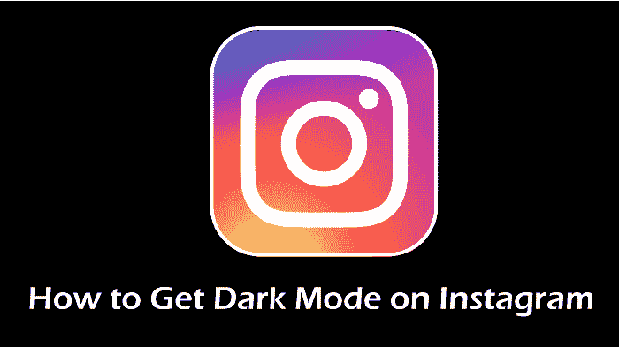
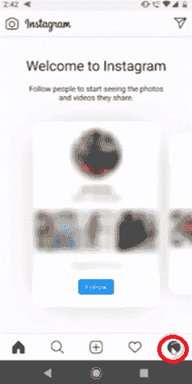
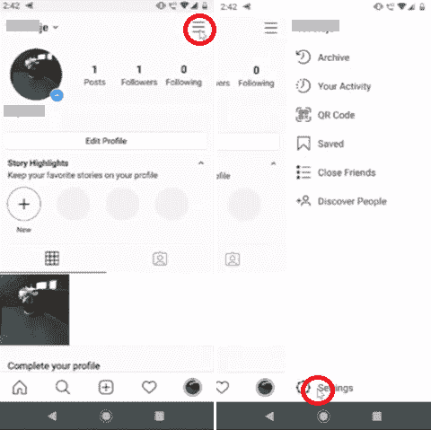
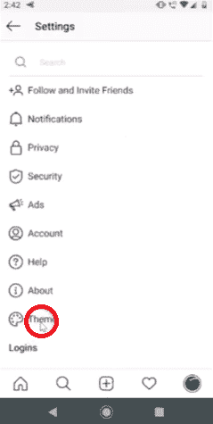
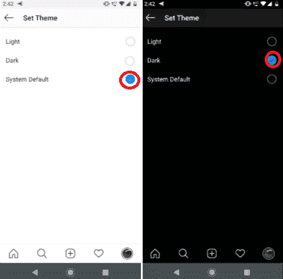
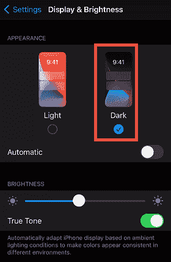
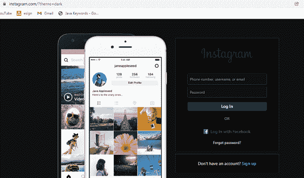

# 如何在安卓和 iPhone 上的 Instagram 上获得暗模式

> 原文：<https://www.javatpoint.com/how-to-get-dark-mode-on-instagram-on-android-and-iphone>

用户最熟悉和最有用的应用功能之一是黑暗模式。在应用程序中打开暗模式会将其背景更改为暗黑色主题。它会降低设备屏幕上白光的亮度。暗模式也有利于电池消耗，减少蓝光对眼睛的影响。

大多数社交媒体影响者和用户都在安卓和 iPhone 上的 Instagram 应用程序上寻找黑暗模式。对于运行在[安卓 10](https://www.javatpoint.com/android-10) 或更高版本上的安卓和运行在 iOS 13 或更高版本上的 iPhones 或 iPads，可以在 Instagram 上获得黑暗模式。但是，Instagram 应用程序中没有设置选项，您可以在旧版本中启用它。您必须将您的应用程序更新到最新版本。 ***你可以在安卓和 iPhone 设备上通过设备设置*** 开启黑暗模式。Instagram 应用程序会自动调整其背景，以匹配设备的其他背景主题。

请记住，要在安卓或 iPhone 上的 Instagram 上获得黑暗模式，您需要将 Instagram 应用程序更新到最新版本，并将设备操作系统更新到安卓 10 或 iOS 13。

在本文中，我们将逐步了解如何在安卓和 iOS 设备上的 Instagram 上获得暗模式。

## 安卓上 Instagram 如何启用暗模式

### 方法 1:使用电话设置应用程序

Instagram 的黑暗模式目前仅适用于安卓 10 用户，他们可以使用手机的设置应用程序来实现这一点。希望这项功能也能很快在其他安卓版本中推出:

1.  打开安卓手机的**设置** app。
2.  寻找**显示&亮度**选项并点击。
    T3】
3.  现在，从可用选项中激活“**黑暗主题**”。
    T3】
4.  然后，启动 Instagram 应用，会发现暗模式自动启用。

从设置中激活黑暗主题模式后，Instagram 应用程序本身会调整其屏幕颜色，以获得更暗的外观。除了 Instagram，你的其他几个应用也调整到了变暗模式。

### 方法 2:使用 Instagram 应用程序本身

要访问安卓系统上 Instagram 应用程序的暗模式功能，您不需要将设备的操作系统更新为安卓 10。安卓用户也可以从 Instagram 应用中打开/关闭黑暗模式功能。以下是在安卓 Instagram 应用程序中启用或禁用变暗的步骤。

**第一步:点击你的个人资料图片**

要在您的 Instagram 应用程序中启用暗模式，首先，请访问您的个人资料页面。进入个人资料页面后，点击右下角的“个人资料图片”。

**第二步:点击“菜单”图标，然后点击“设置”选项**

接下来，点击屏幕右上角的“菜单”图标。从菜单项列表中，点击界面底部与其他项目分开的“设置”部分。

**第三步:点击“主题”**

进入设置屏幕后，您将看到一个列表，其中包含各种小标题，点击“主题”

**第四步:点击“黑暗”选项**

最后，您将看到三个不同的选项:“亮”、“暗”和“系统默认值”要在 Instagram 应用程序上获得深色主题，请选择“深色”选项。它会将 Instagram 主题更改为您最喜欢的变暗模式。

## 如何在 iPhone、iPad 或 iPod touch 上的 Instagram 上获得暗模式

要在弱光环境中获得更好的观看体验，请打开 iOS 设备(iPhone、iPad 或 iPod touch)上的暗模式。要在 iOS 设备上的 Instagram 上获得暗模式，您需要 iPhone 的 iOS 13 或更高版本，iPad 的 iPad 13 或更高版本。以下是在您的 iOS 设备上获取此信息的步骤:

### 方法 1:使用设置应用程序

1.  启动运行在 iOS 13 或更高版本(运行在 iPadOS 13 上的 iPad)上的 iPhone 的**设置应用程序**。
2.  寻找底部的**显示&亮度**，点击。
    T3】
3.  在 ***外观*** 部分，你会发现两个选项: ***亮*** 和 ***暗*** 。点击**黑暗**启用设备黑暗模式。
    
4.  现在打开你的 **Instagram app** ，你会看到它以黑暗模式出现。
    T3】

### 方法 2:使用控制中心

在 iPhone 或 iPad 中启用黑暗模式的替代方法是使用其*控制中心*。导航至控制中心，点击**黑暗模式**按钮。打开和关闭控制中心的方式因您使用的设备而异。

**iPhone X 及更高版本**

*   要打开控制中心，请从设备右上角向下滑动屏幕。
*   要关闭控制中心，请从底部向上滑动屏幕或点击屏幕本身。

**iPhone SE、iPhone 8 及更早版本、iPod touch**

*   要打开控制中心，从任何屏幕的最底部向上滑动。
*   要关闭控制中心，点击屏幕顶部，或者您也可以按下主页按钮。

### 方法 3:自动启用暗模式

要在日落后或特定时间自动启用黑暗模式，导航 ***设置>显示&亮度*** 并启用 ***自动*** 功能。之后，点击 ***选项*** 为 ***暗模式*** 安排时间。

## 在网络 Instagram 中启用暗模式

Instagram 的网站没有提供任何特殊的设置选项或切换按钮来进入黑暗模式，但有一种方法(技巧)可以让网站变暗。

在电脑上打开网络浏览器，将下面给出的网址复制并粘贴到地址栏中，然后按回车键。这个网址是 Instagram 的官方网站，末尾有一个参数，请求黑暗主题。

*https://www.instagram.com/?theme=dark*

当使用上面的网址加载网站时，你会发现网站周围都是深色。现在你可以用你最喜欢的主题，黑暗模式来浏览网站了。

请记住，如果你重新加载网站，你将失去主题。上面的链接暂时启用了黑暗模式，不过还好你至少有一个选项。

### 在网页 Instagram 上使用暗模式的替代方法(Chrome 浏览器)

在 Instagram 网页上，尤其是 Chrome 浏览器上体验黑暗模式的替代方式是 ***使用 Instagram 黑暗模式扩展*** (插)。你会在网上找到几个 Instagram 的网页暗模式扩展。使用 Instagram 网站上的这些扩展，您可以获得全新的夜间蓝色体验，同时还能保护眼睛免受疲劳。一些 Instagram 暗模式扩展包括:

*   Instagram 的夜间模式
*   Instagram 黑暗主题
*   夜间模式 Instagram

## 在 Instagram 上启用暗模式的一些主要好处

在 Instagram 上启用变暗模式可以让您的用户体验更上一层楼。暗模式提供了更好的图像和视频观看体验。除了在更好的界面中查看图像和视频，变暗模式还有其他一些好处。

显著降低击中眼睛的亮度，你会感觉不到眼睛疲劳，尤其是在晚上使用手机时。所以，你的眼睛在睡觉前看到你的订阅源上的帖子并不会很难。

在 Instagram 上切换到黑暗模式也可以降低设备的电池消耗。与灯光模式相比，花太多时间在深色屏幕上滚动图像和观看视频会延长电池寿命。但是，如果你整天使用 Instagram，你必须找到其他方法来延长电池寿命。

* * *