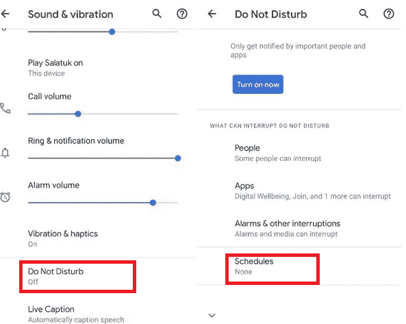

# 如何在安卓系统上激活开车不打扰

> 原文：<https://www.javatpoint.com/how-to-activate-do-not-disturb-while-driving-on-android>

我相信你一定看过电影里的一个角色，一个英雄开车接电话，突然出了事故。但是，它不仅仅是一个卷轴生活的场景；这样的事故在现实生活中也时有发生。为防止开车时出现任何意外情况，**开车时打开安卓或 iPhone 上的“请勿打扰”模式**。

激活手机的免打扰功能会阻止通话、短信和通知。在某些设备中，可以选择用户想要阻止或不阻止哪些应用。

谷歌和苹果等大公司已经在努力让你的手机在开车时自动进入“请勿打扰”模式。像 iOS 11、谷歌的 Pixel 2 和 Pixel 2XL 智能手机这样的一些设备就可以做到这一点。

还有一些移动应用程序可供您在驾驶时使用，以自动激活“请勿打扰”功能。其中一款安卓应用是“ ***【驾驶侦探】*** ”，设计时保留了“开车时 DND”软件的要求。

在这里，我们将讨论在开车时激活安卓系统上“请勿打扰”功能的所有可能方法。

## 方法一:开车时如何在安卓手机上激活“请勿打扰”模式

你会在网上找到几个应用程序，它们可以运行带有 DND 功能的软件。谷歌为使用相同功能的 Pixel 手机开发应用程序。它们可以在任何运行安卓 4.1 或更高版本的设备上工作，设置它们也很容易。

我们将演示如何使用 ***【驾驶侦探】*** 应用程序在驾驶时打开“请勿打扰”模式。但是如果你想更多地了解这种不仅可以在开车时使用的应用程序。你可以看看下面流行的安卓“请勿打扰”应用。

*   守夜人
*   请勿打扰-静音模式
*   请勿打扰

让我们看看如何使用**驾驶检测**应用程序在驾驶时激活“请勿打扰”:

### 驾驶时激活“请勿打扰”功能:使用“驾驶侦探”应用程序

[驾驶检测](https://play.google.com/store/apps/details?id=mk.com.vasilev.drivingdetective&hl=en_IN&gl=US)应用的工作基于软件“驾驶时请勿打扰”。当坐在移动的车辆上时，该应用程序会自动检测设备，并启用“请勿打扰”切换按钮。它能在你开车时消除所有的警报。一旦您离开车辆，该应用程序会将手机功能恢复到正常运行状态。

驾驶侦探停止检测要么你离开汽车走一小段距离，要么你的车停留超过 15 分钟。然而，这个应用的一个问题是，它可以在乘坐公共交通工具时触发“请勿打扰”。在这种情况下，启动后，通过单击右上角的开关关闭应用程序。

1.  访问谷歌 Play 商店，搜索应用(**驾驶侦探**)，并将其安装在你的安卓手机上。
2.  **打开**请勿打扰开关按钮。
    T3】
3.  授予访问 DND 设置的必要权限。
4.  选择您想要键入的首选项“ ***【完全静音】【仅报警】*** 或 ***【仅优先】*** 。
    

如果选择了*优先模式*，还需要检查优先模式设置。您可以看到默认的首选项设置，如果您想要更改某些内容，请相应地启用或禁用它们。

### 使用手机设置在安卓系统上激活免打扰模式。

如果您想在安卓手机上快速启用免打扰模式，请从屏幕顶部向下滑动以访问快速设置面板。在这里你会看到一个代表请勿打扰的图标；上车前轻按它以启用它。以下是激活此功能的步骤:

1.  从屏幕顶部向下滑动以访问设备的快速设置面板。
2.  轻按“请勿打扰”图标以启用它。

如果您希望更改默认免打扰设置，您需要长按免打扰图标来访问免打扰设置屏幕。一旦您进入 DND 设置屏幕，您将看到以下两个选项:

*   **时间表**:您可以设置自动启用和不启用 DND 模式的时间表。
*   **异常**:除了默认设置 DND 模式之外，您可以允许和禁止一些甚至可以在 DND 启用时起作用的功能，例如来自被盯着的联系人的呼叫和通知。

## 方法二:如何在像素手机上开启“请勿打扰”模式

谷歌已经在其 Pixel 2 和 Pixel 3 智能手机中添加了“请勿打扰”模式，并声称该设备会自动检测用户是否在开车。如果它检测到您正在驾驶，它的 DND 功能会自动限制警报和通知。

像素设备配备了人工智能系统，可以从各种传感器识别您的运动活动。如果手机发现你在开车，它会自动关闭收到的通知，如消息、电子邮件和警报。通话是允许的，但会被传输到车辆的蓝牙音频系统。

以下是在谷歌 Pixel 2 和 Pixel 3 手机上设置驾驶模式的步骤:

### 如何在 Pixel 3 智能手机上设置驾驶模式

1.  启动手机的**设置**
2.  点击**连接的设备**部分。
    T3】
3.  再次点击**连接首选项**和**驾驶模式**。
    
4.  点击**行为**并选择一个选项:
    *   如果您有兴趣在驾驶过程中使用谷歌助手在路上保持联系，请选择 ***打开安卓汽车***
    *   如果您不想在开车时使用手机，请选择“打开请勿打扰”选项。
        
5.  按下**“自动开启**”选项。
    *   如果您的汽车提供蓝牙连接，打开选项“*当连接到蓝牙时*”并选择您的汽车。
    *   如果您的汽车不提供蓝牙选项，则在检测到驾驶时启用“*”。
        T3】*

 *完成所有设置后，在安卓 Pixel 3 手机上驾驶时，点击**“立即打开**”激活“请勿打扰”。

### 如何为 Pixel 2 智能手机设置驾驶规则

1.  启动手机的**设置**
2.  点击**声音**部分，然后选择**请勿打扰**。
3.  点击**“自动开启**”。
4.  点击**添加** **规则**，然后选择**驾驶**。
5.  确保**打开屏幕顶部的**规则。
6.  要删除您的规则，点击**删除**

## 方法 3:如何在“请勿打扰”模式下限制打扰

您没有可能锁定所有通知的功能。但是，该模式也可以自定义。

1.  **即时关闭请勿打扰选项:**如果您想快速关闭安卓系统上的*请勿打扰*模式，请从我们的屏幕顶部向下滑动以访问快速设置面板。之后，找到**请勿打扰**图标并点击。
2.  **更改设置**:默认设置选项停止大部分声音和振动。但是，您可以更改这些设置并选择通知的作用范围。
    *   **设置屏蔽什么**:DND 设置中有选择屏蔽什么和不屏蔽什么的选项。您必须导航至设备**设置>声音&振动**并启用**请勿打扰**。
        
    *   您可以根据自己的优先级允许所选的通知和呼叫。
    *   将例外设置为允许:您可以例外地允许 DND 设置选项中默认设置以外的某些功能。不同的电话提供不同的选项(通话、仅带星号的联系人、消息或通知)以允许例外情况。
        

如果你想了解更多关于安卓系统的“免打扰”模式，请查看我们的文章[安卓系统的免打扰](https://www.javatpoint.com/do-not-disturb-in-android)。

## 如何在安卓上关闭开车时的“请勿打扰”

如果您不小心激活了设备的请勿打扰模式，您需要将其关闭才能接收所有呼叫和通知。不同的手机在开车时关闭安卓上“请勿打扰”模式的设置不同。根据设备型号和安卓操作系统版本，步骤略有不同。

### 在 Pixel 智能手机上使用驾驶模式设置

1.  启动手机的设置应用程序。
2.  点击 ***连接设备*** 部分。
3.  再次点击 ***连接首选项*** 和 ***驾驶模式***
4.  点击“ ***”自动开启*** ”选项，确保连接蓝牙时 ***”和检测到驾驶时*选项均未启用。****
**   如果上述步骤(步骤 4)不起作用，请返回上一屏幕，点击“ ***【行为】*** ”，并选择选项“ ***【安卓自动】*** ”而非“ ***打开请勿打扰*** ”*

 *### 来自设备免打扰设置

驾驶时关闭“请勿打扰”的另一种方法是通过设备免打扰设置。这些设置仅在您乘坐移动车辆时有效。但是，步骤可能因设备而异。

1.  导航至设备 ***设置*** 然后 ***声音&振动*** 。
2.  现在，点击*并点击 ***时间表*** 的下一个屏幕标签。
    *
**   选项卡上的设置图标旁边的“ ***【驾驶模式】*** ”。*   当连接到蓝牙时关闭切换按钮“ ***”、“当检测到驾驶时关闭切换按钮“*** ”和下一屏幕上的“*”。
    **

 **### 从设备快速设置面板

如果您想在驾驶时快速关闭安卓系统上的*请勿打扰*模式，请从屏幕顶部向下滑动以访问快速设置面板。之后，找到**请勿打扰**图标并点击。

* * *****