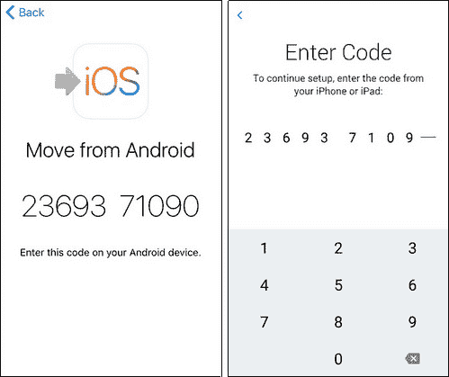
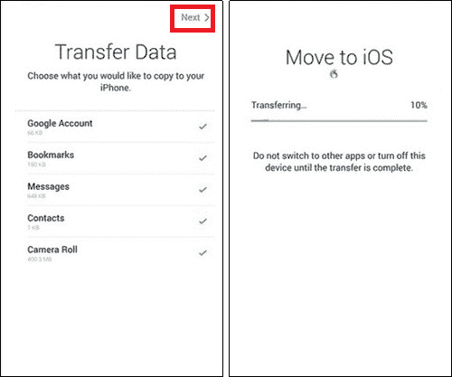

# 如何将应用从安卓转移到 iPhone

> 原文：<https://www.javatpoint.com/how-to-transfer-apps-from-android-to-iphone>

如果你用的是安卓手机，想换成 iPhone，或者你是不是已经从安卓换成 iOS 了。您可能希望将所有媒体文件、文档和安卓应用程序传输到您的 iPhone，并确保不会丢失任何内容。与文件或媒体传输不同，将应用程序从安卓移动到 iPhone 并不简单。由于这两款设备是跨平台的，从安卓手机转移到 iPhone 可能会很繁琐。

本文将讨论有助于 ***将应用从安卓转移到 iPhone*** 的各种应用和工具。

## 使用移动应用程序将应用程序从安卓手机传输到 iPhone

如今，人们正在为他们的手机寻找智能应用程序，以将数据从一部手机传输到另一部手机。出于同样的原因，你可以使用一些应用程序来帮助你将应用程序从安卓系统转移到苹果手机上。在这里，我们已经从我们这边列出了三个最好的解决方案来将应用从安卓转移到苹果手机上。

### 使用以下方法将应用程序从安卓系统转移到 iPhone:转移到 iOS 应用程序

**移至 iOS** 是苹果发布的官方应用，旨在帮助其用户将数据从安卓手机传输到新 iPhone(尚未设置)。该应用程序可以帮助您将联系人、消息、相机胶卷数据和书签从安卓系统传输到 iPhone。但是，可能存在无法使用“移动到 iOS”应用程序移动设备完整数据的情况。为此，请从谷歌 Play 商店下载并在您的安卓系统上安装“转到 iOS”应用程序。

请注意，您只能在安装全新的 iPhone 时选择将应用程序从安卓系统转移到 iPhone 系统。如果您已经设置并使用了您的 iPhone，您需要在开始从 Android 到 iPhone 的数据传输之前重置它。

1.  **下载并运行移至 iOS 应用:**首先，在你的安卓手机上安装最新版本的移至 iOS 应用。安装后，在安卓手机上运行。在你的 iPhone 上，寻找“应用程序&数据”屏幕，点击“ ***从安卓移动数据*** ”。
    
2.  **将两台设备与数字代码配对:**现在点击安卓系统上的**继续**按钮，阅读隐私政策。若要继续，请点击同意。另外，点击“从安卓移动”屏幕上的**继续**按钮。
    
3.  **输入数字代码:**等待几秒钟，你会在你的 iPhone 上看到一个**数字代码**，在你的安卓手机上输入该代码，将两台设备配对。等待片刻，直到两台设备之间完成配对。一旦设备配对完成，您将在安卓手机上看到“*传输数据*”屏幕。
    
4.  **选择数据并开始传输:**现在，从安卓设备中选择您想要传输的数据并点击**下一步**。另外，在你的 iPhone 上接受它。完成 iPhone 上的加载栏后，在安卓系统上点击**完成**。
    

### 使用共享应用传输应用

SHAREit 是一款流行且广泛使用的数据共享应用(包括文件、音乐、视频、应用等)。)从一部手机无线传输到另一部手机。该应用程序建立了直接的无线连接，传输数据的速度甚至比蓝牙还快。以下是使用共享信息技术将应用程序(和其他数据)从安卓传输到苹果手机的步骤。

1.  **下载应用:**在你的两台设备上下载并安装 SHAREit 应用(在安卓上，从 Play Store 下载，在 iPhone 上，从 App Store 下载)。
2.  **建立连接:**在两台设备上启动应用，将两台设备放得更近，并启用 Wi-Fi 选项。
3.  **选择发送方和接收方设备:**现在，转到“传输”部分，选择安卓设备作为发送方，iPhone 作为接收方。
4.  **选择要传输的数据(app):**在你的安卓手机(发送方)上，会询问你要传输什么。导航到“应用程序”部分，选择您想要传输的应用程序。
    T3】
5.  **开始传输:**等待几秒钟，应用程序会尝试连接您的安卓和 iPhone 设备。将您的 iPhone 标记为接收器，并选择一部安卓手机进行连接。iPhone 用户(SHAREit)将出现在安卓用户屏幕上；轻按 iPhone 用户名(图标)，开始将您的应用程序从 Android 传输到 iPhone。
    T3】

### 使用以下方法将应用程序从安卓系统传输到 iPhone 系统:移动电子-将数据复制到 iOS 系统

**MobileTrans -将数据复制到 iOS** 是一款移动应用，可以帮助你移动数据，包括从安卓到 iPhone 的应用。这款应用可以在所有主要的 iOS 设备和安卓手机上运行，所以你不需要担心兼容性问题。以下是使用此应用程序传输应用程序和其他数据的步骤。

1.  **连接安卓和 iPhone:** 首先你要借助一根 USB 线和一个连接器**把安卓和 iPhone 都连接上**。一旦两个设备之间建立了连接，您必须授予对所连接设备的访问权限。
    
2.  **选择要传输的数据:**打开 MobileTrans 应用程序，查看连接两台设备后的状态。要继续，选择要从安卓移动到 iPhone 的数据；点击“**开始导入**按钮。
    
3.  **访问您传输的数据:**等待几分钟(根据您移动的数据量)您选择的数据从安卓移动到 iPhone。数据传输完成后，应用程序会通知您，您现在可以在 iPhone 上访问新传输的数据。
    T3】

## 使用第三方桌面应用程序将应用程序从安卓手机传输到 iPhone

除了移动应用，你还可以使用桌面应用将安卓手机的应用转移到 iPhones 上。在这里，我们将讨论三种有效的桌面工具，它们易于使用并且可靠，可以在跨平台(安卓到 iPhone)之间传输应用程序。

### 使用任何传输工具传输应用程序

**any transs**是一款 iOS 数据管理桌面工具，可以帮助其用户管理设备，将数据从安卓移动到 iPhone，没有任何限制。这个工具支持大多数安卓手机和 iOS 设备(iPhone、iPad、iPod)。使用任何传输，您可以传输数据，如联系人、消息、照片等，包括移动应用程序。

按照下面给出的步骤，通过 AnyTrans 桌面工具将应用程序(和其他数据)从安卓传输到 iPhone。

1.  在你的电脑上下载并安装 [AnyTrans](https://www.imobie.com/anytrans/) 工具的设置并启动它。
2.  使用通用串行总线电缆将您的安卓手机和苹果手机连接到您的电脑。
3.  点击应用屏幕左面板的“**手机开关**”选项，会让你将数据从安卓迁移到 iPhone。
    T3】
4.  在“手机到 iPhone”部分，点击“**立即迁移**”按钮。
5.  选择你的安卓手机作为源，选择你的 iPhone 作为目标，点击**下一步**。
    T3】
6.  选择要从安卓移动到 iPhone 的数据，点击**下一步**按钮继续。
    T3】

### 使用 AppTrans 工具传输应用程序

AppTrans 是另一个桌面工具，用户可以使用它将应用程序从 Android 传输到 iPhone，反之亦然。使用这个应用程序，你可以在一分钟内将 WhatsApp 应用程序从安卓移动到 iPhone。以下是使用 AppTrans 工具将应用程序从安卓手机传输到 iPhone 的步骤。

1.  在电脑上下载并安装 [AppTrans](https://www.imobie.com/anytrans/) 工具的设置并启动。
2.  点击应用屏幕左侧面板的 **App Transfer** 选项，它会让你将数据从安卓迁移到 iPhone。
    T3】
3.  同时，**用 USB 线将**安卓和 iPhone 都连接到你的电脑上，让工具识别这两个设备。
4.  选择你的安卓手机作为源设备，iPhone 作为目标设备。
5.  现在，点击**立即转移**按钮继续。
6.  选择安卓手机上的应用程序，将其移动到 iPhone 上，然后再次点击“**立即转移**”按钮继续。
    T3】

过一会儿(根据数据传输量)，您将看到一个屏幕，通知应用程序传输完成。您成功地将应用程序从安卓手机传输到了 iPhone。

### 使用移动电子桌面工具将应用程序从安卓系统转移到 iPhone 系统

帮助你从安卓切换到 iPhone 的另一个值得信赖的桌面工具是[手机电子转账](https://mobiletrans.wondershare.com/phone-to-phone-transfer.html)。该应用程序允许以两种不同的方式传输您的应用程序和其他数据。当两个设备都在您手中时，您可以通过工具连接它们来传输数据。第二种方法是在手机不可用时备份和恢复数据。只需将安卓手机的数据备份到电脑上，需要时在 iPhone 上还原即可。

按照下面给出的步骤，通过手机转移工具将应用程序从安卓转移到 iPhone。

1.  在您的计算机上下载并安装 MobileTrans 工具的设置，然后启动它。
2.  点击主屏幕上方的**电话转接**选项，它会让你将数据从安卓迁移到 iPhone。
    T3】
3.  同时，**用 USB 线将**两个设备安卓和 iPhone 都连接到你的 PC 上，让工具识别两个设备。
    T3】
4.  确保您的安卓手机设置为源设备，而 iPhone 设置为目标设备。如果没有，点击“翻转”重新排列。
5.  选择要从安卓手机传输到 iPhone 的应用程序(或数据)，然后点击“**开始**”按钮。
    T3】

* * *