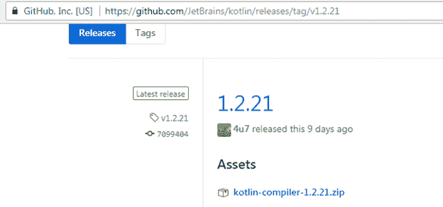
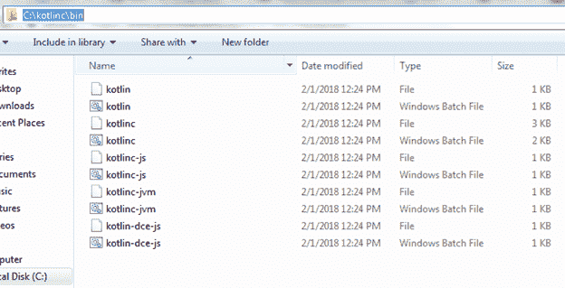
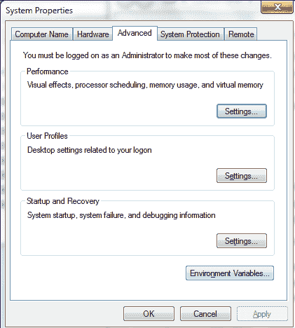
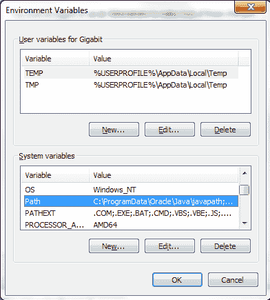
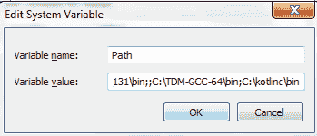

# Kotlin环境设置(命令行)

> 原文：<https://www.javatpoint.com/kotlin-environment-setup-command-line>

### 先决条件

由于 Kotlin 在 JVM 上运行，因此有必要安装 JDK，并在本地系统环境变量中设置 JDK 和 JRE 路径。

要为命令行设置 Kotlin，您必须预先安装 JDK 1.6+或更高版本。要安装 JDK 并设置 JDK 和 JRE 的路径，请参考 Java 中的链接 [**【设置路径】**](https://www.javatpoint.com/how-to-set-path-in-java) 。

## 为命令行设置Kotlin

要为命令行设置 Kotlin，我们需要完成以下步骤:

1.从 GitHub 发行版[**【https://github.com/JetBrains/kotlin/releases/tag/v1.2.21】**](https://github.com/JetBrains/kotlin/releases/tag/v1.2.21)下载 Kotlin 编译器。

2.在任何系统位置提取下载的 zip 文件(在我这里是在 c 盘)。

3.将路径复制到 kotlinc 的 bin 目录。

4.打开计算机属性，然后单击环境变量。

5.点击编辑路径

6.在变量值中经过 kotlinc bin 目录的路径。

