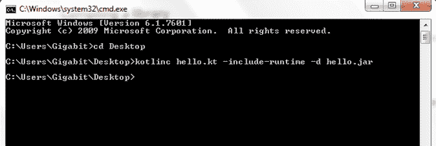
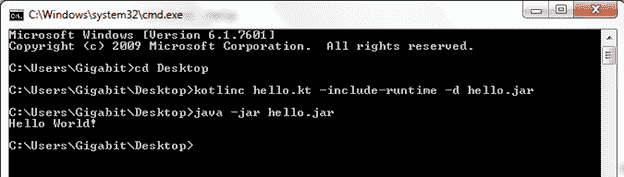

# 命令行中的 Kotlin Hello World 程序。

> 原文：<https://www.javatpoint.com/kotlin-hello-world-program-command-line>

要编写 Kotlin 程序，我们可以使用任何文本编辑器，如:记事本++。将以下代码放入任何文本文件并保存。

```

fun main(args: Array<String>){
	println("Hello World!")
}

```

保存文件名为 hello.kt、**的文件。kt** 扩展名用于 Kotlin 文件。

## 编译Kotlin文件

打开命令提示符，转到存储文件的目录位置。用以下命令编译 **hello.kt** 文件。

```

kotlinc hello.kt -include-runtime -d hello.jar

```



## 运行Kotlin文件

去经营Kotlin。jar (hello.jar)文件运行以下命令。

```

java -jar hello.jar

```

