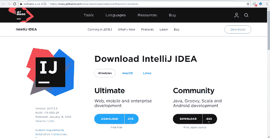
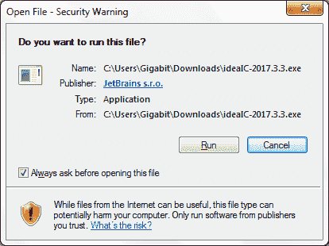
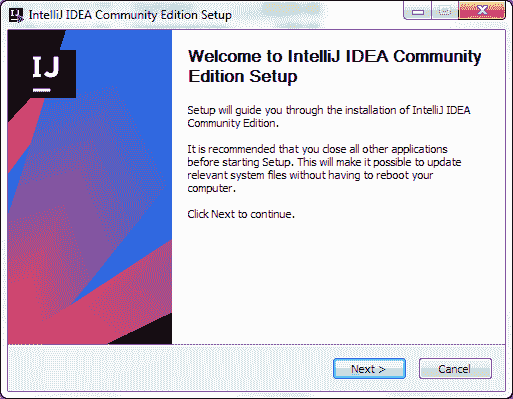
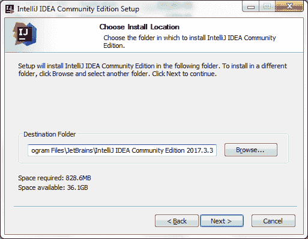
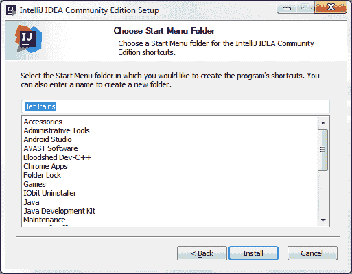
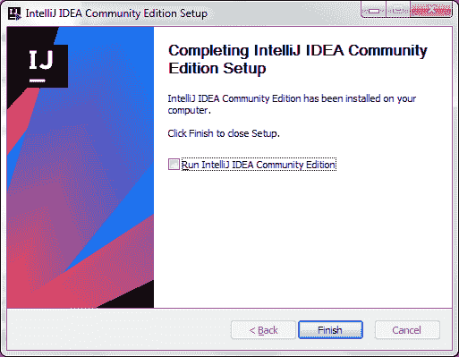

# 科特林环境设置

> 原文：<https://www.javatpoint.com/kotlin-environment-setup-ide>

## 安装 JDK 并设置 JDK 路径

因为 Kotlin 运行在 JVM 上，所以需要安装 JDK，并在本地系统环境变量中设置 JDK 和 JRE 路径。使用此链接[**【https://www.javatpoint.com/how-to-set-path-in-java】**](https://www.javatpoint.com/how-to-set-path-in-java)设置 JDK 路径。

## 为柯特林安装 IDE

有各种各样的 Java IDE 支持 Kotlin 项目开发。我们可以根据自己的兼容性选择这些 IDE。这些集成开发环境的下载链接如下。

| IDE 名称 | 下载链接 |
| IntelliJ IDEA | [https://www.jetbrains.com/idea/download/](https://www.jetbrains.com/idea/download/) |
| Android Studio | [https://developer.android.com/studio/preview/index.html](https://developer.android.com/studio/preview/index.html) |
| 黯然失色 | [https://www.eclipse.org/downloads/](https://www.eclipse.org/downloads/) |

在本教程中，我们将使用 IntelliJ IDEA 进行我们的 Kotlin 程序开发。

## 设置智能概念的步骤

### 1.下载 IntelliJ IDEA。

### 2.运行下载的安装程序。

### 3.单击“下一步”继续。

### 4.选择安装位置。

### 5.选择开始菜单文件夹，然后单击安装。

### 6.单击“完成”完成安装。

