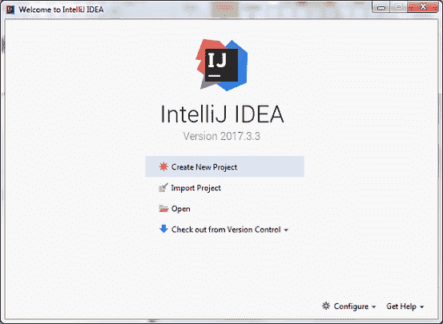
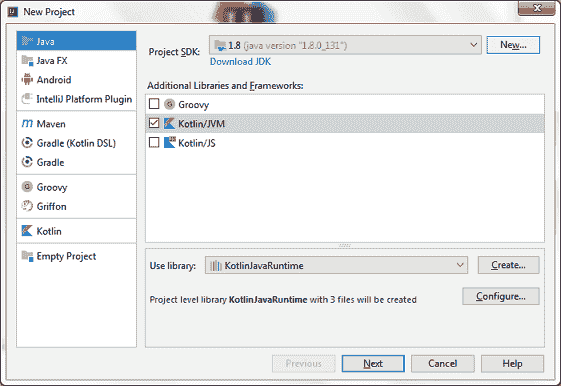
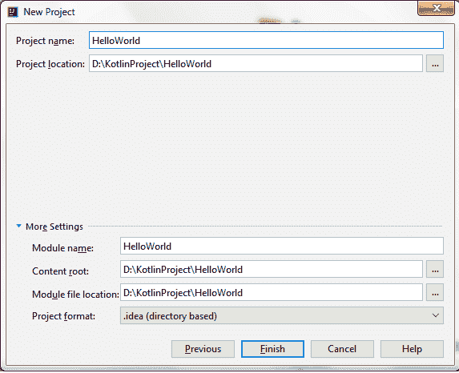
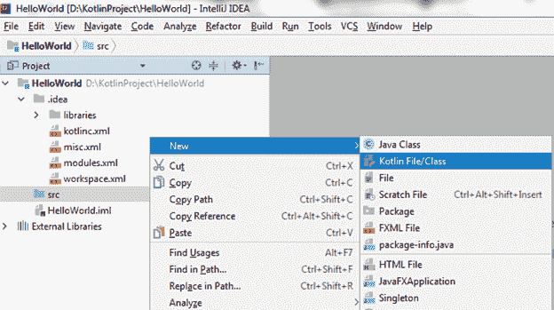
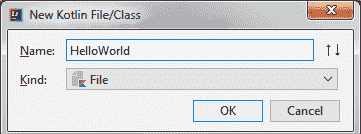
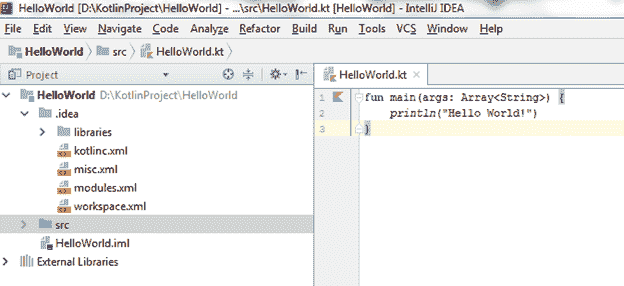
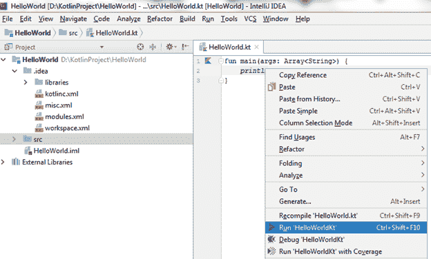
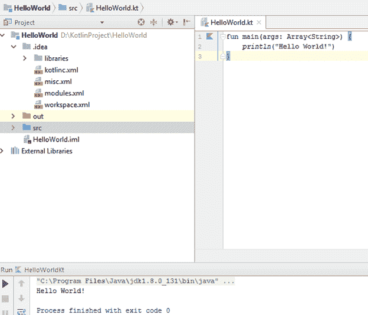

# 柯特林第一个程序打印' HelloWorld '

> 原文：<https://www.javatpoint.com/kotlin-first-program-on-ide>

让我们使用 IntelliJ IDEA IDE 创建一个 Kotlin 第一个示例。

## 创建第一个示例的步骤

**1。**打开 IntelliJ IDEA，点击“新建项目”。



**2。**选择 Java 选项，提供项目 SDK 路径，勾选 Kotlin/JVM 框架。



**3。**在新框架中提供项目详情，点击【完成】。



**4。**创建一个新的 Kotlin 文件来运行 Kotlin 第一个示例。转到 src - >新- >科特林文件/类。



**5。**输入文件名“HelloWorld”，点击“确定”。



**6。**在‘hello world . kt’文件中编写以下代码。Kotlin 文件和类是用“”保存的。kt "分机。

```

fun main(args: Array<String>) {
    println("Hello World!")
}

```

我们将在后面的教程中讨论这段代码的细节。



**7。**现在我们可以通过右键单击文件并选择运行选项来运行该程序。



**8。**最后，我们在控制台上得到程序的输出，显示‘hello world’消息。

