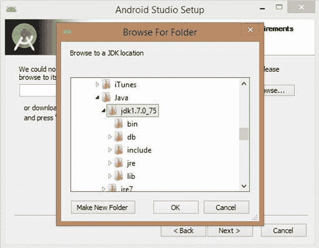
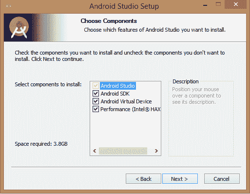

# 安卓工作室安装

> 原文：<https://www.javatpoint.com/kotlin-install-android-studio>

要使用 Kotlin 开发一个安卓应用，我们需要一个安卓应用开发 IDE，比如安卓 Studio。安卓工作室是一个集成开发环境，允许我们在单个平台上开发应用程序。我们可以从安卓工作室官方链接 [**下载安卓工作室**](https://developer.android.com/studio/index.html) 下载安卓工作室套装。

在我们的机器上安装安卓工作室之前，我们必须安装 Java。在这里看一个参考[**https://www.javatpoint.com/how-to-set-path-in-java**](https://www.javatpoint.com/how-to-set-path-in-java)来设定 JDK 的路径。

下载安卓工作室后，运行其设置并安装。按照说明进行安装。

单击“下一步”继续。

浏览 JDK 路径，然后单击下一步

检查我们要安装的组件。

提供 Android SDK 安装位置。

选择要使用模拟器实例的最大内存大小。

安卓工作室成功安装在我们的系统上。

