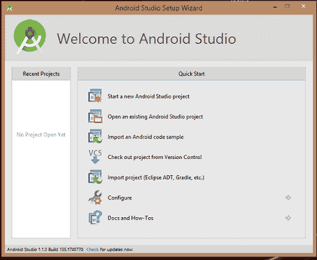
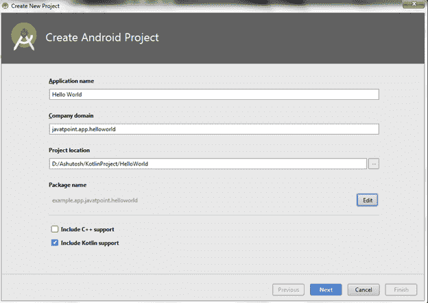
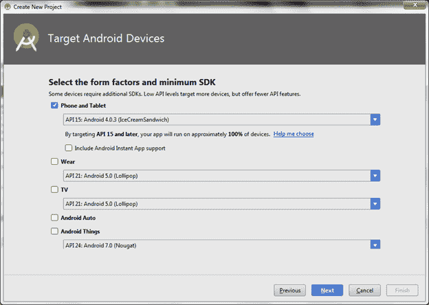
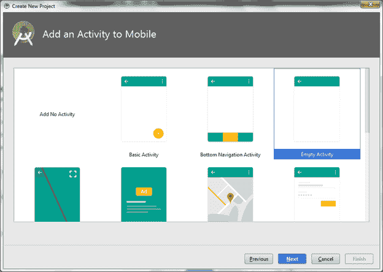
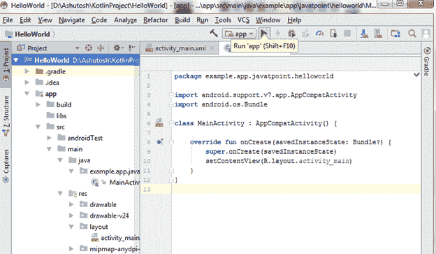
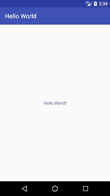

# Kotlin你好世界应用

> 原文：<https://www.javatpoint.com/kotlin-hello-world-app>

让？让我们使用 Kotlin 编程语言在 Android studio 上开发第一个 hello word 应用程序。要开发安卓应用程序，请启动AndroidStudio，并选择“启动新的AndroidStudio项目”选项。



提供一个应用程序名称(在我的案例中为“Hello World”)，并选中“包括 Kotlin 支持”，然后继续。



选择安卓应用的 API 级别，点击下一步。



选择活动类型，然后单击下一步。



**activity_main.xml**

在布局文件夹中创建一个 activity_main.xml 文件，并添加以下代码。

```

<?xml version="1.0" encoding="utf-8"?>
<android.support.constraint.ConstraintLayout xmlns:android="http://schemas.android.com/apk/res/android"
    xmlns:app="http://schemas.android.com/apk/res-auto"
    xmlns:tools="http://schemas.android.com/tools"
    android:layout_width="match_parent"
    android:layout_height="match_parent"
    tools:context="example.app.javatpoint.helloworld.MainActivity">

    <TextView
        android:layout_width="wrap_content"
        android:layout_height="wrap_content"
        android:text="Hello World!"
        app:layout_constraintBottom_toBottomOf="parent"
        app:layout_constraintLeft_toLeftOf="parent"
        app:layout_constraintRight_toRightOf="parent"
        app:layout_constraintTop_toTopOf="parent" />

</android.support.constraint.ConstraintLayout>

```

**MainActivity.kt**

在**示例. app.javatpoint.helloworld** 包中创建 MainActivity.kt 文件，添加以下代码。

```

package example.app.javatpoint.helloworld

import android.support.v7.app.AppCompatActivity
import android.os.Bundle

class MainActivity : AppCompatActivity() {

    override fun onCreate(savedInstanceState: Bundle?) {
        super.onCreate(savedInstanceState)
        setContentView(R.layout.activity_main)
    }
}

```

现在运行您的应用程序。



**输出:**

