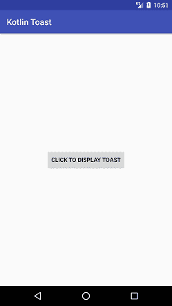
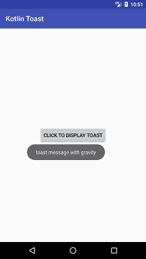

# 科特林安卓烤面包

> 哎哎哎:# t0]https://www . javatppoint . com/kot Lin-Android-toast

安卓 Toast 用于向用户显示排序时间通知，而不影响用户与 UI 的交互。使用 Toast 类显示的消息显示速度很快，一段时间后就会消失。吐司中的信息可以是文本、图像或两者兼有。

要了解更多关于安卓吐司的信息，请前往[安卓吐司示例](android-toast-example)

## Kotlin 安卓吐司示例

在本例中，我们将通过单击按钮来显示祝酒信息。请参见以下示例:

```

Toast.makeText(applicationContext,"this is toast message",Toast.LENGTH_SHORT).show()
val toast = Toast.makeText(applicationContext, "Hello Javatpoint", Toast.LENGTH_LONG)
            toast.show()
val myToast = Toast.makeText(applicationContext,"toast message with gravity",Toast.LENGTH_SHORT)
            myToast.setGravity(Gravity.LEFT,200,200)
            myToast.show()

```

*   **应用竞赛**返回上下文类的实例。
*   该消息为字符串类型**(“这是祝酒消息”)**。
*   敬酒。长度 _ 短和**吐司。长度 _ 长**是定义消息显示持续时间的常数。
*   toast 类的 **show()** 方法用于显示 Toast 消息。
*   吐司的 **setGravity()** 方法用于自定义吐司消息的位置。

### activity_main.xml

在 *activity_main.xml* 文件中添加以下代码。在这个文件中，我们在布局中添加了一个按钮来执行点击操作。

```

<?xml version="1.0" encoding="utf-8"?>
<android.support.constraint.ConstraintLayout xmlns:android="http://schemas.android.com/apk/res/android"
    xmlns:app="http://schemas.android.com/apk/res-auto"
    xmlns:tools="http://schemas.android.com/tools"
    android:layout_width="match_parent"
    android:layout_height="match_parent"
    tools:context="example.javatpoint.com.kotlintoast.MainActivity">

    <Button
        android:id="@+id/button"
        android:layout_width="wrap_content"
        android:layout_height="wrap_content"
        android:layout_marginBottom="8dp"
        android:layout_marginEnd="8dp"
        android:layout_marginStart="8dp"
        android:layout_marginTop="8dp"
        android:text="Click to display toast"
        app:layout_constraintBottom_toBottomOf="parent"
        app:layout_constraintEnd_toEndOf="parent"
        app:layout_constraintStart_toStartOf="parent"
        app:layout_constraintTop_toTopOf="parent" />
</android.support.constraint.ConstraintLayout>

```

### MainActivity.kt 公司

在 *MainActivity.kt* 类中添加以下代码。在本课中，我们在显示祝酒词的按钮上执行点击操作。

```

package example.javatpoint.com.kotlintoast

import android.support.v7.app.AppCompatActivity
import android.os.Bundle
import android.view.Gravity
import android.widget.Toast
import kotlinx.android.synthetic.main.activity_main.*

class MainActivity : AppCompatActivity() {

    override fun onCreate(savedInstanceState: Bundle?) {
        super.onCreate(savedInstanceState)
        setContentView(R.layout.activity_main)
        button.setOnClickListener(){
            Toast.makeText(applicationContext,"this is toast message",Toast.LENGTH_SHORT).show()

            val toast = Toast.makeText(applicationContext, "Hello Javatpoint", Toast.LENGTH_SHORT)
            toast.show()

            val myToast = Toast.makeText(applicationContext,"toast message with gravity",Toast.LENGTH_SHORT)
            myToast.setGravity(Gravity.LEFT,200,200)
            myToast.show()
        }
    }
}

```

**输出:**

 