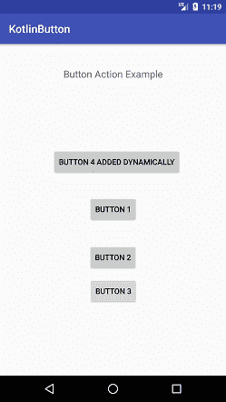
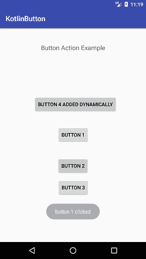
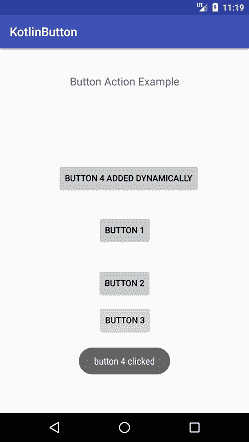

# Kotlin安卓按钮

> 原文：<https://www.javatpoint.com/kotlin-android-button>

**安卓按钮**是一个按钮，用于在点击时执行事件。这是一个在**安卓. widget.Button** 类下的用户界面组件。要了解更多关于安卓按钮的信息，请参考[安卓按钮示例](android-working-with-button)

使用 Kotlin，我们可以通过不同的方式在 Android Button 上执行事件，使用:

1.实现按钮的**设置点击监听器**

```

button1.setOnClickListener(){
            Toast.makeText(this,"button 1 clicked", Toast.LENGTH_SHORT).show()
        }

```

2.实现**视图。OnClickListner** 并覆盖其功能

```

button2.setOnClickListener(this) 
    . .
    override fun onClick(view: View) {
        //  TODO("not implemented") //To change body of created functions use File | Settings | File Templates.
    }

```

3.在布局文件中添加按钮的 **onClick** 属性并实现其功能。

```

    <Button
                android:onClick="clickButton"/>

    fun clickButton(v: View){
        val mToast = Toast.makeText(applicationContext,"button 3 clicked", Toast.LENGTH_SHORT)
        mToast.show()
    }

```

4.以编程方式创建一个按钮，并将其设置在布局上

```

button4.setLayoutParams(ViewGroup.LayoutParams(ViewGroup.LayoutParams.WRAP_CONTENT, ViewGroup.LayoutParams.WRAP_CONTENT))
        button4.setId(button4_Id)
        button4.x = 250f
        button4.y = 500f
        button4.setOnClickListener(this)
        constraintLayout.addView(button4)

```

## Kotlin安卓按钮示例

在本例中，我们将创建按钮并对其执行事件。点击按钮，显示祝酒信息。

### activity_main.xml

在 *activity_main.xml* 布局文件中添加三个按钮。它的代码如下。id button3 的 Button 增加了 **onClick** 属性，其函数名在 *MainActivity* 类文件中实现。

```

<?xml version="1.0" encoding="utf-8"?>
<android.support.constraint.ConstraintLayout xmlns:android="http://schemas.android.com/apk/res/android"
    xmlns:app="http://schemas.android.com/apk/res-auto"
    xmlns:tools="http://schemas.android.com/tools"
    android:layout_width="match_parent"
    android:layout_height="match_parent"
    android:id="@+id/constraintLayout"
    tools:context="example.javatpoint.com.kotlinbutton.MainActivity">
    <TextView
        android:layout_width="wrap_content"
        android:layout_height="wrap_content"
        android:text="Button Action Example"
        app:layout_constraintBottom_toBottomOf="parent"
        app:layout_constraintLeft_toLeftOf="parent"
        app:layout_constraintRight_toRightOf="parent"
        app:layout_constraintTop_toTopOf="parent"
        app:layout_constraintVertical_bias="0.073"
        android:textAppearance="@style/Base.TextAppearance.AppCompat.Medium"/>

    <Button
        android:id="@+id/button1"
        android:layout_width="95dp"
        android:layout_height="wrap_content"
        android:layout_marginBottom="8dp"
        android:layout_marginEnd="8dp"
        android:layout_marginStart="8dp"
        android:layout_marginTop="8dp"
        android:text="Button 1"
        app:layout_constraintBottom_toBottomOf="parent"
        app:layout_constraintEnd_toEndOf="parent"
        app:layout_constraintHorizontal_bias="0.501"
        app:layout_constraintStart_toStartOf="parent"
        app:layout_constraintTop_toTopOf="parent"
        app:layout_constraintVertical_bias="0.498" />

    <Button
        android:id="@+id/button2"
        android:layout_width="wrap_content"
        android:layout_height="wrap_content"
        android:layout_marginBottom="80dp"
        android:layout_marginEnd="8dp"
        android:layout_marginStart="8dp"
        android:layout_marginTop="8dp"
        android:text="Button 2"
        app:layout_constraintBottom_toBottomOf="parent"
        app:layout_constraintEnd_toEndOf="parent"
        app:layout_constraintStart_toStartOf="parent"
        app:layout_constraintTop_toTopOf="parent"
        app:layout_constraintVertical_bias="0.762" />

    <Button
        android:id="@+id/button3"
        android:layout_width="101dp"
        android:layout_height="48dp"
        android:layout_marginBottom="8dp"
        android:layout_marginEnd="8dp"
        android:layout_marginStart="8dp"
        android:layout_marginTop="8dp"
        android:onClick="clickButton"
        android:text="Button 3"
        app:layout_constraintBottom_toBottomOf="parent"
        app:layout_constraintEnd_toEndOf="parent"
        app:layout_constraintHorizontal_bias="0.502"
        app:layout_constraintStart_toStartOf="parent"
        app:layout_constraintTop_toTopOf="parent"
        app:layout_constraintVertical_bias="0.774" />
</android.support.constraint.ConstraintLayout>

```

### MainActivity.kt 公司

在 *MainActivity.kt* 类中添加以下代码。在这个类中，我们实现了按钮上的**设置点击监听器**监听器，实现了视图类的 OnClickListener(**视图)。OnClickListener** )并覆盖其功能 **onClick** 。在这个类中，我们还以编程方式创建一个按钮(button4)，定义它的属性，并在布局中设置它。

```

package example.javatpoint.com.kotlinbutton

import android.support.v7.app.AppCompatActivity
import android.os.Bundle
import android.view.View
import android.view.ViewGroup
import android.widget.Button
import android.widget.Toast
import kotlinx.android.synthetic.main.activity_main.*

class MainActivity : AppCompatActivity() , View.OnClickListener {
    val button4_Id: Int = 1111
    override fun onCreate(savedInstanceState: Bundle?) {
        super.onCreate(savedInstanceState)
        setContentView(R.layout.activity_main)
        button1.setOnClickListener(){
            Toast.makeText(this,"button 1 clicked", Toast.LENGTH_SHORT).show()
        }
        button2.setOnClickListener(this)
        // add button dynamically
        val button4 = Button(this)
        button4.setText("Button 4 added dynamically")
        button4.setLayoutParams(ViewGroup.LayoutParams(ViewGroup.LayoutParams.WRAP_CONTENT, ViewGroup.LayoutParams.WRAP_CONTENT))
        button4.setId(button4_Id)
        button4.x = 250f
        button4.y = 500f
        button4.setOnClickListener(this)
        constraintLayout.addView(button4)
    }
    override fun onClick(view: View) {
        //  TODO("not implemented") //To change body of created functions use File | Settings | File Templates.
        when (view.id) {
            R.id.button2 ->
                Toast.makeText(this,"button 2 clicked", Toast.LENGTH_SHORT).show()//single line code
            button4_Id->{//multiline code
                val myToast = Toast.makeText(this,"button 4 clicked", Toast.LENGTH_SHORT)
                myToast.show()
            }
        }
    }
    fun clickButton(v: View){
        val mToast = Toast.makeText(applicationContext,"button 3 clicked", Toast.LENGTH_SHORT)
        mToast.show()
    }
}

```

**输出:**

 
