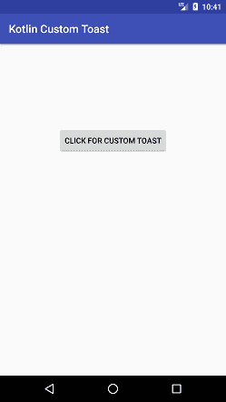
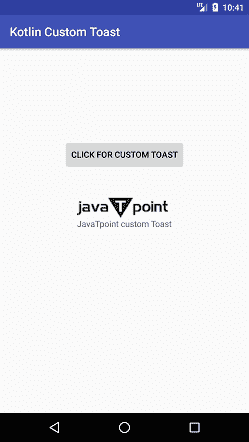

# Kotlin安卓定制吐司

> 原文：<https://www.javatpoint.com/kotlin-android-custom-toast>

在前面的例子中， [Kotlin 安卓吐司](kotlin-android-toast)我们显示了一个简单的吐司信息。我们也可以定制我们的信息，这将显示为祝酒词。在吐司中，我们可以显示字符串文本、图像或两者，并自定义其位置。

## Kotlin 安卓定制吐司示例

在本例中，我们将在单击按钮时显示文本和图像作为自定义吐司。

### activity_main.xml

在 *activity_main.xml* 文件中添加以下代码。在这个文件中，我们添加了一个按钮来执行点击操作。

```

<?xml version="1.0" encoding="utf-8"?>
<android.support.constraint.ConstraintLayout xmlns:android="http://schemas.android.com/apk/res/android"
    xmlns:app="http://schemas.android.com/apk/res-auto"
    xmlns:tools="http://schemas.android.com/tools"
    android:layout_width="match_parent"
    android:layout_height="match_parent"
    tools:context="example.javatpoint.com.kotlincustomtoast.MainActivity">

    <Button
        android:id="@+id/button"
        android:layout_width="wrap_content"
        android:layout_height="wrap_content"
        android:layout_marginBottom="8dp"
        android:layout_marginEnd="8dp"
        android:layout_marginStart="8dp"
        android:layout_marginTop="8dp"
        android:text="click for custom toast"
        app:layout_constraintBottom_toBottomOf="parent"
        app:layout_constraintEnd_toEndOf="parent"
        app:layout_constraintStart_toStartOf="parent"
        app:layout_constraintTop_toTopOf="parent"
        app:layout_constraintVertical_bias="0.266" />
</android.support.constraint.ConstraintLayout>

```

### custom_toast.xml

创建一个名为 *custom_toast.xml* 的布局文件，并添加一个 **ImageView** 和 **TextView** 来显示为一条吐司消息。将图像设置为图像视图，并在文本视图中放置消息。

```

<?xml version="1.0" encoding="utf-8"?>
<LinearLayout xmlns:android="http://schemas.android.com/apk/res/android"
    android:orientation="vertical" android:layout_width="match_parent"
    android:layout_height="match_parent"
    android:id="@+id/linearLayout">
    <ImageView
        android:id="@+id/custom_toast_image"
        android:layout_width="wrap_content"
        android:layout_height="wrap_content"
        android:contentDescription="logo image"
        android:src="@drawable/jtp_logo"/>

    <TextView
        android:id="@+id/custom_toast_message"
        android:layout_width="wrap_content"
        android:layout_height="wrap_content"
        android:contentDescription="To"
        android:text="JavaTpoint custom Toast" />
</LinearLayout>

```

### MainActivity.kt 公司

在这个 *MainActivity.kt* 类中，我们使用**layoutinflate()**方法获取视图对象。点击按钮显示带有图像和文本的祝酒词。通过使用 toast 类的实例调用视图(如 myToast.view = layout)，可以在 Toast 上添加自定义布局。

```

package example.javatpoint.com.kotlincustomtoast

import android.support.v7.app.AppCompatActivity
import android.os.Bundle
import android.widget.Toast
import android.view.Gravity
import kotlinx.android.synthetic.main.activity_main.*
import kotlinx.android.synthetic.main.custom_toast.*

class MainActivity : AppCompatActivity() {

    override fun onCreate(savedInstanceState: Bundle?) {
        super.onCreate(savedInstanceState)
        setContentView(R.layout.activity_main)
        //getting the View object as defined in the custom_toast.xml file
        val layout = layoutInflater.inflate(R.layout.custom_toast,linearLayout)
        button.setOnClickListener(){
            val myToast = Toast(applicationContext)
            myToast.duration = Toast.LENGTH_LONG
            myToast.setGravity(Gravity.CENTER_VERTICAL, 0, 0)
            myToast.view = layout//setting the view of custom toast layout
            myToast.show()
        }
    }
}

```

上面的代码执行以下任务:

*   **val my Toast**=**Toast(application context**:创建 Toast 类的实例。
*   **myToast.duration** = Toast。LENGTH_LONG:设置显示祝酒词的恒定持续时间。
*   **myToast.setGravity(重力。CENTER_VERTICAL，0，0)** :设置吐司信息的重力(位置)。
*   **myToast.view** =布局:添加自定义 _toast 布局进行查看。
*   **myToast.show()** :显示吐司信息。

**输出:**

 