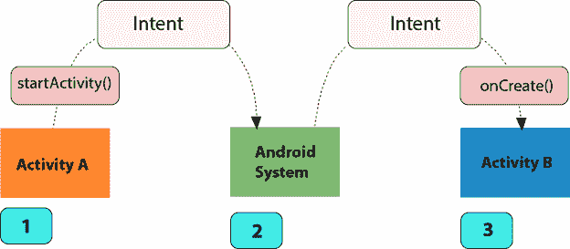
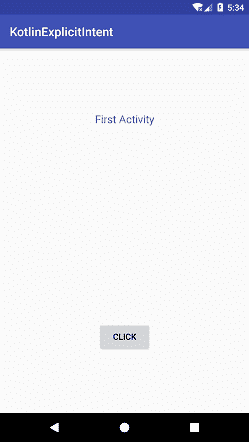
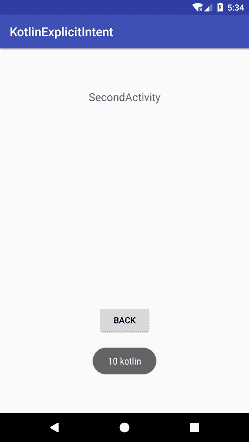

# Kotlin 安卓明确意图

> 原文：<https://www.javatpoint.com/kotlin-android-explicit-intent>

安卓意图是一个消息对象，用于请求另一个应用程序组件执行一个操作。Intent 便于用户通过多种方式与应用组件进行通信，如启动活动、启动服务、交付广播接收器等。

安卓意图主要用于:

*   启动服务
*   发起活动
*   显示网页
*   显示联系人列表
*   广播消息
*   拨打电话等。

## 安卓意图的类型

安卓有两种意图:

**明确意图**:该意图满足应用程序组件内的请求。它采用我们想要启动的活动或服务的完全限定类名。

```

intent = Intent(applicationContext, SecondActivity::class.java)
startActivity(intent)

```

**隐含意图**:该意图不指定组件名称。它调用另一个应用程序的组件来处理它。

```

intent = Intent(Intent.ACTION_VIEW)
intent.setData(Uri.parse("https://www.javatpoint.com/"))
startActivity(intent)

intent= Intent(Intent.ACTION_VIEW, Uri.parse("https://www.javatpoint.com/"))
startActivity(intent)

```

## Kotlin 安卓显式意图示例

在本例中，我们将使用显式意图从另一个活动类调用另一个活动类。使用 intent，我们将第一个活动类的数据发送到第二个活动类。第二个活动类获取这些数据，并在 toast 消息中显示它们。



### activity_main.xml

在 *activity_main.xml* 中添加以下代码。

```

<?xml version="1.0" encoding="utf-8"?>
<android.support.constraint.ConstraintLayout xmlns:android="http://schemas.android.com/apk/res/android"
    xmlns:app="http://schemas.android.com/apk/res-auto"
    xmlns:tools="http://schemas.android.com/tools"
    android:layout_width="match_parent"
    android:layout_height="match_parent"
    tools:context="example.javatpoint.com.kotlinexplicitintent.MainActivity">

    <TextView
        android:id="@+id/textView"
        android:layout_width="wrap_content"
        android:layout_height="wrap_content"
        android:layout_marginBottom="8dp"
        android:layout_marginTop="8dp"
        android:text="First Activity"
        android:textSize="18sp"
        app:layout_constraintBottom_toBottomOf="parent"
        app:layout_constraintHorizontal_bias="0.501"
        app:layout_constraintLeft_toLeftOf="parent"
        app:layout_constraintRight_toRightOf="parent"
        app:layout_constraintTop_toTopOf="parent"
        app:layout_constraintVertical_bias="0.172" />

    <Button
        android:id="@+id/button"
        android:layout_width="wrap_content"
        android:layout_height="wrap_content"
        android:layout_marginBottom="8dp"
        android:layout_marginEnd="8dp"
        android:layout_marginStart="8dp"
        android:layout_marginTop="8dp"
        android:text="Click"
        app:layout_constraintBottom_toBottomOf="parent"
        app:layout_constraintEnd_toEndOf="parent"
        app:layout_constraintStart_toStartOf="parent"
        app:layout_constraintTop_toBottomOf="@+id/textView"
        app:layout_constraintVertical_bias="0.77" />

</android.support.constraint.ConstraintLayout>

```

### MainActivity.kt 公司

在 **MainActivity.kt 类**中添加以下代码。在这个类中，我们创建了一个意图类的实例，并调用了组件活动类 SecondActivity.kt。意图类的 **putExtra(键，值)**方法将数据发送到 SecondActivity.kt 类。**开始活动()**方法开始意图。

```

package example.javatpoint.com.kotlinexplicitintent

import android.content.Intent
import android.support.v7.app.AppCompatActivity
import android.os.Bundle
import kotlinx.android.synthetic.main.activity_main.*

class MainActivity : AppCompatActivity() {
    val id:Int = 10
    val language:String = "kotlin"
    override fun onCreate(savedInstanceState: Bundle?) {
        super.onCreate(savedInstanceState)
        setContentView(R.layout.activity_main)

        button.setOnClickListener() {
            intent = Intent(this, SecondActivity::class.java)
            intent.putExtra("id_value", id)
            intent.putExtra("language_value", language)
            startActivity(intent)
        }
    }
}

```

创建另一个名为 SecondActivity 的活动类。

### second_activity.xml

在 second_activity.xml 文件中添加以下代码。

```

<?xml version="1.0" encoding="utf-8"?>
<android.support.constraint.ConstraintLayout xmlns:android="http://schemas.android.com/apk/res/android"
    xmlns:app="http://schemas.android.com/apk/res-auto"
    xmlns:tools="http://schemas.android.com/tools"
    android:layout_width="match_parent"
    android:layout_height="match_parent"
    tools:context="example.javatpoint.com.kotlinexplicitintent.SecondActivity">

    <TextView
        android:id="@+id/textView2"
        android:layout_width="wrap_content"
        android:layout_height="wrap_content"
        android:layout_marginBottom="8dp"
        android:layout_marginEnd="8dp"
        android:layout_marginStart="8dp"
        android:layout_marginTop="8dp"
        android:text="SecondActivity"
        android:textSize="18sp"
        app:layout_constraintBottom_toBottomOf="parent"
        app:layout_constraintEnd_toEndOf="parent"
        app:layout_constraintStart_toStartOf="parent"
        app:layout_constraintTop_toTopOf="parent"
        app:layout_constraintVertical_bias="0.107" />

    <Button
        android:id="@+id/button2"
        android:layout_width="wrap_content"
        android:layout_height="wrap_content"
        android:layout_marginBottom="8dp"
        android:layout_marginEnd="8dp"
        android:layout_marginStart="8dp"
        android:layout_marginTop="8dp"
        android:text="back"
        app:layout_constraintBottom_toBottomOf="parent"
        app:layout_constraintEnd_toEndOf="parent"
        app:layout_constraintStart_toStartOf="parent"
        app:layout_constraintTop_toTopOf="parent"
        app:layout_constraintVertical_bias="0.774" />
</android.support.constraint.ConstraintLayout>

```

### SecondActivity.kt

在 SecondActivity.kt 类中添加以下代码。在这个类中，我们通过使用 **intent.extras** 在 **Bundle** 类上创建实例来接收意图数据，并在 toast 消息中显示数据。通过点击按钮，我们调用了 Intent 来调用 MainActivity.kt 类。

```

package example.javatpoint.com.kotlinexplicitintent

import android.content.Intent
import android.support.v7.app.AppCompatActivity
import android.os.Bundle
import android.widget.Toast
import kotlinx.android.synthetic.main.activity_second.*

class SecondActivity : AppCompatActivity() {

    override fun onCreate(savedInstanceState: Bundle?) {
        super.onCreate(savedInstanceState)
        setContentView(R.layout.activity_second)

        val bundle:Bundle = intent.extras
        val id = bundle.get("id_value")
        val language = bundle.get("language_value")
        Toast.makeText(applicationContext,id.toString()+" "+language,Toast.LENGTH_LONG).show()
        button2.setOnClickListener(){
            intent = Intent(this,MainActivity::class.java)
            startActivity(intent)
        }
    }
}

```

**输出:**

 