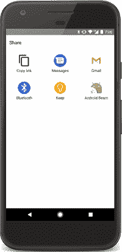
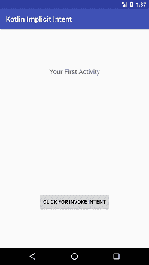
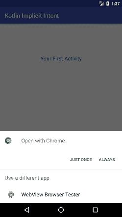

# Kotlin安卓隐含意图

> 原文：<https://www.javatpoint.com/kotlin-android-implicit-intent>

安卓**隐含意图**调用另一个应用的组件来处理请求。它没有具体指定组件名称。

例如，如果我们想要使用意图共享数据，它会调用相关的组件来满足请求。



```

intent = Intent(Intent.ACTION_VIEW)
intent.setData(Uri.parse("https://www.javatpoint.com/"))
startActivity(intent)

intent= Intent(Intent.ACTION_VIEW, Uri.parse("https://www.javatpoint.com/"))
startActivity(intent)

```

### Kotlin安卓隐含意图示例调用网址

在这个例子中，我们将使用隐式意图点击按钮来调用网址。

### activity_main.xml

在 *activity_main.xml* 文件中添加以下代码。在本活动中，我们使用一个按钮来调用意图。

```

<?xml version="1.0" encoding="utf-8"?>
<android.support.constraint.ConstraintLayout xmlns:android="http://schemas.android.com/apk/res/android"
    xmlns:app="http://schemas.android.com/apk/res-auto"
    xmlns:tools="http://schemas.android.com/tools"
    android:layout_width="match_parent"
    android:layout_height="match_parent"
    tools:context="example.javatpoint.com.kotlinimplicitintent.MainActivity">

    <TextView
        android:id="@+id/textView"
        android:layout_width="wrap_content"
        android:layout_height="wrap_content"
        android:layout_marginBottom="8dp"
        android:layout_marginTop="8dp"
        android:text="Your First Activity"
        android:textSize="18sp"
        app:layout_constraintBottom_toBottomOf="parent"
        app:layout_constraintHorizontal_bias="0.501"
        app:layout_constraintLeft_toLeftOf="parent"
        app:layout_constraintRight_toRightOf="parent"
        app:layout_constraintTop_toTopOf="parent"
        app:layout_constraintVertical_bias="0.172" />

    <Button
        android:id="@+id/button"
        android:layout_width="wrap_content"
        android:layout_height="wrap_content"
        android:layout_marginBottom="8dp"
        android:layout_marginEnd="8dp"
        android:layout_marginStart="8dp"
        android:layout_marginTop="8dp"
        android:text="click to invoke intent"
        app:layout_constraintBottom_toBottomOf="parent"
        app:layout_constraintEnd_toEndOf="parent"
        app:layout_constraintStart_toStartOf="parent"
        app:layout_constraintTop_toBottomOf="@+id/textView"
        app:layout_constraintVertical_bias="0.77" />

</android.support.constraint.ConstraintLayout>

```

### MainActivity.kt 公司

在 *MainActivity.kt* 类中添加以下代码。在这个类中，我们使用隐式意图来调用点击按钮的网址。为了调用这个意图，我们传递了动作类型和 URL。**启动活动()**方法用于启动意图。

```

package example.javatpoint.com.kotlinimplicitintent

import android.content.Intent
import android.net.Uri
import android.support.v7.app.AppCompatActivity
import android.os.Bundle
import kotlinx.android.synthetic.main.activity_main.*

class MainActivity : AppCompatActivity() {

    override fun onCreate(savedInstanceState: Bundle?) {
        super.onCreate(savedInstanceState)
        setContentView(R.layout.activity_main)

        button.setOnClickListener(){
            intent = Intent(Intent.ACTION_VIEW)
            intent.setData(Uri.parse("https://www.javatpoint.com/"))
            startActivity(intent)
            /*  intent= Intent(Intent.ACTION_VIEW, Uri.parse("https://www.javatpoint.com/"))
            startActivity(intent)*/
        }
    }
}

```

**输出:**

 
