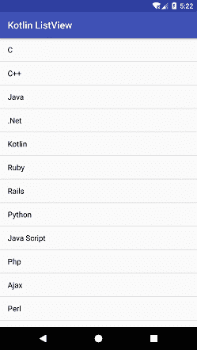
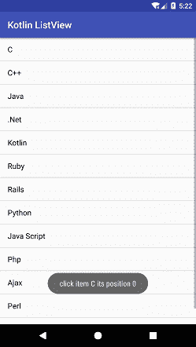

# Kotlin Android 列表视图

> 吴奇珍:t0]https://www . javatppoint . com/kot Lin-Android-list view

安卓**列表视图**是一个包含项目列表的视图组件，显示在一个可滚动的列表中。使用**适配器**类将列表项自动添加到列表中。适配器类在**适配器视图**和其他视图组件(列表视图、滚动视图等)之间桥接数据列表。).

调用**设置适配器**(适配器)将适配器与列表连接，以列表视图显示项目。要了解更多关于安卓列表视图的信息，请前往[https://www.javatpoint.com/android-listview-exampler](android-listview-example)

### Kotlin 安卓列表视图示例

在本例中，我们将创建一个**列表视图**，并对列表项执行点击操作。列表项可以在类文件中创建，也可以在一个单独的文件中创建，如 strings.xml。

例如，在类文件中创建列表项，并将其添加到 **ArrayAdapter** 类中:

```
val language = arrayOf("C","C++","Java",".Net","Kotlin","Ruby","Rails","Python","Java Script","Php","Ajax","Perl","Hadoop")
override fun onCreate(savedInstanceState: Bundle?) {
    super.onCreate(savedInstanceState)
    setContentView(R.layout.activity_main)
    val arrayAdapter = ArrayAdapter<string>(this,android.R.layout.simple_list_item_1,language)
    listView.adapter = arrayAdapter
}</string> 
```

在单独的 *strings.xml* 文件中创建列表项，并将其添加到 ArrayAdapter 类中:

```
<string-array name="technology_list">
        <item>C</item>
        <item>C++</item>
        <item>Java</item>
        <item>.Net</item>
</string-array>

val language:Array<String> = resources.getStringArray(R.array.technology_list)
val arrayAdapter = ArrayAdapter<String>(this,android.R.layout.simple_list_item_1,language)
listView.adapter = arrayAdapter

```

### activity_main.xml

添加一个**列表视图**组件来显示*活动 _main.xml* 文件中的项目列表。

```
<?xml version="1.0" encoding="utf-8"?>
<android.support.constraint.ConstraintLayout xmlns:android="http://schemas.android.com/apk/res/android"
    xmlns:app="http://schemas.android.com/apk/res-auto"
    xmlns:tools="http://schemas.android.com/tools"
    android:layout_width="match_parent"
    android:layout_height="match_parent"
    tools:context="example.javatpoint.com.kotlinlistview.MainActivity">

    <ListView
        android:id="@+id/listView"
        android:layout_width="match_parent"
        android:layout_height="fill_parent" />
</android.support.constraint.ConstraintLayout>

```

### strings.xml

在 *strings.xml* 文件中，创建一个字符串数组，并将列表项添加到项目标签中。

```
<resources>
    <string name="app_name">Kotlin ListView</string>
    <string-array name="technology_list">
        <item>C</item>
        <item>C++</item>
        <item>Java</item>
        <item>.Net</item>
        <item>Kotlin</item>
        <item>Ruby</item>
        <item>Rails</item>
        <item>Python</item>
        <item>Java Script</item>
        <item>Php</item>
        <item>Ajax</item>
        <item>Perl</item>
        <item>Hadoop</item>
    </string-array>
</resources>

```

### MainActivity.kt 公司

在 *MainActivity.kt* 类文件中添加以下代码。在这个类中，我们使用**resource . getstringgarray()**方法从 strings.xml 文件中获取项目列表。用应用程序上下文初始化的 **ArrayAdapter** 类将列表和数组项的资源类型设置为参数。**列表视图适配器** = **排列适配器**将适配器设置为列表视图。要对列表中的项目执行点击操作，请调用**图标监听器{}** 。

```
package example.javatpoint.com.kotlinlistview

import android.support.v7.app.AppCompatActivity
import android.os.Bundle
import android.widget.*
import kotlinx.android.synthetic.main.activity_main.*

class MainActivity : AppCompatActivity() {

   // val language = arrayOf<String>("C","C++","Java",".Net","Kotlin","Ruby","Rails","Python","Java Script","Php","Ajax","Perl","Hadoop")

    override fun onCreate(savedInstanceState: Bundle?) {
        super.onCreate(savedInstanceState)
        setContentView(R.layout.activity_main)

        val language:Array<String> = resources.getStringArray(R.array.technology_list)
        val arrayAdapter = ArrayAdapter<String>(this,android.R.layout.simple_list_item_1,language)

        listView.adapter = arrayAdapter
        listView.onItemClickListener = AdapterView.OnItemClickListener { adapterView, view, position, id ->
            val selectedItem = adapterView.getItemAtPosition(position) as String
            val itemIdAtPos = adapterView.getItemIdAtPosition(position)

            Toast.makeText(applicationContext,"click item $selectedItem its position $itemIdAtPos",Toast.LENGTH_SHORT).show()
        }
    }
}

```

**输出:**

 