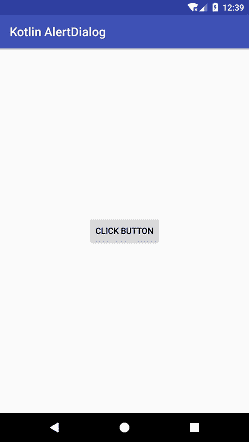
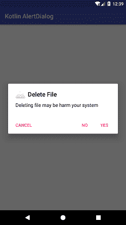
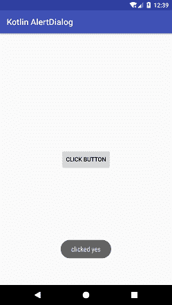

# Kotlin Android 警报对话框

> 哎哎哎:# t0]https://www . javatppoint . com/kot Lin-Android 警报对话框

安卓**警报对话框**是**对话框**类的子类。它用于提示一个小的对话框窗口，以便用户在不改变屏幕的情况下继续进行相同的活动之前做出决定。对话框显示标题、消息、最多三个按钮或自定义布局。

**警报对话框的实例。生成器**类用于制作一个提醒对话框。通过警报对话框，我们创建肯定(是)、否定(否)和中立(取消)决策。

## Kotlin 安卓警报对话框示例

在本例中，我们通过单击一个按钮来提示一个警报对话框窗口。该对话窗口将三个决策动作设置为积极、消极和中立。

### activity_main.xml

在 *activity_main.xml* 文件中添加以下代码。在这个布局文件中，我们添加了一个按钮来提示一个警告对话框。

```

<?xml version="1.0" encoding="utf-8"?>
<android.support.constraint.ConstraintLayout xmlns:android="http://schemas.android.com/apk/res/android"
    xmlns:app="http://schemas.android.com/apk/res-auto"
    xmlns:tools="http://schemas.android.com/tools"
    android:layout_width="match_parent"
    android:layout_height="match_parent"
    tools:context="example.javatpoint.com.kotlinalertdialog.MainActivity">

    <Button
        android:id="@+id/button"
        android:layout_width="wrap_content"
        android:layout_height="wrap_content"
        android:layout_marginBottom="8dp"
        android:layout_marginEnd="8dp"
        android:layout_marginStart="8dp"
        android:layout_marginTop="8dp"
        android:text="@string/button"
        app:layout_constraintBottom_toBottomOf="parent"
        app:layout_constraintEnd_toEndOf="parent"
        app:layout_constraintStart_toStartOf="parent"
        app:layout_constraintTop_toTopOf="parent" />

</android.support.constraint.ConstraintLayout>

```

### strings.xml

在 *strings.xml* 文件中添加以下代码。

```

<resources>
    <string name="app_name">Kotlin AlertDialog</string>
    <string name="button">click button</string>
    <string name="dialogTitle">Delete File</string>
    <string name="dialogMessage">Deleting file may be harm your system</string>

</resources>

```

### MainActivity.kt 公司

在 *MainActivity.kt* 类中添加以下代码。AlertDialog 的实例。Builder 类调用 setTitle()，setMessage()，setIcon()方法分别设置对话框标题，消息，图标。

要在警报对话框中设置操作，请分别调用积极、中立和消极操作的 setPositiveButton()和 setNeutralButton()方法。AlertDialog 的 show()方法。生成器用于显示警报对话框。

```

package example.javatpoint.com.kotlinalertdialog

import android.support.v7.app.AppCompatActivity
import android.os.Bundle
import android.support.v7.app.AlertDialog
import android.widget.Button
import android.widget.Toast

class MainActivity : AppCompatActivity() {

    override fun onCreate(savedInstanceState: Bundle?) {
        super.onCreate(savedInstanceState)
        setContentView(R.layout.activity_main)

        val button = findViewById<Button>(R.id.button)

        button.setOnClickListener {
            val builder = AlertDialog.Builder(this)
            //set title for alert dialog
            builder.setTitle(R.string.dialogTitle)
            //set message for alert dialog
            builder.setMessage(R.string.dialogMessage)
            builder.setIcon(android.R.drawable.ic_dialog_alert)

            //performing positive action
            builder.setPositiveButton("Yes"){dialogInterface, which ->
                Toast.makeText(applicationContext,"clicked yes",Toast.LENGTH_LONG).show()
            }
            //performing cancel action
            builder.setNeutralButton("Cancel"){dialogInterface , which ->
                Toast.makeText(applicationContext,"clicked cancel\n operation cancel",Toast.LENGTH_LONG).show()
            }
            //performing negative action
            builder.setNegativeButton("No"){dialogInterface, which ->
                Toast.makeText(applicationContext,"clicked No",Toast.LENGTH_LONG).show()
            }
            // Create the AlertDialog
            val alertDialog: AlertDialog = builder.create()
            // Set other dialog properties
            alertDialog.setCancelable(false)
            alertDialog.show()
        }
    }
}

```

**输出:**

 
