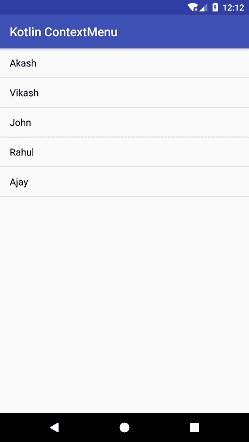
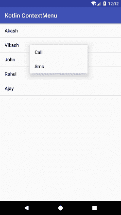
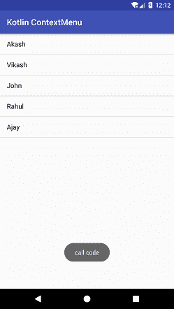

# Kotlin安卓上下文菜单

> 原文：<https://www.javatpoint.com/kotlin-android-context-menu>

**安卓上下文菜单**是一个浮动菜单，当用户长时间点击一个元素时就会出现。在上下文菜单上执行的操作仅影响选定的内容。上下文菜单可以在任何视图上实现，但它主要用于列表视图、网格视图或其他视图集合的项目。

上下文菜单是通过覆盖 **onCreateContextMenu()** 功能创建的。菜单资源通过调用**菜单菜单**类的**膨胀()**方法来膨胀。若要对菜单项进行操作，请重写 onContextItemSelected()函数。

## Kotlin 安卓上下文菜单示例

在本例中，我们将添加一个列表视图，并在其项目上实现上下文菜单。在列表项上执行长按显示了上下文菜单项，我们可以在这些菜单项上执行相关操作。

创建一个安卓项目，选择**基本活动**。本活动自动为菜单选项生成代码。

### activity_main.xml

在布局目录的 *activity_main.xml* 文件中添加以下代码。该代码在创建**基本活动**时自动生成。

```

<?xml version="1.0" encoding="utf-8"?>
<android.support.design.widget.CoordinatorLayout xmlns:android="http://schemas.android.com/apk/res/android"
    xmlns:app="http://schemas.android.com/apk/res-auto"
    xmlns:tools="http://schemas.android.com/tools"
    android:layout_width="match_parent"
    android:layout_height="match_parent"
    tools:context="example.javatpoint.com.kotlincontextmenu.MainActivity">

    <android.support.design.widget.AppBarLayout
        android:layout_width="match_parent"
        android:layout_height="wrap_content"
        android:theme="@style/AppTheme.AppBarOverlay">

        <android.support.v7.widget.Toolbar
            android:id="@+id/toolbar"
            android:layout_width="match_parent"
            android:layout_height="?attr/actionBarSize"
            android:background="?attr/colorPrimary"
            app:popupTheme="@style/AppTheme.PopupOverlay" />

    </android.support.design.widget.AppBarLayout>

    <include layout="@layout/content_main" />

</android.support.design.widget.CoordinatorLayout>

```

### content_main.xml

在布局目录的 *content_main.xml* 文件中添加以下代码。在这个文件中，我们添加了一个列表视图。

```

<?xml version="1.0" encoding="utf-8"?>
<android.support.constraint.ConstraintLayout xmlns:android="http://schemas.android.com/apk/res/android"
    xmlns:app="http://schemas.android.com/apk/res-auto"
    xmlns:tools="http://schemas.android.com/tools"
    android:layout_width="match_parent"
    android:layout_height="match_parent"
    app:layout_behavior="@string/appbar_scrolling_view_behavior"
    tools:context="example.javatpoint.com.kotlincontextmenu.MainActivity"
    tools:showIn="@layout/activity_main">

    <ListView
        android:id="@+id/listView"
        android:layout_width="match_parent"
        android:layout_height="match_parent" />
</android.support.constraint.ConstraintLayout>

```

### strings.xml

在 *strings.xml* 文件中添加以下代码。

```

<resources>
    <string name="app_name">Kotlin ContextMenu</string>
    <string name="action_call">Call</string>
    <string name="action_sms">Sms</string>
</resources>

```

### menu_main.xml

在菜单目录的 *menu_main.xml* 文件中添加以下代码。添加为上下文菜单创建菜单项的项目标记。

```

<menu xmlns:android="http://schemas.android.com/apk/res/android"
    xmlns:app="http://schemas.android.com/apk/res-auto"
    xmlns:tools="http://schemas.android.com/tools"
    tools:context="example.javatpoint.com.kotlincontextmenu.MainActivity">
    <item
        android:id="@+id/call"
        android:orderInCategory="100"
        android:title="@string/action_call"
        app:showAsAction="never" />
    <item
        android:id="@+id/sms"
        android:orderInCategory="100"
        android:title="@string/action_sms"
        app:showAsAction="never" />
</menu>

```

### MainActivity.kt 公司

在 *MianActivity.kt* 类中添加以下代码。在这个类中，我们创建一个列表视图，并在它的项目上实现上下文菜单。使用**注册上下文菜单(列表)**方法添加上下文菜单的列表项。要创建上下文菜单，覆盖 **onCreateContextMenu()** 并调用 **MenuInflater** 类的**explain()**方法。

要对上下文菜单的每个项目执行操作，请覆盖 **onContextItemSelected()** 功能。

```

package example.javatpoint.com.kotlincontextmenu

import android.os.Bundle
import android.support.v7.app.AppCompatActivity
import android.view.ContextMenu
import android.view.MenuItem
import android.view.View
import android.widget.ArrayAdapter

import kotlinx.android.synthetic.main.activity_main.*
import kotlinx.android.synthetic.main.content_main.*
import android.widget.Toast

class MainActivity : AppCompatActivity() {
    private val contact = arrayOf<String>("Akash","Vikash","John","Rahul","Ajay")
    override fun onCreate(savedInstanceState: Bundle?) {
        super.onCreate(savedInstanceState)
        setContentView(R.layout.activity_main)
        setSupportActionBar(toolbar)

        val arrayAdapter: ArrayAdapter<String> = ArrayAdapter<String>(this,android.R.layout.simple_list_item_1,contact)
        listView.adapter = arrayAdapter
        registerForContextMenu(listView)
    }

    override fun onCreateContextMenu(menu: ContextMenu?, v: View?, menuInfo: ContextMenu.ContextMenuInfo?) {
        super.onCreateContextMenu(menu, v, menuInfo)
        val inflater = menuInflater
        inflater.inflate(R.menu.menu_main, menu)
    }

    override fun onContextItemSelected(item: MenuItem?): Boolean {
        return when (item!!.itemId) {
            R.id.call ->{
                Toast.makeText(applicationContext, "call code", Toast.LENGTH_LONG).show()
                return true
            }
            R.id.sms ->{
                Toast.makeText(applicationContext, "sms code", Toast.LENGTH_LONG).show()
                return true
            }
            else -> super.onOptionsItemSelected(item)
        }
    }
}

```

 
