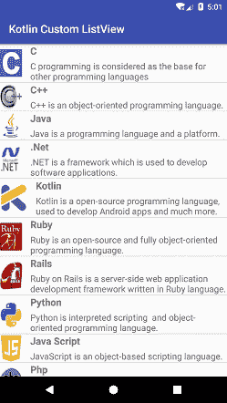
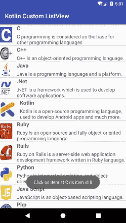

# Kotlin Android 自定义列表视图

> 原文：<https://www.javatpoint.com/kotlin-android-custom-listview>

在之前的教程 [Kotlin 安卓 ListView](kotlin-android-listview) 中，我们已经创建了一个默认 ListView 的例子。安卓提供了定制列表视图的工具。在本教程中，我们将自定义我们的列表视图。

适配器类用于在列表中添加列表项。它在适配器视图和其他视图组件(列表视图、滚动视图等)之间桥接数据列表。).

## Kotlin 安卓定制列表视图示例

在这个例子中，我们将创建一个自定义的列表视图，并对列表项执行点击操作。在这个自定义列表视图中，我们为列表视图的每一行添加了一个图像和两个不同的文本描述。

### activity_main.xml

在 *activity_main.xml* 文件中添加一个**列表视图**组件来显示项目列表。

```

<?xml version="1.0" encoding="utf-8"?>
<android.support.constraint.ConstraintLayout xmlns:android="http://schemas.android.com/apk/res/android"
    xmlns:app="http://schemas.android.com/apk/res-auto"
    xmlns:tools="http://schemas.android.com/tools"
    android:layout_width="match_parent"
    android:layout_height="match_parent"
    tools:context="example.javatpoint.com.kotlincustomlistview.MainActivity">

    <ListView
        android:id="@+id/listView"
        android:layout_width="match_parent"
        android:layout_height="match_parent"/>
</android.support.constraint.ConstraintLayout>

```

### custom_list.xml

在布局目录中创建一个名为 *custom_list.xml* 的布局文件，并添加一个 ImageView 和两个 TextView。图像视图用于显示图像，一个文本视图用于显示标题，另一个文本视图用于显示文本描述。

```

<?xml version="1.0" encoding="utf-8"?>
<LinearLayout xmlns:android="http://schemas.android.com/apk/res/android"
    xmlns:app="http://schemas.android.com/apk/res-auto"
    android:layout_width="match_parent"
    android:layout_height="match_parent"
    android:orientation="horizontal">
    <LinearLayout
        android:orientation="horizontal"
        android:layout_width="wrap_content"
        android:layout_height="wrap_content"
        android:gravity="center" >
    <ImageView
        android:id="@+id/icon"
        android:layout_width="wrap_content"
        android:layout_height="wrap_content"
        app:srcCompat="@mipmap/ic_launcher" />

    <LinearLayout
        android:layout_width="match_parent"
        android:layout_height="wrap_content"
        android:layout_weight="1"
        android:orientation="vertical">

        <TextView
            android:id="@+id/title"
            android:layout_width="match_parent"
            android:layout_height="wrap_content"
            android:text="title"
            android:textStyle="bold"
            android:layout_marginLeft="15dp"
            android:layout_marginStart="15dp"
            android:textAppearance="@style/Base.TextAppearance.AppCompat.Medium" />

        <TextView
            android:id="@+id/description"
            android:layout_width="match_parent"
            android:layout_height="wrap_content"
            android:text="description"
            android:layout_marginLeft="15dp"
            android:layout_marginStart="15dp"
            android:layout_marginTop="5dp"
            android:textSize="16sp"/>
    </LinearLayout>
    </LinearLayout>
</LinearLayout>

```

### MainActivity.kt 公司

在 *MainActivity.kt* 类中添加以下代码。在这个类中，我们创建了两个 String 数组和一个 Int 数组来分别存储字符串文本和图像 id。

在这个类中，我们通过传递上下文和数据作为参数来调用一个名为 MyListAdapter 的自定义适配器类。**列表视图适配器** = **我的列表适配器**将返回适配器设置为列表视图。

```

package example.javatpoint.com.kotlincustomlistview

import android.support.v7.app.AppCompatActivity
import android.os.Bundle
import android.widget.Toast
import kotlinx.android.synthetic.main.activity_main.*

class MainActivity : AppCompatActivity() {
    val language = arrayOf<String>("C","C++","Java",".Net","Kotlin","Ruby","Rails","Python","Java Script","Php","Ajax","Perl","Hadoop")
    val description = arrayOf<String>(
            "C programming is considered as the base for other programming languages",
            "C++ is an object-oriented programming language.",
            "Java is a programming language and a platform.",
            ".NET is a framework which is used to develop software applications.",
            "Kotlin is a open-source programming language, used to develop Android apps and much more.",
            "Ruby is an open-source and fully object-oriented programming language.",
            "Ruby on Rails is a server-side web application development framework written in Ruby language.",
            "Python is interpreted scripting  and object-oriented programming language.",
            "JavaScript is an object-based scripting language.",
            "PHP is an interpreted language, i.e., there is no need for compilation.",
            "AJAX allows you to send and receive data asynchronously without reloading the web page.",
            "Perl is a cross-platform environment used to create network and server-side applications.",
            "Hadoop is an open source framework from Apache written in Java."
    )

    val imageId = arrayOf<Int>(
            R.drawable.c_image,R.drawable.cpp_image,R.drawable.java_image,
            R.drawable.net_image,R.drawable.kotlin_image,R.drawable.ruby_image,
            R.drawable.rails_image,R.drawable.python_image,R.drawable.js_image,
            R.drawable.php_image,R.drawable.ajax_image,R.drawable.python_image,
            R.drawable.hadoop_image
    )
    override fun onCreate(savedInstanceState: Bundle?) {
        super.onCreate(savedInstanceState)
        setContentView(R.layout.activity_main)

        val myListAdapter = MyListAdapter(this,language,description,imageId)
        listView.adapter = myListAdapter

        listView.setOnItemClickListener(){adapterView, view, position, id ->
            val itemAtPos = adapterView.getItemAtPosition(position)
            val itemIdAtPos = adapterView.getItemIdAtPosition(position)
            Toast.makeText(this, "Click on item at $itemAtPos its item id $itemIdAtPos", Toast.LENGTH_LONG).show()
        }
    }
}

```

### my list 适配器. kt

现在，创建一个名为 *MyListAdapter.kt* 的自定义适配器类，将数据模型填充到列表视图中。

```

package example.javatpoint.com.kotlincustomlistview

import android.app.Activity
import android.view.View
import android.view.ViewGroup
import android.widget.*
class MyListAdapter(private val context: Activity, private val title: Array<String>, private val description: Array<String>, private val imgid: Array<Int>)
    : ArrayAdapter<String>(context, R.layout.custom_list, title) {

    override fun getView(position: Int, view: View?, parent: ViewGroup): View {
        val inflater = context.layoutInflater
        val rowView = inflater.inflate(R.layout.custom_list, null, true)

        val titleText = rowView.findViewById(R.id.title) as TextView
        val imageView = rowView.findViewById(R.id.icon) as ImageView
        val subtitleText = rowView.findViewById(R.id.description) as TextView

        titleText.text = title[position]
        imageView.setImageResource(imgid[position])
        subtitleText.text = description[position]

        return rowView
    }
}

```

**输出:**

 