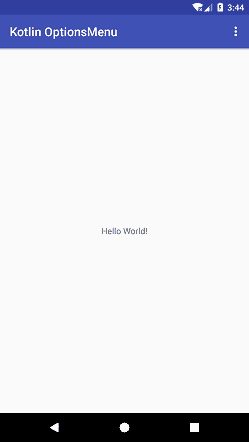
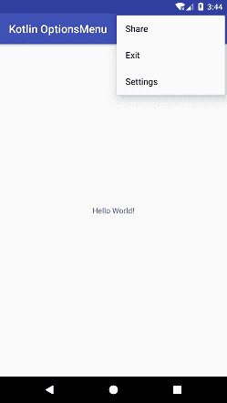
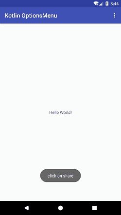

# Kotlin Android 选项菜单

> 原文：<https://www.javatpoint.com/kotlin-android-options-menu>

**安卓选项菜单**是一个活动的菜单项集合。选项菜单允许对应用程序进行全局影响的操作。

选项菜单是通过覆盖 **onCreateOptionsMenu()** 功能创建的。菜单资源通过调用**菜单菜单**类的**膨胀()**方法来膨胀。要对菜单项进行操作，覆盖 **onOptionsItemSelected()** 功能。

## Kotlin安卓选项菜单示例

在本例中，我们将在操作栏上添加选项菜单项。点击菜单显示选项菜单项，我们可以在上面执行相关操作。

创建一个安卓项目，选择**基本活动**。该活动自动生成菜单选项和**工具栏**的代码。

### activity_main.xml

在布局目录的 *activity_main.xml* 文件中添加以下代码。该代码在创建**基本活动**时自动生成。

```

<?xml version="1.0" encoding="utf-8"?>
<android.support.design.widget.CoordinatorLayout xmlns:android="http://schemas.android.com/apk/res/android"
    xmlns:app="http://schemas.android.com/apk/res-auto"
    xmlns:tools="http://schemas.android.com/tools"
    android:layout_width="match_parent"
    android:layout_height="match_parent"
    tools:context="example.javatpoint.com.kotlinoptionsmenu.MainActivity">

    <android.support.design.widget.AppBarLayout
        android:layout_width="match_parent"
        android:layout_height="wrap_content"
        android:theme="@style/AppTheme.AppBarOverlay">

        <android.support.v7.widget.Toolbar
            android:id="@+id/toolbar"
            android:layout_width="match_parent"
            android:layout_height="?attr/actionBarSize"
            android:background="?attr/colorPrimary"
            app:popupTheme="@style/AppTheme.PopupOverlay" />

    </android.support.design.widget.AppBarLayout>

    <include layout="@layout/content_main" />

</android.support.design.widget.CoordinatorLayout>

```

### content_main.xml

在布局目录的 *content_main.xml* 文件中添加以下代码。在这个布局中，您可以放置您的用户界面组件。

```

<?xml version="1.0" encoding="utf-8"?>
<android.support.constraint.ConstraintLayout xmlns:android="http://schemas.android.com/apk/res/android"
    xmlns:app="http://schemas.android.com/apk/res-auto"
    xmlns:tools="http://schemas.android.com/tools"
    android:layout_width="match_parent"
    android:layout_height="match_parent"
    app:layout_behavior="@string/appbar_scrolling_view_behavior"
    tools:context="example.javatpoint.com.kotlinoptionsmenu.MainActivity"
    tools:showIn="@layout/activity_main">

    <TextView
        android:layout_width="wrap_content"
        android:layout_height="wrap_content"
        android:text="Hello World!"
        app:layout_constraintBottom_toBottomOf="parent"
        app:layout_constraintLeft_toLeftOf="parent"
        app:layout_constraintRight_toRightOf="parent"
        app:layout_constraintTop_toTopOf="parent" />

</android.support.constraint.ConstraintLayout>

```

### strings.xml

在 *strings.xml* 文件中添加以下代码。

```

<resources>
    <string name="app_name">Kotlin OptionsMenu</string>
    <string name="action_settings">Settings</string>
    <string name="action_share">Share</string>
    <string name="action_exit">Exit</string>
</resources>

```

### menu_main.xml

在菜单目录的 *menu_main.xml* 文件中添加以下代码。添加为选项菜单创建菜单项的项目标记。

```

<menu xmlns:android="http://schemas.android.com/apk/res/android"
    xmlns:app="http://schemas.android.com/apk/res-auto"
    xmlns:tools="http://schemas.android.com/tools"
    tools:context="example.javatpoint.com.kotlinoptionsmenu.MainActivity">
    <item
        android:id="@+id/action_settings"
        android:orderInCategory="100"
        android:title="@string/action_settings"/>
    <item
        android:id="@+id/action_share"
        android:title="@string/action_share"
        app:showAsAction="never"/>
    <item
        android:id="@+id/action_exit"
        android:title="@string/action_exit"
        app:showAsAction="never"/>
</menu>

```

### MainActivity.kt 公司

在 *MainActivity.kt* 类中添加以下代码。在这个类中，我们覆盖了函数 **onCreateOptionsMenu()** ，并调用**菜单的**explain()**类来扩展菜单并向动作栏添加项目。**

要对每个选项执行操作，菜单会覆盖 **onOptionsItemSelected()** 功能。

```

package example.javatpoint.com.kotlinoptionsmenu

import android.os.Bundle
import android.support.v7.app.AppCompatActivity
import android.view.Menu
import android.view.MenuItem
import android.widget.Toast

import kotlinx.android.synthetic.main.activity_main.*

class MainActivity : AppCompatActivity() {

    override fun onCreate(savedInstanceState: Bundle?) {
        super.onCreate(savedInstanceState)
        setContentView(R.layout.activity_main)
        setSupportActionBar(toolbar)
    }

    override fun onCreateOptionsMenu(menu: Menu): Boolean {
        // Inflate the menu; this adds items to the action bar if it is present.
        menuInflater.inflate(R.menu.menu_main, menu)
        return true
    }

    override fun onOptionsItemSelected(item: MenuItem): Boolean {
        return when (item.itemId) {
            R.id.action_settings -> {
                Toast.makeText(applicationContext, "click on setting", Toast.LENGTH_LONG).show()
                true
            }
            R.id.action_share ->{
                Toast.makeText(applicationContext, "click on share", Toast.LENGTH_LONG).show()
                return true
            }
            R.id.action_exit ->{
                Toast.makeText(applicationContext, "click on exit", Toast.LENGTH_LONG).show()
                return true
            }
            else -> super.onOptionsItemSelected(item)
        }
    }
}

```

**输出:**

 


* * *

## 使用动作栏上的图像创建选项菜单

我们还可以将选项菜单显示为动作栏上的图像。要在选项菜单中设置图像，请在项目标签中添加图标属性，如下所示。

### menu_main.xml

```

<menu xmlns:android="http://schemas.android.com/apk/res/android"
xmlns:app="http://schemas.android.com/apk/res-auto"
xmlns:tools="http://schemas.android.com/tools"
tools:context="example.javatpoint.com.kotlinoptionmenu.MainActivity">
<item
    android:id="@+id/action_settings"
    android:orderInCategory="100"
    android:title="@string/action_settings"
    android:icon="@android:drawable/btn_star" />
<item
    android:id="@+id/action_share"
    android:title="@string/action_share"
    app:showAsAction="ifRoom"
    android:icon="@drawable/shareimage"/>
<item
    android:id="@+id/action_exit"
    android:title="@string/action_exit"
    app:showAsAction="ifRoom"
    android:icon="@drawable/exitimage"/>
</menu>

```