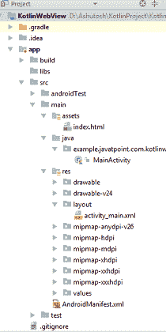

# 科特林 Android WebView

> 哎哎哎:# t0]https://www . javatppoint . com/kot Lin-Android-webview

安卓网络视图是一个显示应用程序中网页的视图组件。它使用网络工具包引擎来显示网页。android.webkit.WebView 类是 AbsoluteLayout 类的子类。

WebView 的 loadUrl()和 loadData()方法用于加载和显示网页。要了解更多关于安卓网络视图的信息，请前往[https://www.javatpoint.com/android-webview-example](android-webview-example)

在网络视图中加载网页有不同的方法，例如:

将 **HTML** 内容作为字符串加载到类中:

```

val wedData: String =  "<html><body><h1>Hello, Javatpoint!</h1></body></html>"
val mimeType: String = "text/html"
val utfType: String = "UTF-8"
webView.loadData(wedData,mimeType,utfType)

```

加载网页(。html，。jsp 等。)从应用程序内部。在这种情况下，网页被放在资产目录中。

```

webView.loadUrl("file:///android_asset/index.html")

```

在网络视图中加载网址，如下所示:

```

webView.loadUrl("https://www.javatpoint.com/")

```

## 科特林安卓网络视图示例

在本例中，我们将在**网络视图**组件中加载网络网址，并覆盖该网址。

### 目录结构



### activity_main.xml

在 *activity_main.xml* 文件中添加 WebView 组件。

```

<?xml version="1.0" encoding="utf-8"?>
<LinearLayout xmlns:android="http://schemas.android.com/apk/res/android"
    xmlns:app="http://schemas.android.com/apk/res-auto"
    xmlns:tools="http://schemas.android.com/tools"
    android:layout_width="match_parent"
    android:layout_height="match_parent"
    tools:context="example.javatpoint.com.kotlinwebview.MainActivity">

    <WebView
        android:id="@+id/webView"
        android:layout_width="fill_parent"
        android:layout_height="fill_parent"/>
</LinearLayout>

```

### androidmenifest . xml 文件

在 *AndroidMenifest.xml* 文件中，添加连接网络连接的 Internet 权限。

```

<uses-permission android:name="android.permission.INTERNET"/>

<?xml version="1.0" encoding="utf-8"?>
<manifest xmlns:android="http://schemas.android.com/apk/res/android"
    package="example.javatpoint.com.kotlinwebview">
    <uses-permission android:name="android.permission.INTERNET"/>
    <application
        android:allowBackup="true"
        android:icon="@mipmap/ic_launcher"
        android:label="@string/app_name"
        android:roundIcon="@mipmap/ic_launcher_round"
        android:supportsRtl="true"
        android:theme="@style/AppTheme">
        <activity android:name=".MainActivity">
            <intent-filter>
                <action android:name="android.intent.action.MAIN" />

                <category android:name="android.intent.category.LAUNCHER" />
            </intent-filter>
        </activity>
    </application>

</manifest>

```

### MainActivity.kt 公司

在 *MainActivity.kt* 类中添加以下代码。在这个类中，我们使用网络视图的**加载网址()**方法来加载网址。

创建一个 MyWebViewClient 类，扩展覆盖**应该覆盖的 **WebViewClient** 方法。**

```

package example.javatpoint.com.kotlinwebview

import android.app.Activity
import android.os.Build
import android.support.v7.app.AppCompatActivity
import android.os.Bundle
import android.support.annotation.RequiresApi
import android.webkit.WebResourceError
import android.webkit.WebResourceRequest
import android.webkit.WebView
import android.webkit.WebViewClient
import android.widget.Toast
import kotlinx.android.synthetic.main.activity_main.*

class MainActivity : AppCompatActivity() {

    override fun onCreate(savedInstanceState: Bundle?) {
        super.onCreate(savedInstanceState)
        setContentView(R.layout.activity_main)

      /*  val wedData: String =  "<html><body><h1>Hello, Javatpoint!</h1></body></html>"
        val mimeType: String = "text/html"
        val utfType: String = "UTF-8"
        webView.loadData(wedData,mimeType,utfType)*/

        /* val myWebUrl: String = "file:///android_asset/index.html"
         webView.loadUrl(myWebUrl)*/

        webView.webViewClient = MyWebViewClient(this)
        webView.loadUrl("https://www.javatpoint.com/")
    }
    class MyWebViewClient internal constructor(private val activity: Activity) : WebViewClient() {

        @RequiresApi(Build.VERSION_CODES.LOLLIPOP)
        override fun shouldOverrideUrlLoading(view: WebView?, request: WebResourceRequest?): Boolean {
            val url: String = request?.url.toString();
            view?.loadUrl(url)
            return true
        }

        override fun shouldOverrideUrlLoading(webView: WebView, url: String): Boolean {
            webView.loadUrl(url)
            return true
        }

        override fun onReceivedError(view: WebView, request: WebResourceRequest, error: WebResourceError) {
            Toast.makeText(activity, "Got Error! $error", Toast.LENGTH_SHORT).show()
        }
    }
}

```

**输出:**

