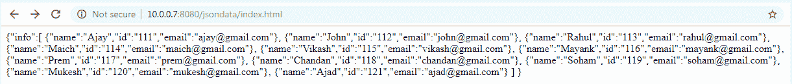
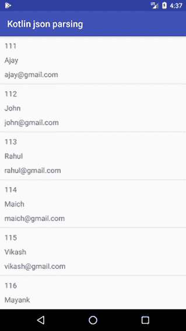

# 使用网址解析安卓 JSON

> 原文：<https://www.javatpoint.com/kotlin-android-json-parsing-using-url>

**JSON** 指的是 **JavaScript 对象标注**，是一种编程语言。JSON 用于解析服务器和客户端之间的数据。它是最小的、文本的和 JavaScript 的子集。它是 XML 解析的替代方法。

### JSON 相对于 XML 的优势

1.  对于 AJAX 应用程序，JSON 比 XML 更快更容易。
2.  与 XML 不同，它更短，读写更快。
3.  它使用数组。

### 对象

JSON 对象像映射一样包含键/值对。键是字符串，值是 JSON 类型。逗号分隔键和值(，)。大括号{}代表 JSON 对象。

## 使用网址解析示例

在这个例子中，我们从网址解析 JSON 数据，并将它们绑定到一个列表视图中。JSON 数据包含“id”“名称”“电子邮件”。

### index.html 数据公司

创建一个 JSON 文件 index.html。

```

{"info":[
		{"name":"Ajay","id":"111","email":"ajay@gmail.com"},
		{"name":"John","id":"112","email":"john@gmail.com"},
		{"name":"Rahul","id":"113","email":"rahul@gmail.com"},
		{"name":"Maich","id":"114","email":"maich@gmail.com"},
		{"name":"Vikash","id":"115","email":"vikash@gmail.com"},
		{"name":"Mayank","id":"116","email":"mayank@gmail.com"},
		{"name":"Prem","id":"117","email":"prem@gmail.com"},
		{"name":"Chandan","id":"118","email":"chandan@gmail.com"},
		{"name":"Soham","id":"119","email":"soham@gmail.com"},
		{"name":"Mukesh","id":"120","email":"mukesh@gmail.com"},
		{"name":"Ajad","id":"121","email":"ajad@gmail.com"}
		]
}

```

执行 JSON 文件时(index.html)，看起来像:



### activity_main.xml

在 activity_main.xml 布局文件中添加 ListView。

```

<?xml version="1.0" encoding="utf-8"?>
<android.support.constraint.ConstraintLayout xmlns:android="http://schemas.android.com/apk/res/android"
    xmlns:app="http://schemas.android.com/apk/res-auto"
    xmlns:tools="http://schemas.android.com/tools"
    android:layout_width="match_parent"
    android:layout_height="match_parent"
    tools:context="example.javatpoint.com.kotlinjsonparsing.MainActivity">

    <ListView
        android:id="@+id/listView"
        android:layout_width="match_parent"
        android:layout_height="match_parent">

    </ListView>

</android.support.constraint.ConstraintLayout>

```

### build.gradle

在 build.gradle 文件中添加以下 **okhttp** 依赖项。

```

compile 'com.squareup.okhttp3:okhttp:3.8.1'

```

### Model.kt

创建一个数据模型类 Model.kt，其中包括信息字符串“id”、字符串“name”和字符串“email”。

```

package example.javatpoint.com.kotlinjsonparsing

public class Model{
    lateinit var id:String
    lateinit var name:String
    lateinit var email:String

    constructor(id: String,name:String,email:String) {
        this.id = id
        this.name = name
        this.email = email
    }

    constructor()
}

```

### 适配器 _layout.xml

在布局目录中创建一个包含 ListView 行项目的 adapter_layout.xml 文件。

```

<?xml version="1.0" encoding="utf-8"?>
<LinearLayout xmlns:android="http://schemas.android.com/apk/res/android"
    android:layout_width="match_parent"
    android:layout_height="wrap_content"
    android:id="@+id/linearLayout"
    android:padding="5dp"
    android:orientation="vertical">

    <TextView
        android:layout_width="wrap_content"
        android:layout_height="wrap_content"
        android:id="@+id/tvId"
        android:layout_margin="5dp"
        android:textSize="16dp"/>
    <TextView
        android:layout_width="wrap_content"
        android:layout_height="wrap_content"
        android:id="@+id/tvName"
        android:textSize="16dp"
        android:layout_margin="5dp"/>

    <TextView
        android:layout_width="wrap_content"
        android:layout_height="wrap_content"
        android:id="@+id/tvEmail"
        android:layout_margin="5dp"
        android:textSize="16dp"/>

</LinearLayout>

```

### CustomAdapter.kt

创建一个自定义适配器类 CustomAdapter.kt，并扩展 BaseAdapter 来处理自定义列表视图。

```

package example.javatpoint.com.kotlinjsonparsing

import android.content.Context
import android.view.LayoutInflater
import android.view.View
import android.view.ViewGroup
import android.widget.BaseAdapter
import android.widget.LinearLayout
import android.widget.TextView

class CustomAdapter(context: Context,arrayListDetails:ArrayList<Model>) : BaseAdapter(){

    private val layoutInflater: LayoutInflater
    private val arrayListDetails:ArrayList<Model>

    init {
        this.layoutInflater = LayoutInflater.from(context)
        this.arrayListDetails=arrayListDetails
    }

    override fun getCount(): Int {
        return arrayListDetails.size
    }

    override fun getItem(position: Int): Any {
        return arrayListDetails.get(position)
    }

    override fun getItemId(position: Int): Long {
        return position.toLong()
    }

    override fun getView(position: Int, convertView: View?, parent: ViewGroup): View? {
        val view: View?
        val listRowHolder: ListRowHolder
        if (convertView == null) {
            view = this.layoutInflater.inflate(R.layout.adapter_layout, parent, false)
            listRowHolder = ListRowHolder(view)
            view.tag = listRowHolder
        } else {
            view = convertView
            listRowHolder = view.tag as ListRowHolder
        }

        listRowHolder.tvName.text = arrayListDetails.get(position).name
        listRowHolder.tvEmail.text = arrayListDetails.get(position).email
        listRowHolder.tvId.text = arrayListDetails.get(position).id
        return view
    }
}

private class ListRowHolder(row: View?) {
    public val tvName: TextView
    public val tvEmail: TextView
    public val tvId: TextView
    public val linearLayout: LinearLayout

    init {
        this.tvId = row?.findViewById<TextView>(R.id.tvId) as TextView
        this.tvName = row?.findViewById<TextView>(R.id.tvName) as TextView
        this.tvEmail = row?.findViewById<TextView>(R.id.tvEmail) as TextView
        this.linearLayout = row?.findViewById<LinearLayout>(R.id.linearLayout) as LinearLayout
    }
}

```

### MainActivity.kt 公司

在 MainActivity.kt 类文件中添加以下代码。这个类以 JSON 对象的形式读取 JSON 数据。使用 JSON 对象，我们读取 JSON 数组数据。JSON 数据绑定在数组列表中。

```

package example.javatpoint.com.kotlinjsonparsing

import android.support.v7.app.AppCompatActivity
import android.os.Bundle
import android.view.View
import android.widget.ListView
import android.widget.ProgressBar
import okhttp3.*
import org.json.JSONArray
import org.json.JSONObject
import java.io.IOException
import kotlin.collections.ArrayList

class MainActivity : AppCompatActivity() {
    lateinit var progress:ProgressBar
    lateinit var listView_details: ListView
    var arrayList_details:ArrayList<Model> = ArrayList();
    //OkHttpClient creates connection pool between client and server
    val client = OkHttpClient()
    override fun onCreate(savedInstanceState: Bundle?) {
        super.onCreate(savedInstanceState)
        setContentView(R.layout.activity_main)
        progress = findViewById(R.id.progressBar)
        progress.visibility = View.VISIBLE
        listView_details = findViewById<ListView>(R.id.listView) as ListView
        run("http://10.0.0.7:8080/jsondata/index.html")
    }

    fun run(url: String) {
        progress.visibility = View.VISIBLE
        val request = Request.Builder()
                .url(url)
                .build()

        client.newCall(request).enqueue(object : Callback {
            override fun onFailure(call: Call, e: IOException) {
                progress.visibility = View.GONE
            }

            override fun onResponse(call: Call, response: Response) {
                var str_response = response.body()!!.string()
                //creating json object
                val json_contact:JSONObject = JSONObject(str_response)
                //creating json array
                var jsonarray_info:JSONArray= json_contact.getJSONArray("info")
                var i:Int = 0
                var size:Int = jsonarray_info.length()
                arrayList_details= ArrayList();
                for (i in 0.. size-1) {
                    var json_objectdetail:JSONObject=jsonarray_info.getJSONObject(i)
                    var model:Model= Model();
                    model.id=json_objectdetail.getString("id")
                    model.name=json_objectdetail.getString("name")
                    model.email=json_objectdetail.getString("email")
                    arrayList_details.add(model)
                }

                runOnUiThread {
                    //stuff that updates ui
                    val obj_adapter : CustomAdapter
                    obj_adapter = CustomAdapter(applicationContext,arrayList_details)
                    listView_details.adapter=obj_adapter
                }
                progress.visibility = View.GONE
            }
        })
    }
}

```

### AndroidManifest.xml

在 AndroidManifest.xml 文件中添加互联网权限。

```

<uses-permission android:name="android.permission.INTERNET"/>

```

**输出:**

