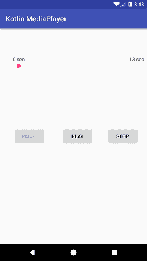
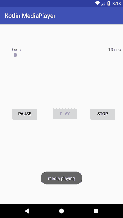
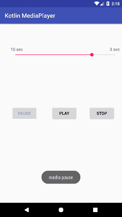

# Kotlin 安卓媒体播放器

> 原文：<https://www.javatpoint.com/kotlin-android-media-player>

**MediaPlayer** 是一个用来控制音频/视频文件和流播放的类。

**Android . media . mediaplayer**类用于控制音频或视频文件。它访问内置的媒体播放器服务，如播放音频、视频等。要使用 **MediaPlayer** 类，我们必须通过调用该类的 **create()** 方法来调用它的 create 实例。

### MediaPlayer 类的方法

MediaPlayer 类有几种可用的方法。其中一些如下:

| 方法 | 描述 |
| 公共空集合数据源(字符串路径) | 它设置要使用的数据源(文件路径或 http url)。 |
| 公共作废准备() | 它为播放器同步播放做准备。 |
| 公共无效开始() | 它开始或恢复播放。 |
| 公共无效停止() | 它会停止播放。 |
| 公共无效暂停() | 它会暂停播放。 |
| 公共布尔 isPlaying() | 它检查媒体播放器是否正在播放。 |
| 公共无效 seekTo(整数毫秒) | 它寻求以毫秒为单位的指定时间。 |
| 公共 void 设置循环(布尔循环) | 它设置播放器是循环播放还是非循环播放。 |
| 公共布尔 isLooping() | 它检查播放器是循环播放还是非循环播放。 |
| 公共空间选择轨迹(整数索引) | 它为指定的索引选择一个轨道。 |
| public int getCurrentPosition() | 它返回当前播放位置。 |
| public int getduration() | 它返回文件的持续时间。 |
| 公共 void setVolume(左浮动卷，右浮动卷) | 它设置这个播放器的音量。 |

## 带有 SeekBar 的安卓媒体播放器示例

在本例中，我们将创建一个具有播放控制功能(如播放、暂停和停止)的媒体播放器。我们还集成了 SeekBar 来显示媒体播放器的进度水平。

### activity_main.xml

在 activity_main.xml 布局文件中，我们增加了**按钮**控制媒体播放， **TextView** 显示歌曲时长， **SeekBar** 显示媒体文件进度级别。

```

<?xml version="1.0" encoding="utf-8"?>
<android.support.constraint.ConstraintLayout xmlns:android="http://schemas.android.com/apk/res/android"
    xmlns:app="http://schemas.android.com/apk/res-auto"
    xmlns:tools="http://schemas.android.com/tools"
    android:layout_width="match_parent"
    android:layout_height="match_parent"
    tools:context="example.javatpoint.com.kotlinmediaplayer.MainActivity">

    <Button
        android:id="@+id/pauseBtn"
        android:layout_width="wrap_content"
        android:layout_height="wrap_content"
        android:layout_marginBottom="8dp"
        android:layout_marginEnd="8dp"
        android:layout_marginStart="8dp"
        android:layout_marginTop="8dp"
        android:enabled="false"
        android:text="Pause"
        app:layout_constraintBottom_toBottomOf="parent"
        app:layout_constraintEnd_toStartOf="@+id/playBtn"
        app:layout_constraintStart_toStartOf="parent"
        app:layout_constraintTop_toTopOf="parent" />

    <Button
        android:id="@+id/playBtn"
        android:layout_width="88dp"
        android:layout_height="wrap_content"
        android:layout_marginBottom="8dp"
        android:layout_marginEnd="8dp"
        android:layout_marginStart="8dp"
        android:layout_marginTop="8dp"
        android:text="Play"
        app:layout_constraintBottom_toBottomOf="parent"
        app:layout_constraintEnd_toStartOf="@+id/stopBtn"
        app:layout_constraintStart_toEndOf="@+id/pauseBtn"
        app:layout_constraintTop_toTopOf="parent" />

    <Button
        android:id="@+id/stopBtn"
        android:layout_width="wrap_content"
        android:layout_height="wrap_content"
        android:layout_marginBottom="8dp"
        android:layout_marginEnd="24dp"
        android:layout_marginRight="24dp"
        android:layout_marginTop="8dp"
        android:enabled="false"
        android:text="Stop"
        app:layout_constraintBottom_toBottomOf="parent"
        app:layout_constraintEnd_toEndOf="parent"
        app:layout_constraintTop_toTopOf="parent" />

    <RelativeLayout
        android:layout_width="368dp"
        android:layout_height="wrap_content"
        android:layout_marginEnd="8dp"
        android:layout_marginStart="8dp"
        android:layout_marginTop="76dp"
        app:layout_constraintEnd_toEndOf="parent"
        app:layout_constraintHorizontal_bias="1.0"
        app:layout_constraintStart_toStartOf="parent"
        app:layout_constraintTop_toTopOf="parent">

        <TextView
            android:id="@+id/tv_pass"
            android:layout_width="wrap_content"
            android:layout_height="wrap_content" />

        <TextView
            android:id="@+id/tv_due"
            android:layout_width="wrap_content"
            android:layout_height="wrap_content"
            android:layout_alignParentEnd="true"
            android:layout_alignParentRight="true" />

        <SeekBar
            android:id="@+id/seek_bar"
            android:layout_width="match_parent"
            android:layout_height="wrap_content"
            android:layout_below="@id/tv_pass"
            android:saveEnabled="false" />
    </RelativeLayout>
</android.support.constraint.ConstraintLayout>

```

### MianActivity.kt

使用 **MediaPlayer.create()** 方法创建 **MediaPlayer** 类的实例。在本例中，我们从原始目录中读取媒体文件。 **MediaPlayer.start()** 方法开始播放媒体文件， **MediaPlayer.pause()** 方法暂停媒体， **Media.stop()** 方法停止播放媒体文件。

```

package example.javatpoint.com.kotlinmediaplayer

import android.media.MediaPlayer
import android.support.v7.app.AppCompatActivity
import android.os.Bundle
import android.widget.Toast
import kotlinx.android.synthetic.main.activity_main.*
import android.os.Handler
import android.widget.SeekBar

class MainActivity : AppCompatActivity() {

    private lateinit var mediaPlayer: MediaPlayer
    private lateinit var runnable:Runnable
    private var handler: Handler = Handler()
    private var pause:Boolean = false
    override fun onCreate(savedInstanceState: Bundle?) {
        super.onCreate(savedInstanceState)
        setContentView(R.layout.activity_main)

        // Start the media player
        playBtn.setOnClickListener{
            if(pause){
                mediaPlayer.seekTo(mediaPlayer.currentPosition)
                mediaPlayer.start()
                pause = false
                Toast.makeText(this,"media playing",Toast.LENGTH_SHORT).show()
            }else{

                mediaPlayer = MediaPlayer.create(applicationContext,R.raw.school_bell)
                mediaPlayer.start()
                Toast.makeText(this,"media playing",Toast.LENGTH_SHORT).show()

            }
            initializeSeekBar()
            playBtn.isEnabled = false
            pauseBtn.isEnabled = true
            stopBtn.isEnabled = true

            mediaPlayer.setOnCompletionListener {
                playBtn.isEnabled = true
                pauseBtn.isEnabled = false
                stopBtn.isEnabled = false
                Toast.makeText(this,"end",Toast.LENGTH_SHORT).show()
            }
        }
        // Pause the media player
        pauseBtn.setOnClickListener {
            if(mediaPlayer.isPlaying){
                mediaPlayer.pause()
                pause = true
                playBtn.isEnabled = true
                pauseBtn.isEnabled = false
                stopBtn.isEnabled = true
                Toast.makeText(this,"media pause",Toast.LENGTH_SHORT).show()
            }
        }
        // Stop the media player
        stopBtn.setOnClickListener{
            if(mediaPlayer.isPlaying || pause.equals(true)){
                pause = false
                seek_bar.setProgress(0)
                mediaPlayer.stop()
                mediaPlayer.reset()
                mediaPlayer.release()
                handler.removeCallbacks(runnable)

                playBtn.isEnabled = true
                pauseBtn.isEnabled = false
                stopBtn.isEnabled = false
                tv_pass.text = ""
                tv_due.text = ""
                Toast.makeText(this,"media stop",Toast.LENGTH_SHORT).show()
            }
        }
        // Seek bar change listener
        seek_bar.setOnSeekBarChangeListener(object : SeekBar.OnSeekBarChangeListener {
            override fun onProgressChanged(seekBar: SeekBar, i: Int, b: Boolean) {
                if (b) {
                    mediaPlayer.seekTo(i * 1000)
                }
            }

            override fun onStartTrackingTouch(seekBar: SeekBar) {
            }

            override fun onStopTrackingTouch(seekBar: SeekBar) {
            }
        })
    }
    // Method to initialize seek bar and audio stats
    private fun initializeSeekBar() {
        seek_bar.max = mediaPlayer.seconds

        runnable = Runnable {
            seek_bar.progress = mediaPlayer.currentSeconds

            tv_pass.text = "${mediaPlayer.currentSeconds} sec"
            val diff = mediaPlayer.seconds - mediaPlayer.currentSeconds
            tv_due.text = "$diff sec"

            handler.postDelayed(runnable, 1000)
        }
        handler.postDelayed(runnable, 1000)
    }
}
// Creating an extension property to get the media player time duration in seconds
val MediaPlayer.seconds:Int
    get() {
        return this.duration / 1000
    }
// Creating an extension property to get media player current position in seconds
val MediaPlayer.currentSeconds:Int
    get() {
        return this.currentPosition/1000
    }

```

**输出:**

 
