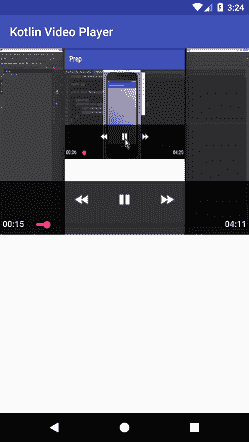

# 科特林安卓视频播放器

> 原文：<https://www.javatpoint.com/kotlin-android-video-player>

**android.widget.VideoView** 类用于在应用程序中播放视频播放器。**安卓. widget.MediaController** 类提供视频播放器的播放控制，如播放、暂停、后退、前进等。来控制视频播放器。

使用 **VideoView** 和 **MediaController** 类，我们可以创建一个视频播放器。

## 视频视图类的方法

android.widget.VideoView 类提供了几种播放和控制视频播放器的方法。视频视图类的常用方法如下:

| 方法 | 描述 |
| 公共空间设置媒体控制器(媒体控制器控制器) | 它将媒体控制器设置为视频视图。 |
| public void setVideoURI (Uri) | 它设置视频文件的 URI。 |
| 公共无效开始() | 它开始视频查看。 |
| 公共 void stopPlayback() | 它会停止播放。 |
| 公共无效暂停() | 它会暂停播放。 |
| 公共无效挂起() | 它会暂停播放。 |
| 公开作废简历() | 它会恢复播放。 |
| 公共无效 seekTo(整数毫秒) | 它寻求以毫秒为单位的指定时间。 |

## 科特林安卓视频播放器示例

在这个例子中，我们播放视频视图中的视频。

### activity_main.xml

在 activity_main.xml 文件中添加以下设计代码。在这个文件中，我们将**视频视图**放置在**框架布局**中。

```

<?xml version="1.0" encoding="utf-8"?>
<android.support.constraint.ConstraintLayout xmlns:android="http://schemas.android.com/apk/res/android"
    xmlns:app="http://schemas.android.com/apk/res-auto"
    xmlns:tools="http://schemas.android.com/tools"
    android:layout_width="match_parent"
    android:layout_height="match_parent"
    tools:context="example.javatpoint.com.kotlinvideoplayer.MainActivity">

    <FrameLayout
        android:layout_width="match_parent"
        android:layout_height="wrap_content">

        <VideoView
            android:id="@+id/videoView"
            android:layout_width="wrap_content"
            android:layout_height="308dp"
            android:layout_marginBottom="0dp"
            android:layout_marginEnd="0dp"
            android:layout_marginStart="0dp"
            app:layout_constraintBottom_toBottomOf="parent"
            app:layout_constraintEnd_toEndOf="parent"
            app:layout_constraintHorizontal_bias="0.0"
            app:layout_constraintStart_toStartOf="parent"
            app:layout_constraintTop_toTopOf="parent"
            app:layout_constraintVertical_bias="1.0" />
    </FrameLayout>
</android.support.constraint.ConstraintLayout>

```

### MainActivity.kt 公司

在 MainActivity.kt 类中添加以下代码。这节课，我们从**sd 卡/电影**目录中读取视频文件 video。通过创建 **Uri 类**的实例来放置视频文件的路径，并将其传递给**video view . setvideo Uri(Uri)**。要播放视频文件，请调用 VideoView 的 start()方法。

```

package example.javatpoint.com.kotlinvideoplayer

import android.net.Uri
import android.net.Uri.*
import android.support.v7.app.AppCompatActivity
import android.os.Bundle
import android.os.Environment
import android.widget.MediaController
import android.widget.VideoView

class MainActivity : AppCompatActivity() {

    override fun onCreate(savedInstanceState: Bundle?) {
        super.onCreate(savedInstanceState)
        setContentView(R.layout.activity_main)

        val videoView = findViewById<VideoView>(R.id.videoView)
        //Creating MediaController
        val mediaController = MediaController(this)
        mediaController.setAnchorView(videoView)
        //specify the location of media file
        val uri:Uri = parse(Environment.getExternalStorageDirectory().getPath() + "/Movies/video.mp4")
        //Setting MediaController and URI, then starting the videoView
        videoView.setMediaController(mediaController)
        videoView.setVideoURI(uri)
        videoView.requestFocus()
        videoView.start()
    }
}

```

### AndroidManifest.xml

在 AndroidManifest.xml 文件中添加以下使用权限。

```

<uses-permission android:name="android.permission.WRITE_EXTERNAL_STORAGE"/>
<uses-permission android:name="android.permission.READ_EXTERNAL_STORAGE"/>

```

**输出:**

