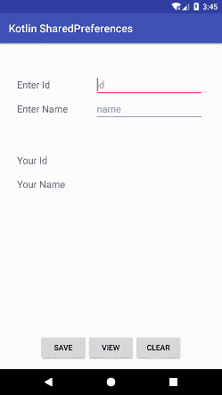
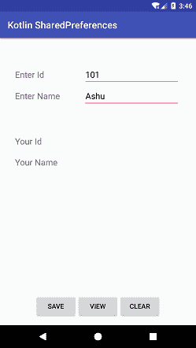

# kotlin android 共享首选项

> 哎哎哎:# t0]https://www . javatppoint . com/kot Lin-Android-shared preferences

**安卓共享首选项**允许活动或应用程序以键和值的形式存储和检索数据。即使应用程序被关闭，存储在应用程序中的数据仍然保持不变，直到它被删除或清除。

安卓设置文件使用共享首选项将应用设置数据以 XML 文件的形式存储在**数据/数据/{应用包}/share_prefs** 目录下。

要在我们的应用程序中访问共享首选项，我们需要使用以下任何方法获取它的实例。

*   getPreferences()
*   getsharedpreferences()
*   getDefaultSharedPreferences()

```

val sharedPreferences: SharedPreferences = this.getSharedPreferences(String preferences_fileName,int mode)

```

这里，首选项文件名是共享首选项文件名，模式是文件的操作模式。

对偏好数据的修改通过**共享参考进行。编辑**对象。

```

val editor:SharedPreferences.Editor =  sharedPreferences.edit()

```

要删除应用程序的首选项数据，我们调用方法:

*   **编辑器.移除(“键”)**:移除指定键的值
*   **editor.clear()** :删除所有偏好数据

当我们执行以下任何操作时，存储在共享首选项中的数据将丢失:

*   正在卸载应用程序。
*   通过设置清除应用数据。

## Kotlin 安卓共享参考示例

在本例中，我们将从 EditText 获取输入数据(id 和名称)，并将它们存储在首选项文件中。通过在按钮上执行点击操作并清除(删除)偏好数据，该偏好数据被检索并显示在文本视图中。

### activity_main.xml

在 *activity_main.xml* 布局文件中添加以下代码:

```

<?xml version="1.0" encoding="utf-8"?>
<android.support.constraint.ConstraintLayout xmlns:android="http://schemas.android.com/apk/res/android"
    xmlns:app="http://schemas.android.com/apk/res-auto"
    xmlns:tools="http://schemas.android.com/tools"
    android:layout_width="match_parent"
    android:layout_height="match_parent"
    tools:context="example.javatpoint.com.kotlinsharedpreference.MainActivity">

    <TableLayout
        android:layout_width="368dp"
        android:layout_height="495dp"
        android:layout_marginBottom="8dp"
        android:layout_marginEnd="8dp"
        android:layout_marginStart="8dp"
        android:layout_marginTop="8dp"
        app:layout_constraintBottom_toBottomOf="parent"
        app:layout_constraintEnd_toEndOf="parent"
        app:layout_constraintStart_toStartOf="parent"
        app:layout_constraintTop_toTopOf="parent">

        <TableRow>

            <TextView
                android:layout_width="wrap_content"
                android:layout_height="wrap_content"
                android:layout_column="0"
                android:layout_marginLeft="10sp"
                android:layout_marginStart="10sp"
                android:text="Enter Id"
                android:textAppearance="@style/Base.TextAppearance.AppCompat.Medium" />

            <EditText
                android:id="@+id/editId"
                android:layout_width="201dp"
                android:layout_height="wrap_content"
                android:layout_column="1"
                android:layout_marginLeft="50sp"
                android:layout_marginStart="50sp"
                android:hint="id"
                android:textAppearance="@style/Base.TextAppearance.AppCompat.Medium" />
        </TableRow>

        <TableRow>

            <TextView
                android:layout_width="wrap_content"
                android:layout_height="wrap_content"
                android:layout_column="0"
                android:layout_marginLeft="10sp"
                android:layout_marginStart="10sp"
                android:text="Enter Name"
                android:textAppearance="@style/Base.TextAppearance.AppCompat.Medium" />

            <EditText
                android:id="@+id/editName"
                android:layout_width="wrap_content"
                android:layout_height="wrap_content"
                android:layout_column="1"
                android:layout_marginLeft="50sp"
                android:layout_marginStart="50sp"
                android:hint="name"
                android:textAppearance="@style/Base.TextAppearance.AppCompat.Medium" />
        </TableRow>

        <TableRow android:layout_marginTop="60dp">

            <TextView
                android:layout_width="wrap_content"
                android:layout_height="wrap_content"
                android:layout_column="0"
                android:layout_marginLeft="10sp"
                android:layout_marginStart="10sp"
                android:text="Your Id"
                android:textAppearance="@style/Base.TextAppearance.AppCompat.Medium" />

            <TextView
                android:id="@+id/textViewShowId"
                android:layout_width="wrap_content"
                android:layout_height="wrap_content"
                android:layout_column="1"
                android:layout_marginLeft="50sp"
                android:layout_marginStart="50sp"
                android:textAppearance="@style/Base.TextAppearance.AppCompat.Medium" />
        </TableRow>

        <TableRow android:layout_marginTop="20dp">

            <TextView
                android:layout_width="wrap_content"
                android:layout_height="wrap_content"
                android:layout_column="0"
                android:layout_marginLeft="10sp"
                android:layout_marginStart="10sp"
                android:text="Your Name"
                android:textAppearance="@style/Base.TextAppearance.AppCompat.Medium" />

            <TextView
                android:id="@+id/textViewShowName"
                android:layout_width="wrap_content"
                android:layout_height="wrap_content"
                android:layout_column="1"
                android:layout_marginLeft="50sp"
                android:layout_marginStart="50sp"
                android:textAppearance="@style/Base.TextAppearance.AppCompat.Medium" />
        </TableRow>
    </TableLayout>

    <LinearLayout
        android:layout_width="fill_parent"
        android:layout_height="wrap_content"
        android:layout_marginBottom="16dp"
        android:layout_marginEnd="8dp"
        android:layout_marginStart="8dp"
        android:orientation="horizontal"
        android:gravity="center"
        app:layout_constraintBottom_toBottomOf="parent"
        app:layout_constraintEnd_toEndOf="parent"
        app:layout_constraintHorizontal_bias="0.0"
        app:layout_constraintStart_toStartOf="parent">

        <Button
            android:id="@+id/save"
            android:layout_width="wrap_content"
            android:layout_height="wrap_content"
            android:text="Save" />

        <Button
            android:id="@+id/view"
            android:layout_width="wrap_content"
            android:layout_height="wrap_content"
            android:text="View" />

        <Button
            android:id="@+id/clear"
            android:layout_width="wrap_content"
            android:layout_height="wrap_content"
            android:text="Clear" />
    </LinearLayout>
</android.support.constraint.ConstraintLayout>

```

### MainActivity.kt 公司

在*mainactivity . kt*类文件中添加以下代码。在这个类中，我们将共享首选项数据以键值的形式存储在 kotlinsharedpreference 中。

```

package example.javatpoint.com.kotlinsharedpreference

import android.content.Context
import android.content.SharedPreferences
import android.support.v7.app.AppCompatActivity
import android.os.Bundle
import android.view.View
import android.widget.Button
import android.widget.EditText
import android.widget.TextView

class MainActivity : AppCompatActivity() {

    private val sharedPrefFile = "kotlinsharedpreference"

    override fun onCreate(savedInstanceState: Bundle?) {
        super.onCreate(savedInstanceState)
        setContentView(R.layout.activity_main)

        val inputId = findViewById<EditText>(R.id.editId)
        val inputName = findViewById<EditText>(R.id.editName)
        val outputId = findViewById<TextView>(R.id.textViewShowId)
        val outputName = findViewById<TextView>(R.id.textViewShowName)

        val btnSave = findViewById<Button>(R.id.save)
        val btnView = findViewById<Button>(R.id.view)
        val btnClear = findViewById<Button>(R.id.clear)
        val sharedPreferences: SharedPreferences = this.getSharedPreferences(sharedPrefFile,Context.MODE_PRIVATE)
        btnSave.setOnClickListener(View.OnClickListener {
            val id:Int = Integer.parseInt(inputId.text.toString())
            val name:String = inputName.text.toString()
            val editor:SharedPreferences.Editor =  sharedPreferences.edit()
            editor.putInt("id_key",id)
            editor.putString("name_key",name)
            editor.apply()
            editor.commit()
        })
        btnView.setOnClickListener {
            val sharedIdValue = sharedPreferences.getInt("id_key",0)
            val sharedNameValue = sharedPreferences.getString("name_key","defaultname")
            if(sharedIdValue.equals(0) && sharedNameValue.equals("defaultname")){
                outputName.setText("default name: ${sharedNameValue}").toString()
                outputId.setText("default id: ${sharedIdValue.toString()}")
            }else{
                outputName.setText(sharedNameValue).toString()
                outputId.setText(sharedIdValue.toString())
            }

        }
        btnClear.setOnClickListener(View.OnClickListener {
            val editor = sharedPreferences.edit()
            editor.clear()
            editor.apply()
            outputName.setText("").toString()
            outputId.setText("".toString())
        })
    }
}

```

**输出:**

 


使用 SharedPreferences，我们可以通过在首选项文件中存储用户的状态(数据)来创建应用程序中的登录和注销功能。