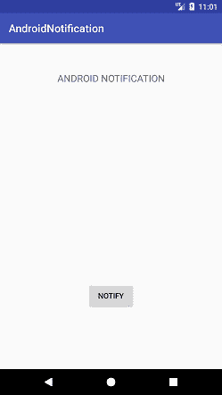
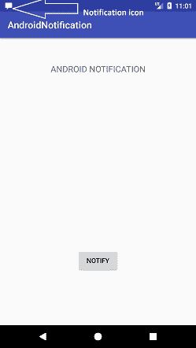
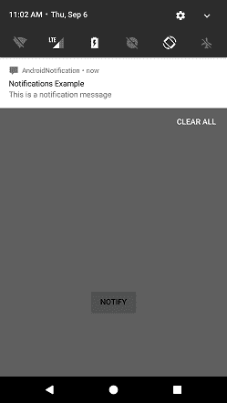
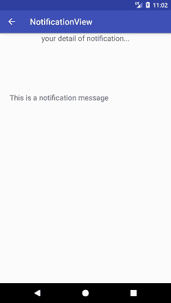

# 安卓通知

> 原文：<https://www.javatpoint.com/kotlin-android-notification>

安卓通知提供关于应用程序中发生的动作的简短、及时的信息，即使它没有运行。通知显示图标、标题和一定数量的内容文本。

## 设置安卓通知属性

安卓通知的属性是使用 NotificationCompat 设置的。生成器对象。下面提到了一些通知属性:

*   **setSmallIcon()** :设置通知的图标。
*   **setContentTitle()** :用于设置通知的标题。
*   **setContentText()** :用于设置短信。
*   **setautoconcel()**:设置通知的可取消属性。
*   **setPriority()** :设置通知的优先级。

## 安卓通知示例

在这个例子中，我们将创建一个通知消息，点击它启动另一个活动。

### activity_main.xml

在 activity_main.xml 文件中添加以下代码。

```

<?xml version="1.0" encoding="utf-8"?>
<android.support.constraint.ConstraintLayout xmlns:android="http://schemas.android.com/apk/res/android"
    xmlns:app="http://schemas.android.com/apk/res-auto"
    xmlns:tools="http://schemas.android.com/tools"
    android:layout_width="match_parent"
    android:layout_height="match_parent"
    tools:context="example.javatpoint.com.androidnotification.MainActivity">

    <TextView
        android:layout_width="wrap_content"
        android:layout_height="wrap_content"
        android:text="ANDROID NOTIFICATION"
        app:layout_constraintBottom_toBottomOf="parent"
        app:layout_constraintLeft_toLeftOf="parent"
        app:layout_constraintRight_toRightOf="parent"
        app:layout_constraintTop_toTopOf="parent"
        app:layout_constraintVertical_bias="0.091"
        android:textAppearance="@style/Base.TextAppearance.AppCompat.Medium"/>

    <Button
        android:layout_width="wrap_content"
        android:layout_height="wrap_content"
        android:id="@+id/button"
        android:layout_marginBottom="112dp"
        android:layout_marginEnd="8dp"
        android:layout_marginStart="8dp"
        android:text="Notify"
        app:layout_constraintBottom_toBottomOf="parent"
        app:layout_constraintEnd_toEndOf="parent"
        app:layout_constraintStart_toStartOf="parent" />

</android.support.constraint.ConstraintLayout>

```

创建一个名为 activity_notification_view.xml 的活动，并添加以下代码。此活动将在单击通知时启动。文本视图用于显示通知消息。

### activity_notification_view.xml

```

<?xml version="1.0" encoding="utf-8"?>
<android.support.constraint.ConstraintLayout xmlns:android="http://schemas.android.com/apk/res/android"
    xmlns:app="http://schemas.android.com/apk/res-auto"
    xmlns:tools="http://schemas.android.com/tools"
    android:layout_width="match_parent"
    android:layout_height="match_parent"
    tools:context="example.javatpoint.com.androidnotification.NotificationView">

    <TextView
        android:id="@+id/textView2"
        android:layout_width="fill_parent"
        android:layout_height="wrap_content"
        android:gravity="center"
        android:text="your detail of notification..."
        android:textAppearance="@style/Base.TextAppearance.AppCompat.Medium" />

    <TextView
        android:id="@+id/textView"
        android:layout_width="wrap_content"
        android:layout_height="wrap_content"
        android:layout_marginBottom="8dp"
        android:layout_marginEnd="8dp"
        android:layout_marginStart="8dp"
        android:layout_marginTop="8dp"
        app:layout_constraintBottom_toBottomOf="parent"
        app:layout_constraintEnd_toEndOf="parent"
        app:layout_constraintHorizontal_bias="0.096"
        app:layout_constraintStart_toStartOf="parent"
        app:layout_constraintTop_toBottomOf="@+id/textView2"
        app:layout_constraintVertical_bias="0.206"
        android:textAppearance="@style/Base.TextAppearance.AppCompat.Medium"/>

</android.support.constraint.ConstraintLayout>

```

### MainActivity.java

在 MainActivity.java 类中添加以下代码。在这个类中，单击按钮会调用 addNotification()方法，在这里我们实现 NotificationCompat。对象来设置通知属性。NotificationManager.notify()方法用于显示通知。意图类用于在录制通知时调用另一个活动(NotificationView.java)。

```

package example.javatpoint.com.androidnotification;

import android.app.NotificationManager;
import android.app.PendingIntent;
import android.content.Context;
import android.content.Intent;
import android.support.v4.app.NotificationCompat;
import android.support.v7.app.AppCompatActivity;
import android.os.Bundle;
import android.view.View;
import android.widget.Button;

public class MainActivity extends AppCompatActivity {
    Button button;
    @Override
    protected void onCreate(Bundle savedInstanceState) {
        super.onCreate(savedInstanceState);
        setContentView(R.layout.activity_main);
        button = findViewById(R.id.button);
        button.setOnClickListener(new View.OnClickListener() {
            @Override
            public void onClick(View v) {
                addNotification();
            }
        });
    }

    private void addNotification() {
        NotificationCompat.Builder builder =
                new NotificationCompat.Builder(this)
                        .setSmallIcon(R.drawable.messageicon) //set icon for notification
                        .setContentTitle("Notifications Example") //set title of notification
                        .setContentText("This is a notification message")//this is notification message
                        .setAutoCancel(true) // makes auto cancel of notification
                        .setPriority(NotificationCompat.PRIORITY_DEFAULT); //set priority of notification

        Intent notificationIntent = new Intent(this, NotificationView.class);
        notificationIntent.addFlags(Intent.FLAG_ACTIVITY_CLEAR_TOP);
        //notification message will get at NotificationView
        notificationIntent.putExtra("message", "This is a notification message");

        PendingIntent pendingIntent = PendingIntent.getActivity(this, 0, notificationIntent,
                PendingIntent.FLAG_UPDATE_CURRENT);
        builder.setContentIntent(pendingIntent);

        // Add as notification
        NotificationManager manager = (NotificationManager) getSystemService(Context.NOTIFICATION_SERVICE);
        manager.notify(0, builder.build());
    }
}

```

### NotificationView.java

NotificationView.java 类接收通知消息并显示在文本视图中。录制通知时调用此类。

```

package example.javatpoint.com.androidnotification;

import android.support.v7.app.AppCompatActivity;
import android.os.Bundle;
import android.widget.TextView;
import android.widget.Toast;

public class NotificationView extends AppCompatActivity {
    TextView textView;
    @Override
    protected void onCreate(Bundle savedInstanceState) {
        super.onCreate(savedInstanceState);
        setContentView(R.layout.activity_notification_view);
        textView = findViewById(R.id.textView);
        //getting the notification message
        String message=getIntent().getStringExtra("message");
        textView.setText(message);
    }
}

```

### strings.xml

```

<resources>
    <string name="app_name">AndroidNotification</string>
    <string name="notification_activity">NotificationView</string>
</resources>

```

### AndroidManifest.xml

在 AndroidManifest.xml 文件中添加以下代码。

```

<?xml version="1.0" encoding="utf-8"?>
<manifest xmlns:android="http://schemas.android.com/apk/res/android"
    package="example.javatpoint.com.androidnotification">

    <application
        android:allowBackup="true"
        android:icon="@mipmap/ic_launcher"
        android:label="@string/app_name"
        android:roundIcon="@mipmap/ic_launcher_round"
        android:supportsRtl="true"
        android:theme="@style/AppTheme">
        <activity android:name=".MainActivity">
            <intent-filter>
                <action android:name="android.intent.action.MAIN" />

                <category android:name="android.intent.category.LAUNCHER" />
            </intent-filter>
        </activity>
        <activity android:name=".NotificationView"
            android:label="@string/notification_activity"
            android:parentActivityName=".MainActivity">
            <meta-data
                android:name="android.support.PARENT_ACTIVITY"
                android:value=".MainActivity"/>
        </activity>
    </application>

</manifest>

```

**输出:**

 
 