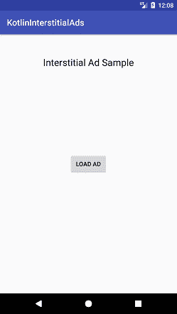
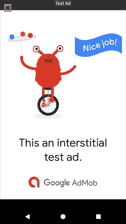
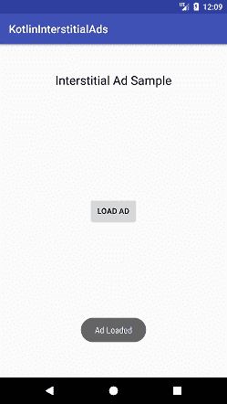

# 柯特林安卓谷歌广告插播广告示例

> 原文：<https://www.javatpoint.com/kotlin-android-google-admob-interstitial-ads-example>

在本教程中，我们在我们的安卓应用程序中实现了**谷歌广告间隙广告**。要在安卓应用中放置**谷歌广告任务**，我们需要创建谷歌广告单元标识。创建谷歌广告账号和生成广告单元标识的完整参考在[安卓谷歌**广告账号**](android-google-admob) 中描述。

一个**中间广告**是覆盖整个活动布局的全屏广告。该广告显示在活动的过渡点。要在安卓应用程序中实现谷歌广告，选择**谷歌广告活动**并选择广告格式类型作为中间广告。

我们还可以将谷歌广告投放在其他活动上，如空白活动。

在 build.gradle 文件中添加谷歌广告依赖项**' com . Google . Android . GMS:play-services-ads:17 . 0 . 0 '**:

## build.gradle

```

dependencies {
    implementation fileTree(dir: 'libs', include: ['*.jar'])
    implementation"org.jetbrains.kotlin:kotlin-stdlib-jdk7:$kotlin_version"
    implementation 'com.android.support:appcompat-v7:26.1.0'
    implementation 'com.google.android.gms:play-services-ads:17.0.0'
    testImplementation 'junit:junit:4.12'
}

```

### activity_main.xml

在 activity_main.xml 中添加您的用户界面代码。按钮组件用于加载广告。

```

<RelativeLayout xmlns:android="http://schemas.android.com/apk/res/android"
    xmlns:tools="http://schemas.android.com/tools"
    android:layout_width="match_parent"
    android:layout_height="match_parent"
    tools:context="example.javatpoint.com.kotlininterstitialads.MainActivity">

    <!-- view for AdMob Interstitial Ad -->
    <TextView
        android:id="@+id/app_title"
        android:layout_width="wrap_content"
        android:layout_height="wrap_content"
        android:layout_centerHorizontal="true"
        android:layout_marginTop="50dp"
        android:text="@string/interstitial_ad_sample"
        android:textAppearance="?android:attr/textAppearanceLarge" />

    <Button
        android:id="@+id/load_ad_button"
        android:layout_width="wrap_content"
        android:layout_height="wrap_content"
        android:layout_centerHorizontal="true"
        android:layout_centerVertical="true"
        android:text="@string/load_ad" />
</RelativeLayout>

```

### strings.xml

在 string.xml 文件中添加创建的广告单元 id。

```

<resources>
    <string name="app_name">KotlinInterstitialAds</string>
    <string name="action_settings">Settings</string>
    <string name="interstitial_ad_sample">Interstitial Ad Sample</string>
    <string name="load_ad">Load Ad</string>
    <!-- -
        This is an ad unit ID for an interstitial test ad. Replace with your own interstitial ad unit id.
    -->
    <string name="interstitial_ad_unit_id">ca-app-pub-3940256099942544/1033173712</string>
</resources>

```

### MainActivity.kt 公司

在 MainActivity.kt 类中添加以下代码。要在 UI 上加载广告，创建 inter initialad 的实例，并在 inter initialad 上初始化广告单元 id**inter initialad . adunitid = getString(r . string . inter tis _ ad _ unit _ id**)。

覆盖初始侦听器 onAdLoaded()， **onAdFailedToLoad()，onAdClosed** 。点击按钮加载广告，创建**广告请求**实例，通过调用**中间步骤加载广告！！。loadAd(AdRequest)** 。

```

package example.javatpoint.com.kotlininterstitialads

import com.google.android.gms.ads.AdListener
import com.google.android.gms.ads.AdRequest
import com.google.android.gms.ads.InterstitialAd
import android.os.Bundle
import android.support.v7.app.AppCompatActivity
import android.widget.Button
import android.widget.Toast

class MainActivity : AppCompatActivity() {
    private var mLoadAdButton: Button? = null
    private var mInterstitialAd: InterstitialAd? = null

    override fun onCreate(savedInstanceState: Bundle?) {
        super.onCreate(savedInstanceState)
        setContentView(R.layout.activity_main)

        // Create the InterstitialAd and set the adUnitId (defined in values/strings.xml).
        mInterstitialAd = newInterstitialAd()
        loadInterstitial()

        // Create the load ad button, tries to show an interstitial when clicked.
        mLoadAdButton = findViewById(R.id.load_ad_button) as Button
        mLoadAdButton!!.isEnabled = false
        mLoadAdButton!!.setOnClickListener {
            showInterstitial()
        }
    }

    private fun newInterstitialAd(): InterstitialAd {
        val interstitialAd = InterstitialAd(this)
        interstitialAd.adUnitId = getString(R.string.interstitial_ad_unit_id)
        interstitialAd.adListener = object : AdListener() {
            override fun onAdLoaded() {
                mLoadAdButton!!.isEnabled = true
                Toast.makeText(applicationContext, "Ad Loaded", Toast.LENGTH_SHORT).show()
            }

            override fun onAdFailedToLoad(errorCode: Int) {
                mLoadAdButton!!.isEnabled = true
                Toast.makeText(applicationContext, "Ad Failed To Load", Toast.LENGTH_SHORT).show()
            }

            override fun onAdClosed() {
                // Proceed to the next level.
               // goToNextLevel()
                Toast.makeText(applicationContext, "Ad Closed", Toast.LENGTH_SHORT).show()
                tryToLoadAdOnceAgain()
            }
        }
        return interstitialAd
    }

    private fun loadInterstitial() {
        // Disable the load ad button and load the ad.
        mLoadAdButton!!.isEnabled = false
        val adRequest = AdRequest.Builder().build()
        mInterstitialAd!!.loadAd(adRequest)
    }

    private fun showInterstitial() {
        // Show the ad if it is ready. Otherwise toast and reload the ad.
        if (mInterstitialAd != null && mInterstitialAd!!.isLoaded) {
            mInterstitialAd!!.show()
        } else {
            Toast.makeText(this, "Ad did not load", Toast.LENGTH_SHORT).show()
            tryToLoadAdOnceAgain()
        }
    }

    private fun tryToLoadAdOnceAgain() {
        mInterstitialAd = newInterstitialAd()
        loadInterstitial()
    }
}

```

### AndroidManifest.xml

在 AndroidManifest.xml 文件中添加以下代码:

```

<?xml version="1.0" encoding="utf-8"?>
<manifest xmlns:android="http://schemas.android.com/apk/res/android"
    package="example.javatpoint.com.kotlininterstitialads">
    <!-- Include required permissions for Google Mobile Ads to run. -->
    <uses-permission android:name="android.permission.INTERNET" />
    <uses-permission android:name="android.permission.ACCESS_NETWORK_STATE" />

    <application
        android:allowBackup="true"
        android:icon="@mipmap/ic_launcher"
        android:label="@string/app_name"
        android:roundIcon="@mipmap/ic_launcher_round"
        android:supportsRtl="true"
        android:theme="@style/AppTheme"> <!-- This meta-data tag is required to use Google Play Services. -->
        <meta-data
            android:name="com.google.android.gms.version"
            android:value="@integer/google_play_services_version" />

        <activity
            android:name=".MainActivity"
            android:label="@string/app_name">
            <intent-filter>
                <action android:name="android.intent.action.MAIN" />

                <category android:name="android.intent.category.LAUNCHER" />
            </intent-filter>
        </activity> <!-- Include the AdActivity configChanges and theme. -->
        <activity
            android:name="com.google.android.gms.ads.AdActivity"
            android:configChanges="keyboard|keyboardHidden|orientation|screenLayout|uiMode|screenSize|smallestScreenSize"
            android:theme="@android:style/Theme.Translucent" />
        <meta-data
            android:name="com.google.android.gms.ads.AD_MANAGER_APP"
            android:value="true"/>
    </application>

</manifest>

```

**输出:**

 
 