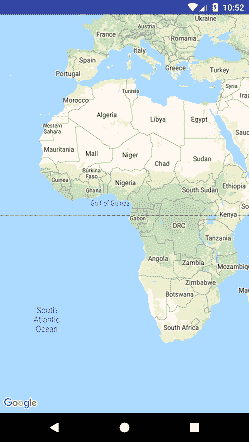

# Kotlin 安卓谷歌地图当前位置

> 原文：<https://www.javatpoint.com/kotlin-android-google-map-current-location>

要在安卓应用程序中实现谷歌地图，我们需要生成谷歌地图应用编程接口密钥。创建谷歌地图应用编程接口密钥的过程在[谷歌地图固定位置](kotlin-android-google-map-fixed-location)教程中有描述。

在 [Kotlin 安卓谷歌地图固定位置](kotlin-android-google-map-fixed-location)的上一个教程中，我们已经显示了固定的谷歌位置。

现在在本教程中，我们将在用户的当前位置显示并放置标记。为了查看用户的当前位置，我们需要实现一些谷歌地图接口，并在那里调用回调方法。

## 谷歌地图应用编程接口

1.  **onmapreadycallback:**当其实例设置在 MapFragment 对象上时，该接口调用。OnMapReadyCallback 接口的 onMapReady(谷歌地图)方法在地图准备好使用时调用。在 onMapReady(谷歌地图)方法中，我们可以添加标记、监听器和其他属性。
2.  **位置监听器:**该接口用于接收设备位置发生变化时的通知。当位置已更改时，将调用 LocationListener 接口的抽象方法 onLocationChanged(Location)。
3.  **GoogleApiClient。ConnectionCallbacks:** 该接口提供 onConnected(Bundle)和 onConnectionSuspended(int)两种回调方法，分别在设备连接和断开时调用。
4.  **GoogleApiClient。OnConnectionFailedListener:** 此接口提供回调方法 onConnectionFailed(ConnectionResult)，在将设备连接到服务时发生错误时调用此方法。

谷歌地图的**是位置启用的**属性，用于启用位置图层，该图层允许设备与当前位置进行交互。

使用 **Java** 显示谷歌地图用户当前位置的教程描述在[安卓谷歌地图显示当前位置]( android-google-map-displaying-current-location)中。

## 谷歌地图的类型

地图应用编程接口中有四种不同类型的谷歌地图。他们每个人对地图都有不同的看法。这些类型有普通、混合、卫星和地形。

*   googleMap.setMapType(GoogleMap)。MAP_TYPE_NORMAL：
*   googleMap.setMapType（GoogleMap.MAP_TYPE_HYBRID）;
*   googleMap.setMapType(GoogleMap)。MAP_TYPE_SATELLITE：
*   googleMap.setMapType(GoogleMap)。MAP_TYPE_TERRAIN：

使用 Kotlin 语法，我们将使用上面的谷歌地图类型作为:

*   Google map . map type = map _ type _ none
*   谷歌地图。地图类型=地图 _ 类型 _ 混合
*   谷歌地图。地图类型=地图类型 _ 卫星
*   Google map . map type = map _ type _ terrain

关于这些地图类型的细节在这里解释[。](android-google-map)

### activity_maps.xml

在 activity_maps.xml 布局文件中添加以下代码。

```

<fragment xmlns:android="http://schemas.android.com/apk/res/android"
    xmlns:map="http://schemas.android.com/apk/res-auto"
    xmlns:tools="http://schemas.android.com/tools"
    android:id="@+id/map"
    android:name="com.google.android.gms.maps.SupportMapFragment"
    android:layout_width="match_parent"
    android:layout_height="match_parent"
    tools:context="example.javatpoint.com.kotlingooglemapcurrentlocation.MapsActivity" />

```

### strings.xml

```

<resources>
    <string name="app_name">Kotlin Google Map Current Location</string>
    <string name="title_activity_maps">Map Current Location</string>
</resources>

```

### build.gradle

在 build.gradle 文件中添加谷歌地图服务和谷歌定位服务依赖项。

```

dependencies {
    implementation fileTree(dir: 'libs', include: ['*.jar'])
    implementation"org.jetbrains.kotlin:kotlin-stdlib-jdk8:$kotlin_version"
    implementation 'com.android.support:appcompat-v7:26.1.0'
    implementation 'com.google.android.gms:play-services-maps:11.8.0'
    compile 'com.google.android.gms:play-services-location:11.8.0'
    testImplementation 'junit:junit:4.12'
}

```

### google_maps_api.xml

将谷歌地图应用编程接口密钥放在 res/values/google_map_api.xml 文件中。

```

<resources>
    <!--
     https://console.developers.google.com/flows/enableapi?apiid=maps_android_backend&keyType=CLIENT_SIDE_ANDROID&r=20:0B:71:3B:B2:46:75:A1:87:78:2E:4C:49:3F:E3:B6:FD:2D:76:D3%3Bexample.javatpoint.com.kotlingooglemapcurrentlocation

    Alternatively, follow the directions here:
    https://developers.google.com/maps/documentation/android/start#get-key
    -->
    <string name="google_maps_key" templateMergeStrategy="preserve" translatable="false">AIzaSyCuxsZ0D73o-REPLACE-WITH-YOUR-API</string>
</resources>

```

### mapsacactivity . kt

在 MapsActivity.kt 类文件中添加以下代码。

```

package example.javatpoint.com.kotlingooglemapcurrentlocation

import android.content.pm.PackageManager
import android.location.Location
import android.os.Build
import android.os.Bundle
import android.support.v4.app.FragmentActivity
import android.support.v4.content.ContextCompat
import com.google.android.gms.common.ConnectionResult
import com.google.android.gms.common.api.GoogleApiClient
import com.google.android.gms.maps.CameraUpdateFactory
import com.google.android.gms.maps.GoogleMap
import com.google.android.gms.maps.OnMapReadyCallback
import com.google.android.gms.maps.SupportMapFragment
import com.google.android.gms.maps.model.BitmapDescriptorFactory
import com.google.android.gms.maps.model.LatLng
import com.google.android.gms.maps.model.Marker
import com.google.android.gms.maps.model.MarkerOptions
import android.Manifest
import android.os.Looper
import android.widget.Toast
import com.google.android.gms.location.*
import com.google.android.gms.location.FusedLocationProviderClient
import com.google.android.gms.location.LocationCallback
import com.google.android.gms.location.LocationRequest
import com.google.android.gms.location.LocationServices

class MapsActivity : FragmentActivity(), OnMapReadyCallback, LocationListener,
        GoogleApiClient.ConnectionCallbacks, GoogleApiClient.OnConnectionFailedListener {

    private var mMap: GoogleMap? = null
    internal lateinit var mLastLocation: Location
    internal lateinit var mLocationResult: LocationRequest
    internal lateinit var mLocationCallback: LocationCallback
    internal var mCurrLocationMarker: Marker? = null
    internal var mGoogleApiClient: GoogleApiClient? = null
    internal lateinit var mLocationRequest: LocationRequest
    internal var mFusedLocationClient: FusedLocationProviderClient? = null

    override fun onCreate(savedInstanceState: Bundle?) {
        super.onCreate(savedInstanceState)
        setContentView(R.layout.activity_maps)
        // Obtain the SupportMapFragment and get notified when the map is ready to be used.
        val mapFragment = supportFragmentManager
                .findFragmentById(R.id.map) as SupportMapFragment
        mapFragment.getMapAsync(this)

    }

    override fun onMapReady(googleMap: GoogleMap) {
        mMap = googleMap

        if (android.os.Build.VERSION.SDK_INT >= Build.VERSION_CODES.M) {
            if (ContextCompat.checkSelfPermission(this,
                            Manifest.permission.ACCESS_FINE_LOCATION) == PackageManager.PERMISSION_GRANTED) {
                buildGoogleApiClient()
                mMap!!.isMyLocationEnabled = true
            }
        } else {
            buildGoogleApiClient()
            mMap!!.isMyLocationEnabled = true
        }

    }

    @Synchronized
    protected fun buildGoogleApiClient() {
        mGoogleApiClient = GoogleApiClient.Builder(this)
                .addConnectionCallbacks(this)
                .addOnConnectionFailedListener(this)
                .addApi(LocationServices.API).build()
        mGoogleApiClient!!.connect()
    }

    override fun onConnected(bundle: Bundle?) {

        mLocationRequest = LocationRequest()
        mLocationRequest.interval = 1000
        mLocationRequest.fastestInterval = 1000
        mLocationRequest.priority = LocationRequest.PRIORITY_BALANCED_POWER_ACCURACY
        if (ContextCompat.checkSelfPermission(this,
                        Manifest.permission.ACCESS_FINE_LOCATION) == PackageManager.PERMISSION_GRANTED) {
            mFusedLocationClient = LocationServices.getFusedLocationProviderClient(this)
            mFusedLocationClient?.requestLocationUpdates(mLocationRequest,mLocationCallback, Looper.myLooper())
        }
    }

    override fun onLocationChanged(location: Location) {

        mLastLocation = location
        if (mCurrLocationMarker != null) {
            mCurrLocationMarker!!.remove()
        }
        //Place current location marker
        val latLng = LatLng(location.latitude, location.longitude)
        val markerOptions = MarkerOptions()
        markerOptions.position(latLng)
        markerOptions.title("Current Position")
        markerOptions.icon(BitmapDescriptorFactory.defaultMarker(BitmapDescriptorFactory.HUE_GREEN))
        mCurrLocationMarker = mMap!!.addMarker(markerOptions)

        //move map camera
        mMap!!.moveCamera(CameraUpdateFactory.newLatLng(latLng))
        mMap!!.animateCamera(CameraUpdateFactory.zoomTo(11f))

        //stop location updates
        if (mGoogleApiClient != null) {
            mFusedLocationClient?.removeLocationUpdates(mLocationCallback)
        }
    }

    override fun onConnectionFailed(connectionResult: ConnectionResult) {
        Toast.makeText(applicationContext,"connection failed", Toast.LENGTH_SHORT).show()
    }

    override fun onConnectionSuspended(p0: Int) {
        Toast.makeText(applicationContext,"connection suspended", Toast.LENGTH_SHORT).show()
    }
}  

```

### AndroidManifest.xml

```

<?xml version="1.0" encoding="utf-8"?>
<manifest xmlns:android="http://schemas.android.com/apk/res/android"
    package="example.javatpoint.com.kotlingooglemapcurrentlocation">

    <uses-permission android:name="android.permission.ACCESS_FINE_LOCATION" />

    <application
        android:allowBackup="true"
        android:icon="@mipmap/ic_launcher"
        android:label="@string/app_name"
        android:roundIcon="@mipmap/ic_launcher_round"
        android:supportsRtl="true"
        android:theme="@style/AppTheme">

        <meta-data
            android:name="com.google.android.geo.API_KEY"
            android:value="@string/google_maps_key" />

        <activity
            android:name=".MapsActivity"
            android:label="@string/title_activity_maps">
            <intent-filter>
                <action android:name="android.intent.action.MAIN" />

                <category android:name="android.intent.category.LAUNCHER" />
            </intent-filter>
        </activity>
    </application>

</manifest>

```

**输出:**

#### 注意:在真实的安卓设备上查看，输出效果最好。

