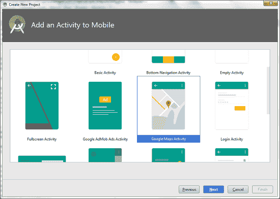
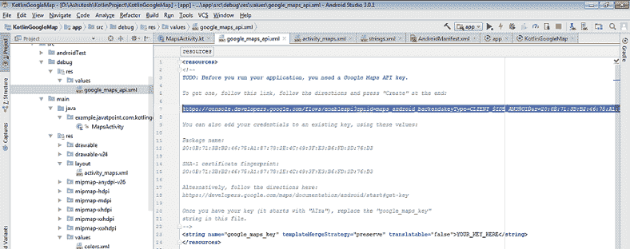
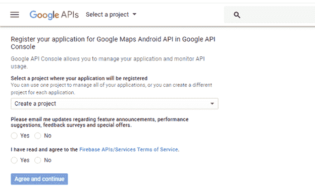
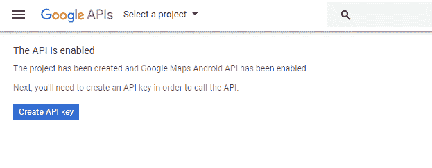
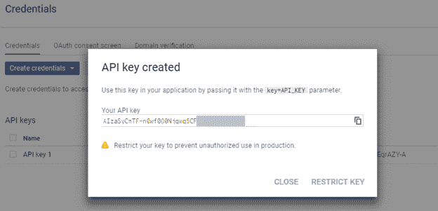
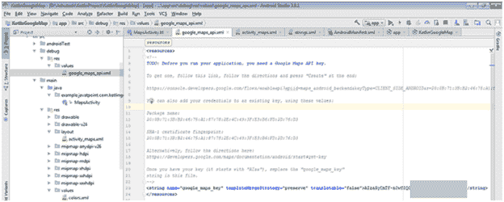
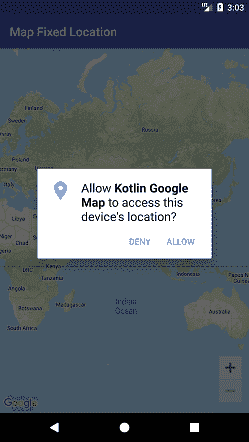
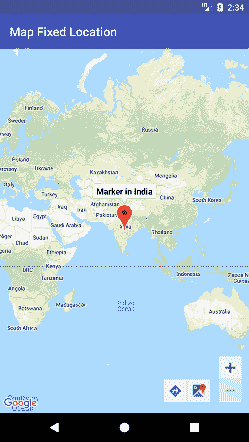

# Kotlin 安卓谷歌地图固定位置

> 原文：<https://www.javatpoint.com/kotlin-android-google-map-fixed-location>

**谷歌地图**显示当前位置、导航位置方向、搜索位置等。要在应用程序中放置谷歌地图，我们需要创建谷歌地图应用编程接口密钥，并将其集成到我们的应用程序中。

使用 Java 代码的谷歌地图教程在[安卓谷歌地图](android-google-map)实现。

在本教程中，我们将把谷歌地图集成到我们的安卓应用程序中。要在应用程序中放置谷歌地图，选择活动类型为**谷歌地图活动**。默认情况下，此活动生成谷歌地图所需的配置和设置。



为了实现谷歌地图，我们需要生成谷歌地图应用编程接口密钥，并将其集成到我们的应用程序中。

从 res/values/google_map_api.xml 文件复制 URL 粘贴到浏览器或者我们可以直接访问 [Console Google Developer]( https://console.developers.google.com) 生成 Google Map API 密钥。

 

单击创建应用编程接口密钥生成应用编程接口密钥。



点击创建应用编程接口密钥后，它将生成我们的应用编程接口密钥，显示如下屏幕。



将生成的 API 密钥粘贴到我们的 res/values/google_map_api.xml 文件中。



### activity_maps.xml

在 activity_maps.xml 布局文件中添加以下代码。

```

<fragment xmlns:android="http://schemas.android.com/apk/res/android"
    xmlns:map="http://schemas.android.com/apk/res-auto"
    xmlns:tools="http://schemas.android.com/tools"
    android:id="@+id/map"
    android:name="com.google.android.gms.maps.SupportMapFragment"
    android:layout_width="match_parent"
    android:layout_height="match_parent"
    tools:context="example.javatpoint.com.kotlingooglemap.MapsActivity" />

```

### build.gradle

在 build.gradle 文件中添加谷歌地图服务和谷歌定位服务依赖项。

```

dependencies {
    implementation fileTree(include: ['*.jar'], dir: 'libs')
    implementation "org.jetbrains.kotlin:kotlin-stdlib-jdk8:$kotlin_version"
    implementation 'com.android.support:appcompat-v7:26.1.0'
    implementation 'com.google.android.gms:play-services-maps:11.8.0'
    implementation 'com.google.android.gms:play-services-location:11.8.0'
    testImplementation 'junit:junit:4.12'
}

```

### strings.xml

```

<resources>
    <string name="app_name">Kotlin Google Map</string>
    <string name="title_activity_maps">Map Fixed Location</string>
</resources>

```

### google_map_api.xml

将谷歌地图应用编程接口密钥放在 res/values/google_map_api.xml 文件中。

```

<resources>
    <!--
     Follow the directions here:

    https://developers.google.com/maps/documentation/android/signup

    Once you have your key (it starts with "AIza"), replace the "google_maps_key"
    string in this file.
    -->
    <string name="google_maps_key" templateMergeStrategy="preserve" translatable="false">AIzaSyCmTF-n-REPLACE-WITH-YOUR-KEY</string>
</resources>

```

### mapsacactivity . kt

为了在我们的 MapsActivity.kt 类中获取谷歌地图对象，我们需要实现 **OnMapReadyCallback** 接口并覆盖 **onMapReady()** 回调方法。要在地图上显示固定位置，请将纬度和经度点放入地图中(纬度、经度)。

GoogleMap.addMarker()指向给定位置的位置。

```

package example.javatpoint.com.kotlingooglemap

import android.os.Bundle
import android.support.v7.app.AppCompatActivity
import com.google.android.gms.maps.CameraUpdateFactory
import com.google.android.gms.maps.GoogleMap
import com.google.android.gms.maps.OnMapReadyCallback
import com.google.android.gms.maps.SupportMapFragment
import com.google.android.gms.maps.model.LatLng
import com.google.android.gms.maps.model.Marker
import com.google.android.gms.maps.model.MarkerOptions

class MapsActivity : AppCompatActivity(), OnMapReadyCallback,  GoogleMap.OnMarkerClickListener {

    private lateinit var mMap: GoogleMap

    override fun onCreate(savedInstanceState: Bundle?) {
        super.onCreate(savedInstanceState)
        setContentView(R.layout.activity_maps)
        // Obtain the SupportMapFragment and get notified when the map is ready to be used.
        val mapFragment = supportFragmentManager
                .findFragmentById(R.id.map) as SupportMapFragment
        mapFragment.getMapAsync(this)
    }

    /**
     * Manipulates the map once available.
     * This callback is triggered when the map is ready to be used.
     * This is where we can add markers or lines, add listeners or move the camera. In this case,
     * we just add a marker near Sydney, Australia.
     * If Google Play services is not installed on the device, the user will be prompted to install
     * it inside the SupportMapFragment. This method will only be triggered once the user has
     * installed Google Play services and returned to the app.
     */
    override fun onMapReady(googleMap: GoogleMap) {

        mMap = googleMap
        // Add a marker in India and move the camera
        val myLocation = LatLng(20.5937, 78.9629)
        mMap.addMarker(MarkerOptions().position(myLocation).title("Marker in India"))
        mMap.moveCamera(CameraUpdateFactory.newLatLng(myLocation))
        mMap.uiSettings.isZoomControlsEnabled = true
    }
    override fun onMarkerClick(p0: Marker?) = false

}

```

### AndroidManifest.xml

在 AndroidManifest.xml 文件中添加。

```

<?xml version="1.0" encoding="utf-8"?>
<manifest xmlns:android="http://schemas.android.com/apk/res/android"
    package="example.javatpoint.com.kotlingooglemap">
     <uses-permission android:name="android.permission.ACCESS_FINE_LOCATION" />

    <application
        android:allowBackup="true"
        android:icon="@mipmap/ic_launcher"
        android:label="@string/app_name"
        android:roundIcon="@mipmap/ic_launcher_round"
        android:supportsRtl="true"
        android:theme="@style/AppTheme">

        <meta-data
            android:name="com.google.android.geo.API_KEY"
            android:value="@string/google_maps_key" />

        <activity
            android:name=".MapsActivity"
            android:label="@string/title_activity_maps">
            <intent-filter>
                <action android:name="android.intent.action.MAIN" />

                <category android:name="android.intent.category.LAUNCHER" />
            </intent-filter>
        </activity>
    </application>

</manifest>

```

**输出:**


### mapsacactivity . kt

基于 Marshmallow 版本构建的应用程序方便了运行时用户权限。在这个类中，我们通过提供运行时权限来访问设备精细位置 **ACCESS_FINE_LOCATION 来创建上面的例子。**

```

package example.javatpoint.com.kotlingooglemap

import android.Manifest
import android.content.pm.PackageManager
import android.os.Build
import android.os.Bundle
import android.support.v4.app.ActivityCompat
import android.support.v4.app.FragmentActivity
import android.widget.Toast
import com.google.android.gms.maps.CameraUpdateFactory
import com.google.android.gms.maps.GoogleMap
import com.google.android.gms.maps.OnMapReadyCallback
import com.google.android.gms.maps.SupportMapFragment
import com.google.android.gms.maps.model.LatLng
import com.google.android.gms.maps.model.Marker
import com.google.android.gms.maps.model.MarkerOptions

class MapsActivity : FragmentActivity(), OnMapReadyCallback, GoogleMap.OnMarkerClickListener  {

    private lateinit var mMap: GoogleMap

    companion object {
        private val MY_PERMISSION_FINE_LOCATION = 101
    }
    override fun onCreate(savedInstanceState: Bundle?) {
        super.onCreate(savedInstanceState)
        setContentView(R.layout.activity_maps)
        // Obtain the SupportMapFragment and get notified when the map is ready to be used.
        val mapFragment = supportFragmentManager
                .findFragmentById(R.id.map) as SupportMapFragment
        mapFragment.getMapAsync(this)
    }

    override fun onMapReady(googleMap: GoogleMap) {
        mMap = googleMap

        // Add a marker in India and move the camera
        val india = LatLng(20.5937, 78.9629)
        mMap.addMarker(MarkerOptions().position(india).title("Marker in India"))
        mMap.moveCamera(CameraUpdateFactory.newLatLng(india))

        if (ActivityCompat.checkSelfPermission(this,
                        Manifest.permission.ACCESS_FINE_LOCATION) == PackageManager.PERMISSION_GRANTED) {
                 mMap.isMyLocationEnabled = true
        }
        else {//condition for Marshmello and above
            if (Build.VERSION.SDK_INT >= Build.VERSION_CODES.M) {
                requestPermissions(arrayOf(Manifest.permission.ACCESS_FINE_LOCATION), MY_PERMISSION_FINE_LOCATION)
            }
        }
        mMap.setOnMarkerClickListener(this)
    }
    override fun onMarkerClick(p0: Marker?) = false

    override fun onRequestPermissionsResult(requestCode: Int, permissions: Array<String>, grantResults: IntArray) {
        super.onRequestPermissionsResult(requestCode, permissions, grantResults)
        when (requestCode) {
            MY_PERMISSION_FINE_LOCATION -> if (grantResults[0] == PackageManager.PERMISSION_GRANTED) {//permission to access location grant
                if (ActivityCompat.checkSelfPermission(this,
                                Manifest.permission.ACCESS_FINE_LOCATION) == PackageManager.PERMISSION_GRANTED) {
                    mMap.isMyLocationEnabled = true
                }
            }
            //permission to access location denied
            else {
                Toast.makeText(applicationContext, "This app requires location permissions to be granted", Toast.LENGTH_LONG).show()
                finish()
            }
        }
    }

}

```

**输出:**

 