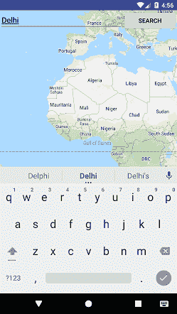
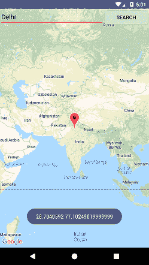

# Kotlin 安卓谷歌地图搜索位置

> 原文：<https://www.javatpoint.com/kotlin-android-google-map-search-location>

在上一个教程中，我们构建了定位[地图固定位置](kotlin-android-google-map-fixed-location)和[地图当前位置](kotlin-android-google-map-current-location)的应用程序。

在本教程中，我们将在谷歌地图中实现搜索位置功能。谷歌位置的搜索是通过地理编码器类完成的。地理编码器类便于地理编码和反向地理编码。

地理编码是将街道地址转换为坐标(纬度、经度)的过程。反向地理编码是将坐标(纬度、经度)转换为街道地址的过程。

## 地理编码器类的方法

1.  List

    <address>getFromLocation(双纬度，双经度，int maxResults):这个方法返回一个地址数组，指定周围的纬度和经度。</address>

2.  List

    <address>getFromLocationName(字符串位置，int 结果，双左纬度，双左经度，双右纬度，双右经度):这个方法返回一个地址数组，描述给定的位置，比如地点，地址等。</address>

3.  list

    <address>getFromLocationName(String location，int results):该方法返回一个 Address 数组，该数组描述了给定的位置，比如地点、地址等。</address>

4.  **静态布尔值 isPresent():** 如果实现了 getFromLocation()和 getFromLocationName()方法，则此方法返回 true。

### activity_maps.xml

在 activity_maps.xml 布局文件中添加以下代码。编辑文本用于输入搜索位置，按钮用于点击事件搜索位置。

```

<fragment xmlns:android="http://schemas.android.com/apk/res/android"
    xmlns:map="http://schemas.android.com/apk/res-auto"
    xmlns:tools="http://schemas.android.com/tools"
    android:id="@+id/map"
    android:name="com.google.android.gms.maps.SupportMapFragment"
    android:layout_width="match_parent"
    android:layout_height="match_parent"
    tools:context="example.javatpoint.com.kotlingooglesearchlocation.MapsActivity" >
    <LinearLayout
        android:layout_width="match_parent"
        android:layout_height="wrap_content"
        android:orientation="horizontal">

        <EditText
            android:layout_width="248dp"
            android:layout_height="wrap_content"
            android:id="@+id/editText"
            android:layout_weight="0.5"
            android:inputType="textPersonName"
            android:hint="Search Location" />

        <Button
            android:layout_width="wrap_content"
            android:layout_height="wrap_content"
            android:layout_weight="0.5"
            android:onClick="searchLocation"
            android:text="Search" />

    </LinearLayout>
</fragment>

```

### build.gradle

在 build.gradle 文件中添加谷歌地图服务和谷歌定位服务依赖项。

```

dependencies {
    implementation fileTree(dir: 'libs', include: ['*.jar'])
    implementation "org.jetbrains.kotlin:kotlin-stdlib-jdk8:$kotlin_version"
    implementation 'com.android.support:appcompat-v7:26.1.0'
    implementation 'com.google.android.gms:play-services-maps:11.8.0'
    compile 'com.google.android.gms:play-services-location:11.8.0'
    testImplementation 'junit:junit:4.12'
    testImplementation 'junit:junit:4.12'
}

```

### strings.xml

```

<resources>
    <string name="app_name">Kotlin Google Search Location</string>
    <string name="title_activity_maps">Google Search Location</string>
</resources>

```

### google_map_api.xml

将谷歌地图应用编程接口密钥放在 res/values/google_map_api.xml 文件中。

```

<resources>
    <!--
    https://console.developers.google.com/flows/enableapi?apiid=maps_android_backend&keyType=CLIENT_SIDE_ANDROID&r=20:0B:71:3B:B2:46:75:A1:87:78:2E:4C:49:3F:E3:B6:FD:2D:76:D3%3Bexample.javatpoint.com.kotlingooglesearchlocation

    Alternatively, follow the directions here:
    https://developers.google.com/maps/documentation/android/start#get-key

    Once you have your key (it starts with "AIza"), replace the "google_maps_key"
    string in this file.
    -->
    <string name="google_maps_key" templateMergeStrategy="preserve" translatable="false">AIzaSyCKvLn2KTPKD_-REPLACE-WITH-YOUR-API</string>
</resources>

```

### mapsacactivity . kt

在 MapsActivity.kt 类文件中添加以下代码。

```

package example.javatpoint.com.kotlingooglesearchlocation

import android.os.Bundle
import com.google.android.gms.maps.CameraUpdateFactory
import com.google.android.gms.maps.GoogleMap
import com.google.android.gms.maps.OnMapReadyCallback
import com.google.android.gms.maps.SupportMapFragment
import com.google.android.gms.maps.model.LatLng
import com.google.android.gms.maps.model.MarkerOptions
import android.location.Address
import android.location.Geocoder
import android.os.Build
import android.support.v4.app.FragmentActivity
import com.google.android.gms.common.api.GoogleApiClient
import com.google.android.gms.maps.model.BitmapDescriptorFactory
import com.google.android.gms.maps.model.Marker
import com.google.android.gms.location.LocationServices
import android.location.Location
import android.Manifest
import android.content.pm.PackageManager
import android.support.v4.content.ContextCompat
import android.view.View
import android.widget.EditText
import android.widget.Toast
import com.google.android.gms.common.ConnectionResult
import com.google.android.gms.location.LocationListener
import com.google.android.gms.location.LocationRequest
import java.io.IOException

class MapsActivity() : FragmentActivity(), OnMapReadyCallback, LocationListener,
        GoogleApiClient.ConnectionCallbacks, GoogleApiClient.OnConnectionFailedListener {

    private var mMap: GoogleMap? = null
    internal lateinit var mLastLocation: Location
    internal var mCurrLocationMarker: Marker? = null
    internal var mGoogleApiClient: GoogleApiClient? = null
    internal lateinit var mLocationRequest: LocationRequest

    override fun onCreate(savedInstanceState: Bundle?) {
        super.onCreate(savedInstanceState)
        setContentView(R.layout.activity_maps)
        // Obtain the SupportMapFragment and get notified when the map is ready to be used.
        val mapFragment = supportFragmentManager
                .findFragmentById(R.id.map) as SupportMapFragment
        mapFragment.getMapAsync(this)
    }

    override fun onMapReady(googleMap: GoogleMap) {
        mMap = googleMap
        if (android.os.Build.VERSION.SDK_INT >= Build.VERSION_CODES.M) {
            if (ContextCompat.checkSelfPermission(this,
                            Manifest.permission.ACCESS_FINE_LOCATION) == PackageManager.PERMISSION_GRANTED) {
                buildGoogleApiClient()
                mMap!!.isMyLocationEnabled = true
            }
        } else {
            buildGoogleApiClient()
            mMap!!.isMyLocationEnabled = true
        }

    }

    @Synchronized
    protected fun buildGoogleApiClient() {
        mGoogleApiClient = GoogleApiClient.Builder(this)
                .addConnectionCallbacks(this)
                .addOnConnectionFailedListener(this)
                .addApi(LocationServices.API).build()
        mGoogleApiClient!!.connect()
    }

    override fun onConnected(bundle: Bundle?) {

        mLocationRequest = LocationRequest()
        mLocationRequest.interval = 1000
        mLocationRequest.fastestInterval = 1000
        mLocationRequest.priority = LocationRequest.PRIORITY_BALANCED_POWER_ACCURACY
        if (ContextCompat.checkSelfPermission(this,
                        Manifest.permission.ACCESS_FINE_LOCATION) == PackageManager.PERMISSION_GRANTED) {
            LocationServices.getFusedLocationProviderClient(this)
        }
    }

    override fun onConnectionSuspended(i: Int) {

    }

    override fun onLocationChanged(location: Location) {

        mLastLocation = location
        if (mCurrLocationMarker != null) {
            mCurrLocationMarker!!.remove()
        }
        //Place current location marker
        val latLng = LatLng(location.latitude, location.longitude)
        val markerOptions = MarkerOptions()
        markerOptions.position(latLng)
        markerOptions.title("Current Position")
        markerOptions.icon(BitmapDescriptorFactory.defaultMarker(BitmapDescriptorFactory.HUE_GREEN))
        mCurrLocationMarker = mMap!!.addMarker(markerOptions)

        //move map camera
        mMap!!.moveCamera(CameraUpdateFactory.newLatLng(latLng))
        mMap!!.animateCamera(CameraUpdateFactory.zoomTo(11f))

        //stop location updates
        if (mGoogleApiClient != null) {
            LocationServices.getFusedLocationProviderClient(this)
        }

    }

    override fun onConnectionFailed(connectionResult: ConnectionResult) {

    }

    fun searchLocation(view: View) {
        val locationSearch:EditText = findViewById<EditText>(R.id.editText)
        lateinit var location: String
        location = locationSearch.text.toString()
        var addressList: List<Address>? = null

        if (location == null || location == "") {
            Toast.makeText(applicationContext,"provide location",Toast.LENGTH_SHORT).show()
        }
        else{
            val geoCoder = Geocoder(this)
            try {
                addressList = geoCoder.getFromLocationName(location, 1)

            } catch (e: IOException) {
                e.printStackTrace()
            }
            val address = addressList!![0]
            val latLng = LatLng(address.latitude, address.longitude)
            mMap!!.addMarker(MarkerOptions().position(latLng).title(location))
            mMap!!.animateCamera(CameraUpdateFactory.newLatLng(latLng))
            Toast.makeText(applicationContext, address.latitude.toString() + " " + address.longitude, Toast.LENGTH_LONG).show()
        }
    }
}

```

### AndroidManifest.xml

```

<?xml version="1.0" encoding="utf-8"?>
<manifest xmlns:android="http://schemas.android.com/apk/res/android"
    package="example.javatpoint.com.kotlingooglesearchlocation">

    <uses-permission android:name="android.permission.ACCESS_FINE_LOCATION" />
    <uses-permission android:name="android.permission.ACCESS_FINE_LOCATION" />
    <uses-permission android:name="android.permission.ACCESS_COARSE_LOCATION" />
    <uses-permission android:name="android.permission.INTERNET" />
    <application
        android:allowBackup="true"
        android:icon="@mipmap/ic_launcher"
        android:label="@string/app_name"
        android:roundIcon="@mipmap/ic_launcher_round"
        android:supportsRtl="true"
        android:theme="@style/AppTheme">

        <meta-data
            android:name="com.google.android.geo.API_KEY"
            android:value="@string/google_maps_key" />

        <activity
            android:name=".MapsActivity"
            android:label="@string/title_activity_maps">
            <intent-filter>
                <action android:name="android.intent.action.MAIN" />

                <category android:name="android.intent.category.LAUNCHER" />
            </intent-filter>
        </activity>
    </application>

</manifest>

```

**输出:**

#### 注意:在真实的安卓设备上查看，输出效果最好。

 