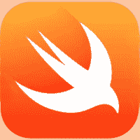

# Swift 教程

> 原文：<https://www.javatpoint.com/swift-tutorial>

我们的 Swift 教程提供了 Swift 的基本和高级概念。本教程是为初学者和专业人士设计的。

Swift 是一种用于开发 iOS 应用程序的通用编程语言。它由苹果公司开发。

我们的 swift 教程包括 Swift 编程的所有主题，例如什么是 Swift、Swift 的历史、Swift 的特性、Swift 与其他编程语言的比较、环境设置、第一个 Swift 程序、语法、数据类型、变量、常量和文本、运算符、控制语句、循环、字符串、函数、集合等。

* * *

## Swift 教程索引

* * *

**迅捷教程**

*   [迅捷教程](swift-tutorial)
*   [什么是雨燕？](swift-introduction)
*   [Swift的历史](history-of-swift)
*   [快速语法](swift-syntax)
*   [快速数据类型](swift-data-types)
*   [快速变量](swift-variables)
*   [快速常数](swift-constants)
*   [快速文字](swift-literals)
*   [迅捷 vs 目标 C](swift-vs-objective-c)
*   [首个 Swift 程序](first-swift-program)

**快速操作员**

*   [快速操作员](swift-operators)
*   [赋值运算符](swift-assignment-operator)
*   [算术运算符](swift-arithmetic-operators)
*   [余数运算符](swift-remainder-operator)
*   [一元减运算符](swift-unary-minus-plus-operator)
*   [一元加运算符](swift-unary-minus-plus-operator#unary-plus-operator)
*   [复合赋值](swift-compound-assignment-operators)
*   [比较运算符](swift-comparison-operators)
*   [三元条件](swift-ternary-conditional-operator)
*   [范围操作员](swift-range-operators)

**控制声明**

*   [切换语句](swift-switch-statement)
*   [if 语句](swift-if-statement)
*   [if-else 语句](swift-if-else-statement)
*   [if-else-if 语句](swift-if-else-if-statement)
*   [嵌套 if-else 语句](swift-nested-if-else-statement)
*   [高德声明](swift-gaurd-statement)
*   [中断声明](swift-break-statement)
*   [继续声明](swift-continue-statement)
*   [失败声明](swift-fallthrough-statement)

**快速循环**

*   [快速循环](swift-4-loops)
*   [内循环](swift-for-in-loop)
*   [同时循环](swift-while-loop)
*   [重复-同时循环](swift-repeat-while-loop)

**快线**

*   [快线](swift-strings)

**快速功能**

*   [快速功能](swift-functions)
*   [快速嵌套功能](swift-nested-function)
*   [参数&返回值](swift-function-parameter-and-return-value)
*   [快速递归](swift-recursion)
*   [功能过载](swift-function-overloading)

**快速采集**

*   [快速阵列](swift-arrays)
*   [迅捷词典](swift-dictionary)
*   [快速设置](swift-sets)
*   [快速关闭](swift-closures)
*   [Swift 类型别名](swift-typealias)

* * *

## 先决条件

在学习 Swift 之前，您必须具备编程概念或任何编程语言的基本知识。

## 观众

我们的 Swift 教程旨在帮助初学者和专业人士。

## 问题

我们保证您在本 Swift 教程中不会发现任何问题。但是如果有任何错误，请在联系表格中发布问题。

* * *