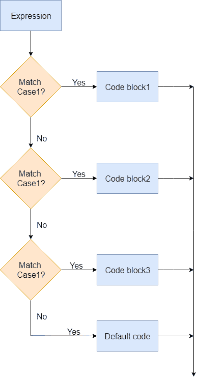

# 快速切换声明

> 原文：<https://www.javatpoint.com/swift-switch-statement>

在匹配复杂模式时，Switch 语句用作长 if-else-if 语句的替代语句。它提供了多种情况，可以根据不同的情况执行不同的操作。

### 语法:

```

switch variable/expression {
case value1:
	// statements
case value2:
	// statements
default:
	// statements
}

```

## Swift 中 Switch 语句的工作原理

*   switch 语句从上到下，获取表达式并与每个案例值进行比较。
*   如果它与案例匹配，则执行案例中的语句，并且一旦第一个匹配的 switch 案例完成，整个 switch 语句就完成其执行。
*   如果没有匹配的案例，则转到下一个案例。
*   默认关键字是一个代码，如果没有匹配的案例，它就会运行。



## 开关语句示例

```

let dayOfWeek = 6
switch dayOfWeek {
	case 1:
		print("It is Sunday today")    
	case 2:
		print("It is Monday today")	    
	case 3:
		print("It is Tuesday today")	    
	case 4:
		print("It is Wednesday today")	    
	case 5:
		print("It is Thursday today")	    
	case 6:
		print("It is Friday today")	    
	case 7:
		print("It is Saturday today")	    
	default:
		print("Invalid day")
}

```

**输出:**

```
It is Friday today

```

在上面的程序中，switch 语句通过将**day fweek**值与案例 1 进行匹配来开始。由于 **dayOfWeek** 值与第一个案例值 1 不匹配，它会下降到下一个案例，直到找到匹配。它在案例 6 中找到匹配，打印声明，switch 语句终止。

## Swift 中带有漏检的 Switch 语句

如果您想将控制进行到下一种情况，则在 switch 语句中使用 fallthrough 语句。

### 例子

```

let dayOfWeek = 5
switch dayOfWeek {
	case 1 :
		print("It is Sunday today")    
	case 2:
		print("It is Monday today")	    
	case 3:
		print("It is Tuesday today")	    
	case 4:
		print("It is Wednesday today")	    
	case 5:
		print("It is Thursday today")
	    fallthrough
	case 6:
		print("It is Friday today")	    
	case 7:
		print("It is Saturday today")	    
	default:
		print("Invalid day")
}

```

**输出:**

```
It is Thursday today
It is Friday today

```

在上面的示例中，您可以看到案例 5 执行语句打印(“今天是星期三”)，而 fallthrough 关键字前进到打印打印(“今天是星期四”)的案例 6。

* * *