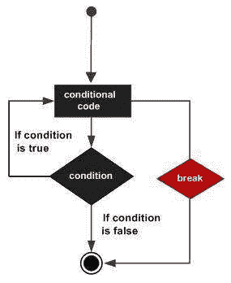

# break 语句

> 原文：<https://www.javatpoint.com/swift-break-statement>

Swift 4 break 语句用于两种情况:

1.  当必须立即终止语句时，break 语句在循环中使用。程序控制在循环后的下一条语句处继续。
2.  它也用于终止 switch 语句中的案例。

在嵌套循环的情况下，break 语句终止最内部的循环，并开始执行块后的下一行代码。

### 语法:

Swift 4 break 语句的语法是:

```

break 

```

**Swift 4 break 语句流程图**



### 示例:

```

var index = 10

repeat {
   index = index + 1
   if( index == 25 ){
      break
   }
   print( "Value of index is \(index)")
} while index < 30

```

**输出:**

```
Value of index is 11
Value of index is 12
Value of index is 13
Value of index is 14
Value of index is 15
Value of index is 16
Value of index is 17
Value of index is 18
Value of index is 19
Value of index is 20
Value of index is 21
Value of index is 22
Value of index is 23
Value of index is 24

```

* * *