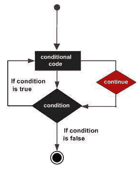

# 循环中的控制语句

> 原文：<https://www.javatpoint.com/swift-continue-statement>

控制语句用于循环中，以改变其正常顺序的执行。当执行离开作用域时，在该作用域中自动创建的所有已经创建的对象都将被销毁。

**Swift 4 支持的控制语句列表:**

* * *

## 连续语句

Swift 4 **continue** 语句用于停止当前正在执行的语句，并通过循环在下一次迭代开始时重新开始。continue 语句与 for 循环一起使用，而 loop 和 do...while 循环。

对于“循环的**，continue 语句测试条件并增加要执行的循环部分。**

用**while 和 do...当“**循环时，continue 语句将程序控制传递给条件测试。

### 语法:

Swift 4 循环的 continue 语句语法如下:

```

continue 

```

**Swift 4 继续声明流程图**



### 示例:

```

var index = 10

repeat {
   index = index + 1
   if( index == 25 ){
      continue
   }
   print( "Value of index is \(index)")
} while index < 30

```

**输出:**

```
Value of index is 11
Value of index is 12
Value of index is 13
Value of index is 14
Value of index is 15
Value of index is 16
Value of index is 17
Value of index is 18
Value of index is 19
Value of index is 20
Value of index is 21
Value of index is 22
Value of index is 23
Value of index is 24
Value of index is 25
Value of index is 26
Value of index is 27
Value of index is 28
Value of index is 29
Value of index is 30

```

* * *