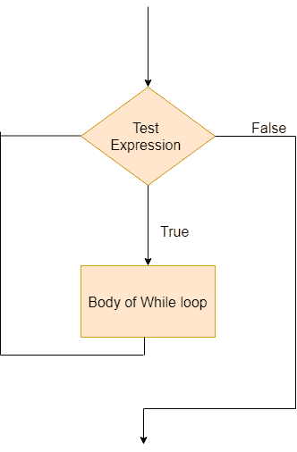

# Swift 边循环和重复边循环

> 原文：<https://www.javatpoint.com/swift-while-loop>

当迭代次数未知时，While 和 Repeat while 循环用作强制循环的替代。while 循环执行一组语句，直到出现 false 条件。当你不知道迭代的次数时，通常使用这个循环。

Swift 中有两种类型的循环:

1.  [同时循环](#while-loop)
2.  [边循环边重复](swift-repeat-while-loop)

## Swift 循环

Swift while 循环在每次通过开始时评估其条件。

### 语法:

```

while (TestExpression) {
    // statements
}

```

这里，TestExpression 是一个布尔表达式。如果是真的，

*   while 循环中的语句被执行。
*   并且，TestExpressionis 再次进行了评估。

这个过程一直持续到 TestExpression 计算为 false。当 TestExpression 获得 false 条件时，while 循环终止。

**While 循环流程图**



### 示例:

```

var currentLevel:Int = 0, finalLevel:Int = 6
let gameCompleted = true
while (currentLevel <= finalLevel) {
    //play game
    if gameCompleted {
        print("You have successfully completed level \(currentLevel)")
        currentLevel += 1
    }
}
//outside of while loop
print("Terminated! You are out of the game ")

```

**输出:**

```
You have successfully completed level 0
You have successfully completed level 1
You have successfully completed level 2
You have successfully completed level 3
You have successfully completed level 4
You have successfully completed level 5
You have successfully completed level 6
Terminated! You are out of the game 

```

在上面的程序中，while 循环被执行，直到条件被评估为 false，并且一旦它得到 false 条件，它就终止。

* * *