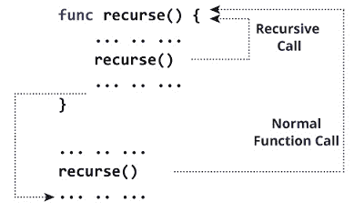

# 快速递归

> 原文：<https://www.javatpoint.com/swift-recursion>

重复调用自身的函数称为递归函数，这种技术称为递归。创建递归函数时，必须创建一个条件，以便函数不会无限期地调用自己。

### 示例:

```

func recurse() {
    //statements
    recurse()
}
recurse()

```



在上图中可以看到递归是无限期执行的。为了摆脱这些类型的不定递归，我们使用控制语句。

### 示例:Swift 4 程序打印 N 个正数

```

func countDownToZero(num: Int) {
    print(num)
    if num > 0 {
        countDownToZero(num: num - 1)
    }
}
print("Countdown:")
countDownToZero(num:6)

```

**输出:**

```
Countdown:
6
5
4
3
2
1
0

```

您可以在上面的程序中看到，print 语句(“倒计时:”给出了输出，而 countDownToZero 语句(num:3)调用了接受参数 Integer 的函数。

函数 countdownozero()中的语句将执行，如果条件 num > 0，函数 countdownozero()将作为 countdownozero(num:num-1)再次调用。

当条件没有满足时，函数调用没有完成，递归停止。

### 执行步骤

| 步伐 | 函数调用 | 印刷的 | num > 0 吗？ |
| one | countdowdozero(6) | six | 是 |
| Two | countdowdozero(5) | five | 是 |
| three | countdowdozero(4) | four | 是 |
| four | countdowdozero(3) | three | 是 |
| five | countdowdozero(2) | Two | 是 |
| six | countdowdozero(1) | one | 是 |
| seven | countdowdozero(0) | Zero | 否(递归结束) |

### 示例 2: Swift 4 程序寻找一个数的阶乘

```

func findFactorial(of num: Int) -> Int {
    if num == 1 {
        return 1
    } else {
        return num * findFactorial(of:num - 1)
    }
}

let x = 6
let result = findFactorial(of: x)
print("The factorial of \(x) is \(result)") 

```

**输出:**

```
The factorial of 6 is 720

```

### 执行步骤

| 步伐 | 参数已通过 | 返回语句 | 价值 |
| one | six | 返回 6 * findFactorial(共 5 个) | 6 *查找阶乘(共 5 个) |
| Two | five | 返回 5 * findFactorial(共 4 个) | 6 *5 查找阶乘(共 4 个) |
| three | four | 返回 4 * findFactorial(共 3 个) | 6 *5*4 查找阶乘(共 3 个) |
| four | three | 返回 3 * findFactorial(共 2 个) | 6 *5*4*3 查找阶乘(共 2 个) |
| five | Two | 返回 2 * findFactorial(共 1 个) | 6*5*4*3*2 查找阶乘(共:1) |
| six | one | 返回 1 | 6*5*4*3*2*1 |

* * *