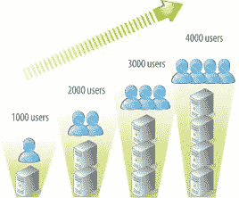

# 移动通信导论

> 原文：<https://www.javatpoint.com/mobile-communication-introduction>

**移动通信**是一种技术的使用，它允许我们在不使用任何物理连接(电线或电缆)的情况下与不同位置的其他人进行通信。移动通信让我们的生活变得更轻松，它节省了时间和精力。

**一部手机**(也叫移动蜂窝网络、手机或手持电话)就是移动通信(无线通信)的一个例子。它是一种电子设备，用于通过称为小区站点的基站蜂窝网络进行全双工双向无线电通信。

## 移动通信的特点

以下是移动通信的特点:

*   **高容量负载平衡:**每个有线或无线基础设施必须包含高容量负载平衡。
    高容量负载平衡意味着，当一个接入点过载时，系统会根据可用容量主动将用户从一个接入点转移到另一个接入点。

*   **可扩展性:**新型无线设备普及度的增长与日俱增。无线网络有能力在必要时从小规模开始，但根据需要在覆盖范围和容量方面进行扩展，而无需大修或构建全新的网络。

*   **网络管理系统:**如今的一天，无线网络要复杂得多，可能由数百甚至数千个接入点、防火墙、交换机、受管电源和各种其他组件组成。
    无线网络有更智能的方式从一个集中点管理整个网络。

*   **基于角色的访问控制:**基于角色的访问控制(RBAC)允许您根据用户或设备试图访问您的网络的内容、人员、位置、时间和方式来分配角色。
    一旦定义了设备的最终用户或角色，就可以实施访问控制策略或规则。

*   **室内和室外覆盖选项:**重要的是，您的无线系统具有增加室内覆盖和室外覆盖的能力。

*   **网络访问控制:**网络访问控制也可以称为移动设备注册。进行安全注册至关重要。
    网络访问控制(NAC)控制用户的角色并实施策略。NAC 可以允许您的用户向网络注册。这是一个增强用户体验的有用功能。

*   **移动设备管理:**假设有很多移动设备正在接入你的无线网络；现在想想那些移动设备上运行的成千上万的应用程序。
    您打算如何管理所有这些设备及其应用程序，尤其是在设备从您的业务中来来去去的情况下？
    移动设备管理可以控制您如何管理对程序和应用程序的访问。即使设备丢失或被盗，您也可以远程擦除。

*   **漫游:**你不需要担心连接中断、速度变慢或任何服务中断，因为你在整个办公室甚至从一栋楼到另一栋楼移动时，无线首先需要移动。
    漫游使您的最终用户能够成功地从一个接入点移动到另一个接入点，而不会注意到性能下降。
    例如，允许学生在从一个班级走到下一个班级时检查他们的邮件。
*   **冗余:**您的无线系统所需的冗余级别或数量取决于您的特定环境和需求。
*   **例如:**医院环境将需要比咖啡店更高级别的冗余。然而，归根结底，他们都需要有一个备份计划。
*   **适当的安全意味着使用正确的防火墙:**系统的主干就是你的网络防火墙。有了合适的防火墙，您将能够:
    *   查看和控制您的应用程序和最终用户。
    *   在安全性和性能之间建立适当的平衡。
    *   通过以下方式降低复杂性:
        *   防病毒保护。
        *   深度数据包检测
        *   应用过滤
    *   保护您的网络和最终用户免受已知和未知线程的攻击，包括:
        *   零日。
        *   加密恶意软件。
        *   勒索软件。
        *   恶意僵尸网络。

*   **交换:**基本上，网络交换机是你的无线网络的流量警察，它确保每个人和每个设备到达他们需要去的地方。
    切换是每个快速、安全无线网络的重要组成部分，原因有几个:
    *   它有助于提高网络流量的效率。
    *   它最大限度地减少了不必要的流量。
    *   它通过确保您的流量流向正确的地方来创造更好的用户体验。

## 移动通信的优势

移动通信有以下优点:

*   **灵活性:**无线通信使人们能够不分地点地相互通信。传递和接收信息不需要在办公室或电话亭。
*   **成本效益:**在无线通信中，不需要任何物理基础设施(电线或电缆)或维护实践。因此，降低了成本。
*   **速度:**在速度上也可以看到提升。网络连接或可访问性在准确性和速度上得到了很大提高。
*   **可达性:**借助无线技术，可以轻松到达偏远地区。例如，在农村地区，在线教育现在是可能的。教育者或学生不再需要去遥远的地方上课。
*   **持续连通:**持续连通确保人们能够相对快速地应对突发事件。例如，像移动电话这样的无线设备可以在你从一个地方移动到另一个地方或旅行时确保你的持续连接，而有线电话则不能。

* * *