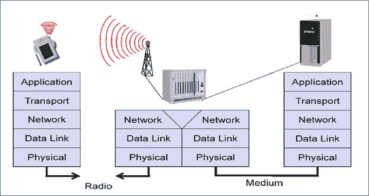

# 通信的简化参考模型

> 原文：<https://www.javatpoint.com/simplified-reference-model-of-mobile-communication>

上图显示了一个**个人数字助理(PDA)** ，它为无线和便携式设备提供了一个示例。这个个人数字助理与图片中间的**基站**通信。基站由无线电收发器(接收器和发送器)和连接无线链路和固定链路的互通单元组成。右侧显示了个人数字助理的通信伙伴，一台**常规计算机**。在地球各网元(如 PDA、互通单元、计算机)下，图为根据参考模型在系统中实现的**协议栈**。

**端系统**，比如例子中的 PDA 和计算机，需要一个完整的协议栈，包括应用层、传输层、网络层、数据链路层和物理层。终端系统上的应用程序使用较低层的服务相互通信。

**互通单元等中间系统**；不一定需要所有的层。上图显示了网络、数据链路和物理层。由于(根据参考模型)只有同一级别的实体相互通信(即，传输与传输、网络与网络)。

**移动通信对层模型的影响**

| 层 | 要点 |
| 应用层 | 

*   Service location
*   New applications, multimedia
*   Adaptive application

 |
| 传输层 | 

*   And congestion and flow control.
*   quality of service

 |
| 网路层 | 

*   Addressing, routing, device location
*   join

 |
| 数据链路层 | 

*   authentication
*   Media access
*   multiplexing
*   Media access control

 |
| 物理层 | 

*   encrypt
*   modulation
*   interfere
*   weaken
*   frequency

 |

### 物理层

这是通信系统中的最低层，负责将比特流转换为在发送端传输的信号。接收器的物理层将信号转换回比特流。对于无线通信，物理层负责载波频率的产生、频率选择、信号检测(尽管强干扰可能会干扰信号)、将数据调制成载波频率和加密。

### 数据链路层

数据链路层的主要任务包括访问介质、多路复用不同的数据流、纠正传输错误和同步(即检测数据帧)。简而言之，数据链路层负责两个设备之间的可靠点对点连接，或者一个发送器和几个接收器之间的点对多点连接。

### 网路层

第三层称为网络层，负责通过网络路由数据包，或者通过许多其他中间系统在两个实体之间建立连接。一些主题是寻址、路由、设备位置和不同网络之间的切换。互联网网络层协议的几种解决方案。

### 传输层

传输层在参考模型中用于建立端到端连接。像服务质量、流量和拥塞控制这样的主题是相关的，特别是如果在无线链路上使用从互联网已知的传输协议，TCP 和 UDP。

### 应用层

应用程序(由支持应用程序的附加层补充)位于所有面向传输的层之上。该层上的一些上下文是服务位置、对多媒体应用的支持、能够处理传输特性变化的自适应应用以及使用便携式设备对万维网的无线访问。要求最高的应用是视频(高数据速率)和交互式游戏(低抖动、低延迟)。

* * *